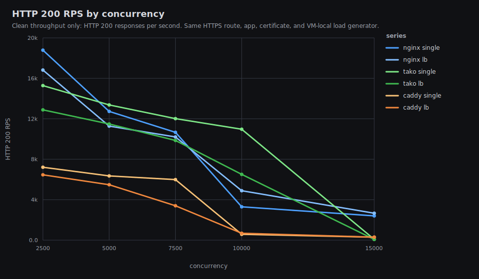
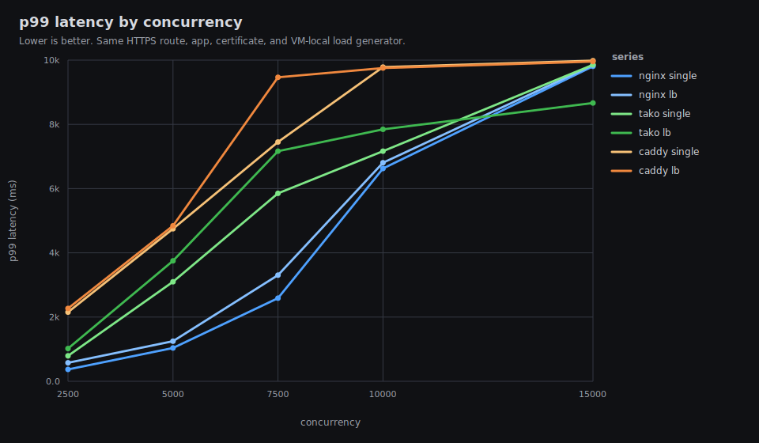
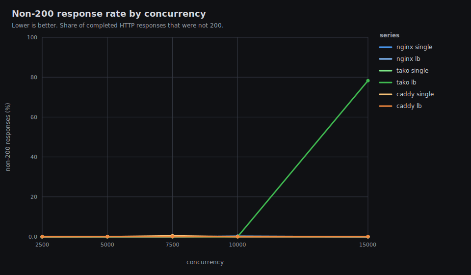
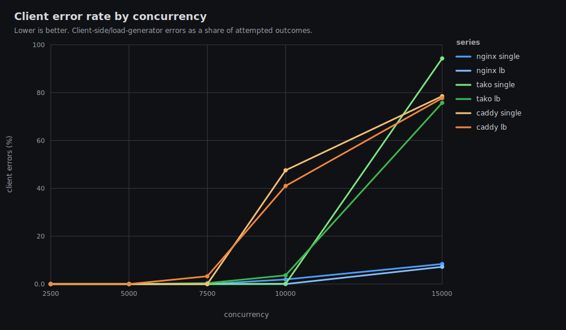
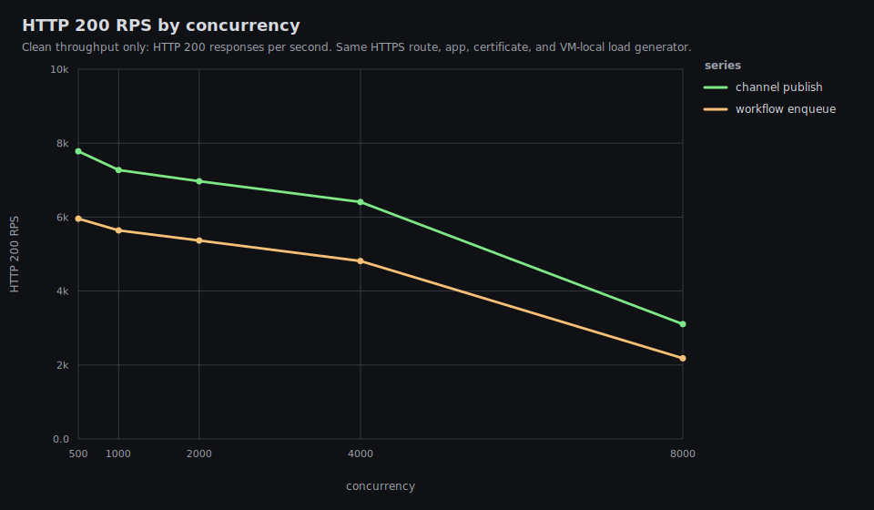
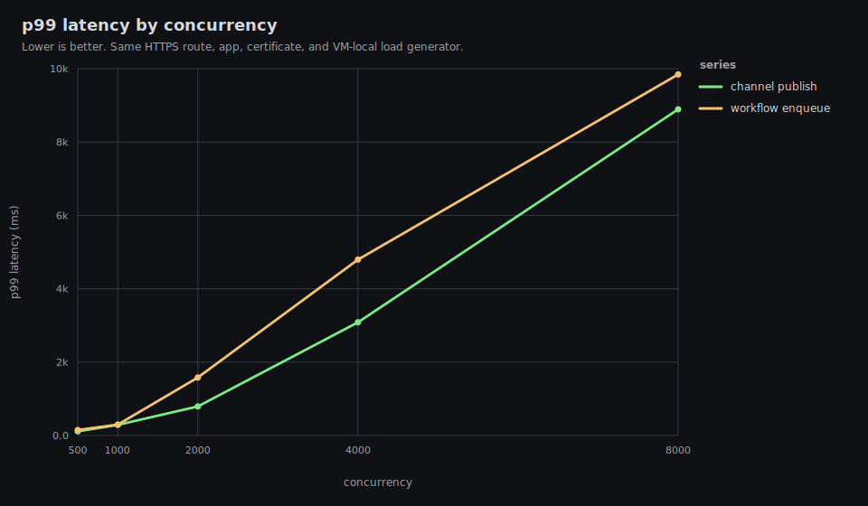
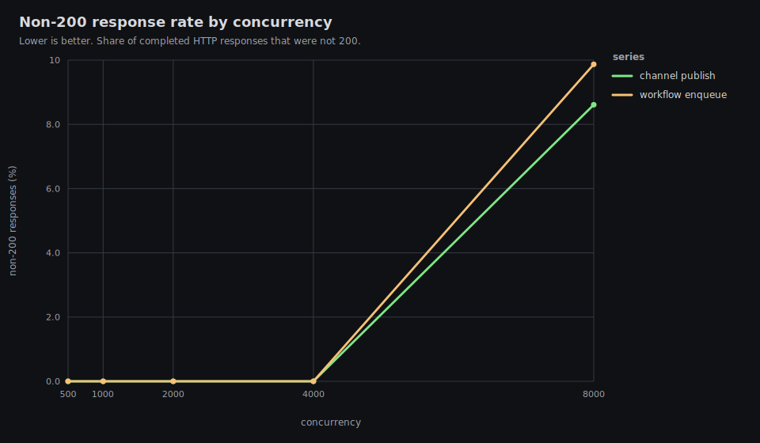
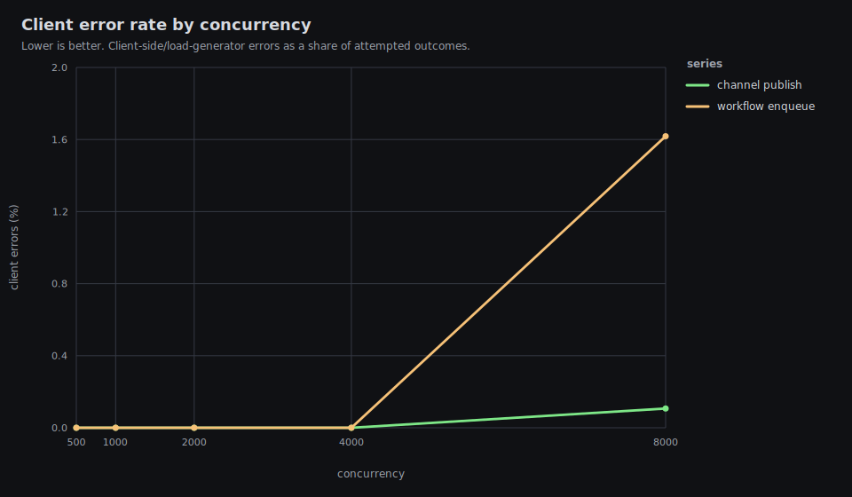

# Tako Proxy Performance Baseline

Date: 2026-05-31 UTC

This is the first repeatable baseline for Tako against nginx and Caddy on the
benchmark VM. It includes both a laptop-driven run over Tailscale and a
VM-local high-load run, using the same TLS route, certificate, application
payloads, and load generator for each proxy. Exact hostnames, public IPs,
private Tailscale IPs, MagicDNS suffixes, peer names, and user identifiers are
intentionally omitted from this public report.

## Executive Summary

At 500 concurrent HTTP/1.1 clients over TLS from the laptop, nginx was the
fastest HTTP proxy. Tako single-instance trailed nginx single-instance by about
7.4% on both plaintext and JSON responses, and was much faster than Caddy in
this environment.

A VM-local high-load pass was added to find the ceiling of the single 2 vCPU
VM. With TLS, the same app, and load generation running on the VM itself, the
best clean 200-throughput was:

- nginx single: 27,694 rps at c100, p99 9 ms
- Tako single: 21,205 rps at c100, p99 10 ms
- Caddy single: 12,128 rps at c100, p99 21 ms

The VM did not get close to 60k-100k clean TLS rps under these conditions. The
machine saturates before that: by c500-c1000 the load generator, proxy, and app
are sharing the full 2 vCPU budget. In the first source-sharded overload run,
Tako beat nginx on clean 200 rps at c2500 and c5000, but p99 latency was
already hundreds of milliseconds to seconds, so those are not good steady-state
targets.

The first high-load Tako runs returned many 429 responses above c2048 because
Tako has a built-in per-client-IP concurrent request cap. A final source-sharded
run used 16 loopback source IPs so the c2500+ rows measure proxy capacity
rather than the per-IP limiter.

The channel and workflow benchmark initially failed on the released
`tako-server 0.0.0-ea3eb66` because app processes could not use the internal
workflow/channel Unix socket. A source fix was implemented and validated with a
patched VM-native `tako-server` build. With the patched binary, channel publish
and workflow enqueue both completed with only HTTP 200 responses.

After releasing `tako-server 0.0.0-1c29253`, I reran the high-load VM-local
benchmark at c2500 through c15000. Load-balanced rows are excluded from the
exe-node HTTP result sets because this 2 vCPU VM makes them measure process
contention more than load-balancer quality. At c2500, nginx single led with
18.8k 200 rps and p99 370 ms; Tako single produced 15.3k 200 rps with p99 794
ms. At c5000 and c10000, Tako single produced more 200 rps than nginx single,
but with much worse p99 latency, so those rows are overload/survivability data.
The released server also passed VM-local channel/workflow benchmarks cleanly
through c4000.

## Released Active-Set Rerun

Raw HTTP data: `results/20260531T113110Z/http-vm-local`  
HTTP graphs: `results/20260531T113110Z/http-vm-local/graphs/README.md`  
Raw channel/workflow data:
`results/20260531T120513Z/tako-features-vm-local`  
Channel/workflow graphs:
`results/20260531T120513Z/tako-features-vm-local/graphs/README.md`

This rerun used the released `tako-server 0.0.0-1c29253`, published from
master on 2026-05-31 at 11:30 UTC. It includes the active-set routing change,
so request routing no longer scans app instances or checks health state on
every request.

The run intentionally skipped low concurrency. It used VM-local HTTPS load
generation, 16 loopback source IPs, 10 second warmups, and 30 second measured
windows at c2500, c5000, c7500, c10000, and c15000. Load-balanced mode is
intentionally excluded for this VM; use `MODES="single lb"` only on a larger
testbed.









### HTTP Rerun Results

| case | conc | 200 rps | p50 ms | p99 ms | non-200 | client errors | status |
|---|---:|---:|---:|---:|---:|---:|---|
| nginx-single | 2500 | 18,781 | 109 | 370 | 0.00% | 0.00% | 200:564762 |
| tako-single | 2500 | 15,280 | 93 | 794 | 0.00% | 0.00% | 200:460191 |
| caddy-single | 2500 | 7,205 | 339 | 2,152 | 0.00% | 0.00% | 200:217521 |
| tako-single | 5000 | 13,371 | 209 | 3,098 | 0.00% | 0.00% | 200:404661 |
| nginx-single | 5000 | 12,729 | 284 | 1,038 | 0.00% | 0.00% | 200:385685 |
| caddy-single | 5000 | 6,352 | 705 | 4,750 | 0.08% | 0.00% | 200:193243, 502:155 |
| tako-single | 7500 | 12,014 | 317 | 5,853 | 0.00% | 0.00% | 200:364979 |
| nginx-single | 7500 | 10,659 | 456 | 2,588 | 0.00% | 0.00% | 200:321841 |
| caddy-single | 7500 | 5,987 | 1,038 | 7,450 | 0.46% | 0.00% | 200:183926, 502:856 |
| tako-single | 10000 | 10,964 | 525 | 7,164 | 0.00% | 0.09% | 200:334218 |
| nginx-single | 10000 | 3,294 | 1,613 | 6,626 | 0.13% | 1.92% | 200:112716, 500:142 |
| caddy-single | 10000 | 578 | 7,765 | 9,782 | 0.00% | 47.54% | 200:19679 |
| nginx-single | 15000 | 2,401 | 3,971 | 9,807 | 0.00% | 8.38% | 200:90756 |
| caddy-single | 15000 | 291 | 7,930 | 9,983 | 0.00% | 78.52% | 200:10752 |
| tako-single | 15000 | 77 | 8,124 | 9,856 | 0.00% | 94.31% | 200:2627 |

Interpretation:

- c2500 is the cleanest high-load comparison. Nginx single leads, Tako single
  is second among single-instance proxies, and Caddy is far behind. Tako single
  is about 18.6% below nginx single on clean 200 RPS in this row.
- c5000-c10000 are overload rows. Tako single produces more clean 200 RPS than
  nginx there, but p99 latency is much worse. That is useful survivability
  data, not a good operating target.
- c15000 is failure-mode data. Nginx still returns more 200s than Tako in this
  exact row. Tako single mostly times out at the client. Caddy also collapses,
  with roughly 78% client errors.

### Resource Highlights

CPU is near saturated for every heavy row. The per-case CPU/RAM SVGs are in the
graph index linked above.

| case | conc | max CPU | max memory | max proxy RSS | max app RSS |
|---|---:|---:|---:|---:|---:|
| nginx-single | 2500 | 100.0% | 1.06 GiB | 198 MiB | 65 MiB |
| tako-single | 2500 | 95.2% | 0.87 GiB | 368 MiB | 31 MiB |
| caddy-single | 2500 | 100.0% | 0.96 GiB | 375 MiB | 103 MiB |
| nginx-single | 5000 | 100.0% | 1.92 GiB | 276 MiB | 79 MiB |
| tako-single | 5000 | 95.1% | 1.35 GiB | 646 MiB | 34 MiB |
| caddy-single | 5000 | 100.0% | 1.58 GiB | 699 MiB | 136 MiB |
| nginx-single | 10000 | 100.0% | 4.00 GiB | 497 MiB | 119 MiB |
| tako-single | 10000 | 97.1% | 2.30 GiB | 1,226 MiB | 47 MiB |
| caddy-single | 10000 | 100.0% | 2.87 GiB | 1,492 MiB | 133 MiB |

### Channel And Workflow Rerun

The released `tako-server 0.0.0-1c29253` also fixes the channel/workflow
internal socket issue. These rows are VM-local HTTPS POST requests through the
Tako proxy to a single Tako app instance.









| case | conc | 200 rps | p50 ms | p99 ms | non-200 | client errors | status |
|---|---:|---:|---:|---:|---:|---:|---|
| channel-publish | 500 | 7,782 | 63 | 114 | 0.00% | 0.00% | 200:233903 |
| workflow-enqueue | 500 | 5,957 | 84 | 150 | 0.00% | 0.00% | 200:179210 |
| channel-publish | 1000 | 7,273 | 135 | 291 | 0.00% | 0.00% | 200:219057 |
| workflow-enqueue | 1000 | 5,641 | 179 | 298 | 0.00% | 0.00% | 200:170240 |
| channel-publish | 2000 | 6,970 | 287 | 793 | 0.00% | 0.00% | 200:210679 |
| workflow-enqueue | 2000 | 5,367 | 371 | 1,582 | 0.00% | 0.00% | 200:162923 |
| channel-publish | 4000 | 6,410 | 616 | 3,087 | 0.00% | 0.00% | 200:195194 |
| workflow-enqueue | 4000 | 4,813 | 754 | 4,796 | 0.00% | 0.00% | 200:147632 |
| channel-publish | 8000 | 3,105 | 1,591 | 8,891 | 8.61% | 0.11% | 200:100576, 502:9455, 503:20 |
| workflow-enqueue | 8000 | 2,182 | 2,402 | 9,842 | 9.87% | 1.62% | 200:72486, 502:7224, 503:713 |

Channel publish and workflow enqueue are clean through c4000 in this setup,
but c4000 already has multi-second p99 latency. At c8000, both feature paths
enter failure mode with 502/503 responses and client errors.

## Test Host And Network

### Load Generator

- OS: macOS Darwin 25.5.0 arm64
- CPU count: 10
- Memory: 16 GiB
- Load snapshot before the feature benchmark: normal desktop/Codex background
  load; no process near 200% CPU or high memory.

### Server

- OS: Ubuntu 24.04.4 LTS, Linux 6.12.90, x86_64
- VM: KVM
- CPU: 2 vCPU, AMD EPYC 9554P 64-Core Processor
- Memory: 7.8 GiB, no swap
- Disk: 25 GiB root filesystem
- Tailscale relay: `tok`
- Direct public address geolocation: Tokyo, Japan, AS396356 Latitude.sh
- Public access hostname geolocation: Berkeley, CA, AS402146 Bold Software Inc,
  anycast

The public access URL was not used for the timed proxy comparison because it
redirected to an `exe.dev` login gate. Benchmarking that URL would measure the
public access layer rather than Tako, nginx, or Caddy directly. The controlled
route was:

```text
https://bench.test:18443/
Host/SNI: bench.test
Resolved to: private Tailscale address
TLS: same self-signed certificate for every proxy
```

Ping from the laptop:

| target | min ms | avg ms | max ms | stddev ms | loss |
|---|---:|---:|---:|---:|---:|
| private Tailscale route | 28.087 | 32.591 | 64.541 | 7.489 | 0% |
| public access hostname | 69.118 | 70.684 | 73.740 | 1.205 | 0% |

## Software Versions

- Tako release used for released active-set rerun:
  `tako-server 0.0.0-1c29253`
- Tako release used for HTTP proxy comparison: `tako-server 0.0.0-ea3eb66`
- Patched Tako binary used for valid channel/workflow benchmark:
  `tako-server 0.0.0`, built on the VM from local source
- nginx: `nginx/1.24.0 (Ubuntu)`
- Caddy: `2.6.2`
- Go on VM: `go1.26.3 linux/amd64`
- Tailscale on VM: `1.98.4-t9e69045b2-ged3a62f14`

## Applications

### HTTP App

The HTTP comparison uses `cmd/benchapp`, a small Go application with identical
payloads behind all three proxies:

- `/plaintext`: `hello, world\n`, fixed `Content-Length: 13`
- `/json`: `{"message":"hello","ok":true}\n`
- `/status`: internal Tako health check endpoint when `Host: bench-http.tako`
- `/pid`: instance metadata for manual checks

Manual nginx and Caddy runs start the same Go binary on loopback ports. Tako
runs the same binary as a deployed app from:

```text
/opt/tako-performance/tako-data/apps/bench-http/production/releases/baseline-001
```

### Channels And Workflows App

The feature benchmark uses `apps/channels-workflows`, a small Bun/Tako SDK app:

- `/channel-publish`: `feed.publish({ type: "tick", data: ... })`
- `/workflow-enqueue`: `noop.enqueue({ seq, at })`
- `/status`: JSON health response

The workflow handler performs one persisted `ctx.run("ack", ...)` step and
returns immediately.

## Methodology

- One route and TLS certificate were used for all HTTP proxy comparisons:
  `bench.test:18443`.
- The load generator resolves `bench.test:18443` to the Tailscale IP and sets
  both Host and SNI to `bench.test`.
- TLS verification is disabled because the certificate is self-signed, but TLS
  is still active for every proxy.
- HTTP/2 is disabled in the load generator, so the comparison is HTTP/1.1 over
  TLS.
- Each timed case has a 5 second warmup followed by a 30 second measurement
  window.
- Single mode uses one upstream instance. Load-balanced rows from this exe-node
  testbed are intentionally excluded because four app processes contend on the
  same 2 vCPU VM.

Because the load generator is the laptop and the VM is in Tokyo, the `c=100`
run is mostly RTT/concurrency limited. The `c=500` run is more useful for proxy
comparison, but still includes real Tailscale and cross-network overhead.

The VM-local high-load runs use the same TLS certificate, Host/SNI, HTTP app,
and proxy configs, but the load generator runs on the VM and resolves
`bench.test:18443` to `127.0.0.1`. Tailscale is not in the measured HTTP path
for these runs; it is only used for SSH orchestration and result collection.
This is not a pure proxy microbenchmark because the load generator, proxy, and
app processes all share the same 2 vCPU VM.

The final high-load run used 16 loopback source IPs:

```text
127.0.0.2 through 127.0.0.17
```

That avoids measuring Tako's per-client-IP DDoS limiter when concurrency is
above 2048. A separate single-source diagnostic run is kept to show that limiter
behavior.

Metrics were sampled once per second from `/proc` on the VM:

- total CPU utilization
- memory used and available
- aggregate benchmark app RSS
- aggregate proxy RSS

Connection counting is disabled in the final run because enumerating thousands
of sockets with `ss` showed measurable CPU overhead at very high concurrency.

## HTTP Results: 100 Concurrent Clients

Raw data: `results/20260531T043913Z/http`

| case | rps | mean ms | p95 ms | p99 ms | errors | status |
|---|---:|---:|---:|---:|---:|---|
| caddy-single-json-c100 | 2653.42 | 37.65 | 49.29 | 60.02 | 0 | 200:79703 |
| caddy-single-plaintext-c100 | 2698.53 | 37.01 | 49.36 | 57.27 | 0 | 200:81036 |
| nginx-single-json-c100 | 2720.52 | 36.72 | 45.17 | 51.83 | 0 | 200:81734 |
| nginx-single-plaintext-c100 | 2740.66 | 36.43 | 44.62 | 50.88 | 0 | 200:82324 |
| tako-single-json-c100 | 2768.7 | 36.08 | 44.97 | 50.53 | 0 | 200:83138 |
| tako-single-plaintext-c100 | 2731.22 | 36.56 | 45.06 | 51.8 | 0 | 200:82072 |

At this concurrency, all three proxies cluster around 2.6-2.8k requests/sec.
That matches the RTT limit: `100 / ~36ms` is roughly 2.8k requests/sec.

## HTTP Results: 500 Concurrent Clients

Raw data: `results/20260531T045015Z/http`

| case | rps | mean ms | p95 ms | p99 ms | errors | status |
|---|---:|---:|---:|---:|---:|---|
| caddy-single-json-c500 | 5733.18 | 87.05 | 129.26 | 151.82 | 0 | 200:172383 |
| caddy-single-plaintext-c500 | 5980.57 | 83.49 | 129.68 | 206.95 | 0 | 200:179811 |
| nginx-single-json-c500 | 13567.68 | 36.78 | 45.44 | 63.53 | 0 | 200:407489 |
| nginx-single-plaintext-c500 | 13691.31 | 36.45 | 45.04 | 64.56 | 0 | 200:411206 |
| tako-single-json-c500 | 12571.87 | 39.7 | 52.05 | 60.87 | 0 | 200:377592 |
| tako-single-plaintext-c500 | 12675.96 | 39.37 | 50.51 | 59.79 | 0 | 200:380687 |

Key comparisons from the 500-concurrency run:

- Tako single plaintext: 12,675.96 rps, 7.4% below nginx single plaintext.
- Tako single JSON: 12,571.87 rps, 7.3% below nginx single JSON.
- Tako single plaintext was about 112% faster than Caddy single plaintext.

## VM-Local High-Load Results

Raw final data: `results/20260531T083525Z/http-vm-local`

CPU/RAM graphs: `results/20260531T083525Z/http-vm-local/graphs`

This run keeps TLS enabled but removes laptop-to-VM network latency from the
request path. The load generator runs on the same VM as the proxy and app, so
the result is the total throughput the single VM can produce end-to-end.

The final pass used 16 loopback source IPs. This matters for Tako because its
default per-client-IP concurrent request cap is 2048. The single-source
diagnostic run, `results/20260531T081058Z/http-vm-local`, reproduced that
behavior: at c2500 and c5000, Tako returned many 429 responses. The
source-sharded run below avoids that artifact and is the fairer high-concurrency
comparison.

| case | conc | source IPs | rps | 200 rps | errors | p99 ms | status |
|---|---:|---:|---:|---:|---:|---:|---|
| caddy-single-plaintext-c100 | 100 | 16 | 12,128 | 12,128 | 0 | 21 | 200:242615 |
| nginx-single-plaintext-c100 | 100 | 16 | 27,694 | 27,694 | 0 | 9 | 200:553921 |
| tako-single-plaintext-c100 | 100 | 16 | 21,205 | 21,205 | 0 | 10 | 200:424182 |
| caddy-single-plaintext-c500 | 500 | 16 | 8,962 | 8,962 | 0 | 103 | 200:179608 |
| nginx-single-plaintext-c500 | 500 | 16 | 27,472 | 27,472 | 0 | 43 | 200:549607 |
| tako-single-plaintext-c500 | 500 | 16 | 17,977 | 17,977 | 0 | 84 | 200:359914 |
| caddy-single-plaintext-c1000 | 1000 | 16 | 7,857 | 7,857 | 0 | 207 | 200:157659 |
| nginx-single-plaintext-c1000 | 1000 | 16 | 24,211 | 24,211 | 0 | 85 | 200:485030 |
| tako-single-plaintext-c1000 | 1000 | 16 | 16,270 | 16,270 | 0 | 262 | 200:326102 |
| caddy-single-plaintext-c2500 | 2500 | 16 | 6,860 | 6,860 | 0 | 2,305 | 200:138615 |
| nginx-single-plaintext-c2500 | 2500 | 16 | 13,867 | 13,867 | 0 | 585 | 200:278468 |
| tako-single-plaintext-c2500 | 2500 | 16 | 14,379 | 14,379 | 0 | 876 | 200:289340 |
| caddy-single-plaintext-c5000 | 5000 | 16 | 5,902 | 5,898 | 0 | 4,882 | 200:121336, 502:84 |
| nginx-single-plaintext-c5000 | 5000 | 16 | 10,544 | 10,544 | 0 | 1,563 | 200:212829 |
| tako-single-plaintext-c5000 | 5000 | 16 | 12,446 | 12,446 | 0 | 3,753 | 200:252142 |
| caddy-single-plaintext-c10000 | 10000 | 16 | 1,599 | 1,540 | 3,952 | 9,885 | 200:36945, 502:1424 |
| nginx-single-plaintext-c10000 | 10000 | 16 | 4,302 | 4,302 | 0 | 5,673 | 200:88449 |
| tako-single-plaintext-c10000 | 10000 | 16 | 7,476 | 7,476 | 2,548 | 8,633 | 200:154736 |

Interpretation:

- The practical low-latency ceiling is below 60k-100k rps on this 2 vCPU VM.
  The best clean row is nginx single at 27.7k rps with p99 9 ms.
- Tako single peaks at 21.2k rps in the low-latency range. At c2500 and c5000,
  Tako's clean 200 rps beats nginx, but p99 latency is already too high for a
  healthy steady-state target.
- Load-balanced rows are excluded for this VM because they mostly measure four
  app processes competing for the same 2 vCPU budget.
- c10000 is failure-mode data. It shows how each proxy behaves under extreme
  overload, not a target operating point.

### VM-Local Resource Summary

| case | max CPU % | max memory GiB | max proxy RSS MiB | max app RSS MiB |
|---|---:|---:|---:|---:|
| nginx-single-c500 | 98.1 | 0.42 | 61 | 30 |
| tako-single-c500 | 94.1 | 0.45 | 140 | 25 |
| caddy-single-c500 | 100.0 | 0.45 | 138 | 30 |
| nginx-single-c2500 | 100.0 | 1.27 | 177 | 56 |
| tako-single-c2500 | 94.7 | 0.85 | 361 | 35 |
| caddy-single-c2500 | 100.0 | 0.91 | 351 | 104 |
| nginx-single-c5000 | 100.0 | 1.88 | 283 | 81 |
| tako-single-c5000 | 95.2 | 1.44 | 730 | 32 |
| caddy-single-c5000 | 100.0 | 1.40 | 608 | 134 |
| nginx-single-c10000 | 100.0 | 2.65 | 398 | 90 |
| tako-single-c10000 | 99.0 | 2.41 | 1,434 | 34 |
| caddy-single-c10000 | 100.0 | 2.55 | 1,278 | 135 |

Example graphs:

- `results/20260531T083525Z/http-vm-local/graphs/nginx-single-plaintext-c500.svg`
- `results/20260531T083525Z/http-vm-local/graphs/tako-single-plaintext-c500.svg`
- `results/20260531T083525Z/http-vm-local/graphs/nginx-single-plaintext-c2500.svg`
- `results/20260531T083525Z/http-vm-local/graphs/tako-single-plaintext-c2500.svg`
- `results/20260531T083525Z/http-vm-local/graphs/tako-single-plaintext-c5000.svg`

## Historical Channel And Workflow Results

Raw valid data: `results/20260531T053951Z/tako-features`

These were run with the patched VM-native `tako-server` build because the
released server failed the first feature attempt. The client sent 50 concurrent
POST requests, with the same TLS route and network path as the HTTP proxy tests.

| case | rps | mean ms | p95 ms | p99 ms | errors | status |
|---|---:|---:|---:|---:|---:|---|
| tako-feature-channel-publish-c50 | 1310.81 | 38.11 | 52.59 | 63.57 | 0 | 200:39380 |
| tako-feature-workflow-enqueue-c50 | 1100.17 | 45.41 | 65.29 | 72.81 | 0 | 200:33054 |

The invalid first attempt is preserved in
`results/20260531T050527Z/tako-features`. It returned only 502/503 responses
and is excluded from the performance result. That run exposed the internal
socket problem fixed in the source tree.

## Findings

1. Load-balanced mode is excluded from the exe-node HTTP result sets. On this
   2 vCPU VM, it mostly measures four upstream app processes competing for the
   same CPU budget, not useful load-balancer behavior.
2. Tako's normal single-instance proxy path is reasonably close to nginx in
   this cross-network TLS run. The measured gap was about 7.4% at 500
   concurrency.
3. In the VM-local high-load run, the single VM did not approach 60k-100k clean
   TLS rps. The best clean low-latency result was nginx single at 27.7k rps.
   In the released active-set rerun that skips low concurrency, the cleanest
   high-load row was nginx single at 18.8k rps at c2500; Tako single was 15.3k
   rps.
4. Tako's built-in per-client-IP cap returns 429 above 2048 concurrent requests
   from one source IP. That is correct DDoS-protection behavior, but benchmarks
   above c2048 must either shard source IPs or apply an equivalent cap to nginx
   and Caddy.
5. In the released active-set rerun, source-sharded Tako single beats nginx
   single on clean 200 RPS at c5000 and c10000, but p99 latency is much worse.
   That is overload behavior, not a good production target.
6. Caddy 2.6.2 was much slower than both nginx and Tako in this setup.
7. Tako proxy RSS grows sharply at high concurrency. In the released active-set
   rerun, Tako single reached about 646 MiB proxy RSS at c5000, 1.2 GiB at
   c10000, and 2.6 GiB at c15000.
8. The channel/workflow feature path was blocked in the earlier released server
   by the internal socket issue. The released `1c29253` server fixes that path
   and produces clean channel/workflow results through c4000.
9. The laptop-driven benchmark is not a pure local proxy ceiling test. It
   includes a real 28-33ms Tailscale path from the laptop to Tokyo.

## Follow-up Profiling Targets

- Revisit load-balanced HTTP on a larger or multi-node testbed:
  - enough vCPU for four or more upstream app processes
  - separate load-generator capacity
  - repeat single vs load-balanced mode with the same TLS route and app payloads
- Profile memory growth in Tako under c2500-c10000:
  - TLS/session allocation behavior
  - Pingora request/session buffering
  - response body handling for very small responses
  - per-request metadata cloned into the proxy context
- Make the per-IP concurrent request cap configurable, or expose a benchmark
  mode that can raise it explicitly. Keep the current default for production
  DDoS protection.
- Add a second same-region load-generator VM. VM-local load generation is useful
  for total-box throughput, but it makes the client compete with the proxy and
  app for the same 2 vCPUs.
- Add repeated runs and confidence intervals after the next benchmark pass.
- Keep channel/workflow benchmarks in CI or release validation so internal
  socket regressions fail before release.

## Reproducing

Prepare the VM from this repo:

```bash
BENCH_VM=<ssh-host> ./scripts/sync-to-vm.sh
```

Run HTTP proxy comparisons:

```bash
BENCH_VM=<ssh-host> BENCH_IP=<target-ip> CONCURRENCY_LIST="100 500" ./scripts/run-http-benchmarks.sh
```

HTTP scripts default to `MODES=single` for this VM. Use `MODES="single lb"`
only on a larger testbed where extra upstream app processes have enough CPU.

Run VM-local high-load comparisons with source-IP sharding:

```bash
BENCH_VM=<ssh-host> \
SOURCE_IPS="127.0.0.2,127.0.0.3,127.0.0.4,127.0.0.5,127.0.0.6,127.0.0.7,127.0.0.8,127.0.0.9,127.0.0.10,127.0.0.11,127.0.0.12,127.0.0.13,127.0.0.14,127.0.0.15,127.0.0.16,127.0.0.17" \
CONCURRENCY_LIST="2500 5000 7500 10000 15000" \
WARMUP=10s \
DURATION=30s \
ENDPOINTS=plaintext \
./scripts/run-vm-local-http-benchmarks.sh
```

The VM-local HTTP script renders throughput, latency, failure-rate, CPU, and
memory graphs automatically. To regenerate them:

```bash
./scripts/render-metrics-graphs.sh results/<timestamp>/http-vm-local
```

Run VM-local Tako channel/workflow feature benchmarks:

```bash
BENCH_VM=<ssh-host> \
SOURCE_IPS="127.0.0.2,127.0.0.3,127.0.0.4,127.0.0.5,127.0.0.6,127.0.0.7,127.0.0.8,127.0.0.9,127.0.0.10,127.0.0.11,127.0.0.12,127.0.0.13,127.0.0.14,127.0.0.15,127.0.0.16,127.0.0.17" \
CONCURRENCY_LIST="500 1000 2000 4000 8000" \
WARMUP=10s \
DURATION=30s \
TAKO_SERVER_BIN=/usr/local/bin/tako-server \
./scripts/run-vm-local-tako-feature-benchmarks.sh
```

Stop benchmark services:

```bash
ssh <ssh-host> 'cd /opt/tako-performance/source && ./scripts/remote/control.sh stop'
```

The sanitized environment summary is in `results/baseline-001/env/summary.md`.
