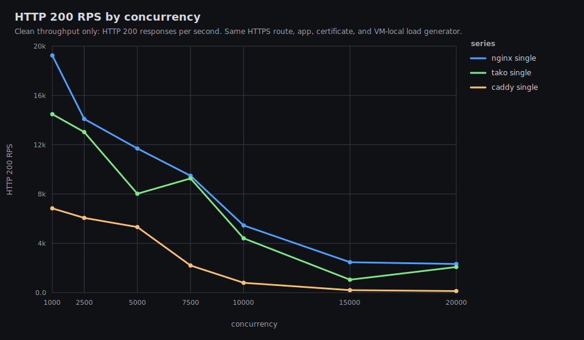
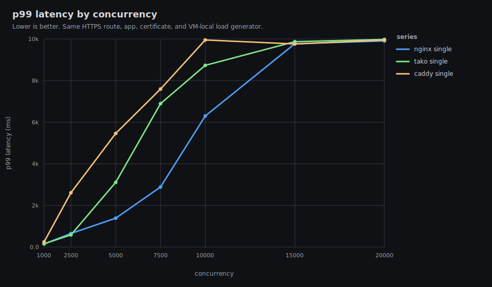
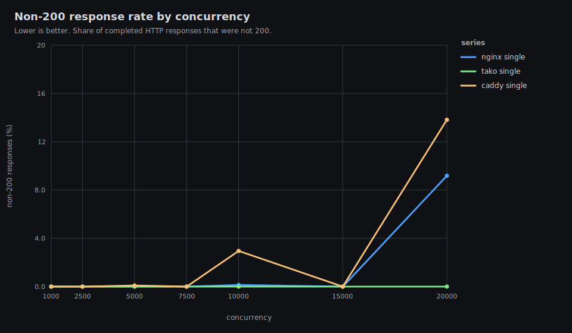
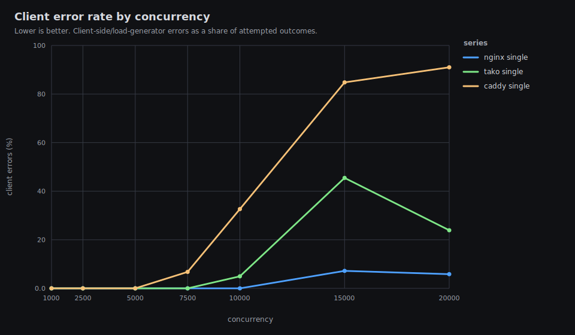
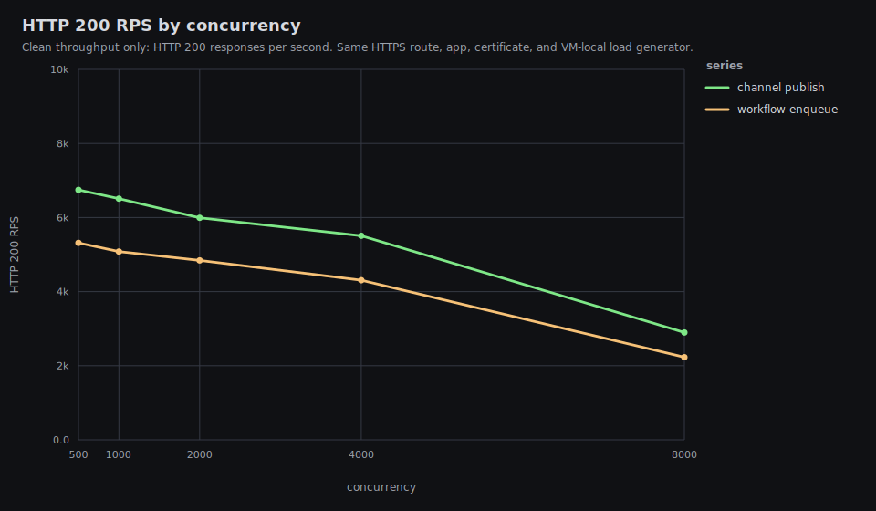
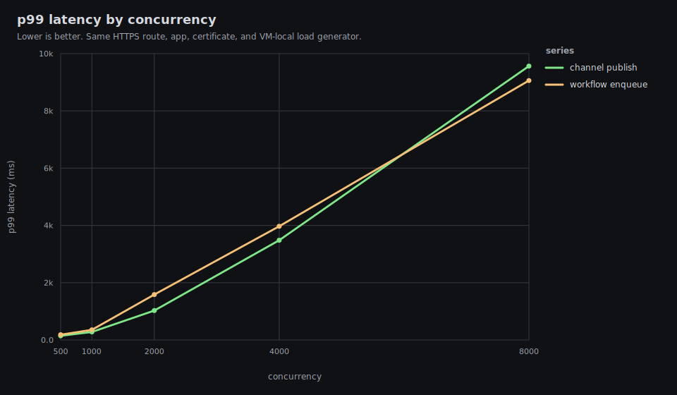
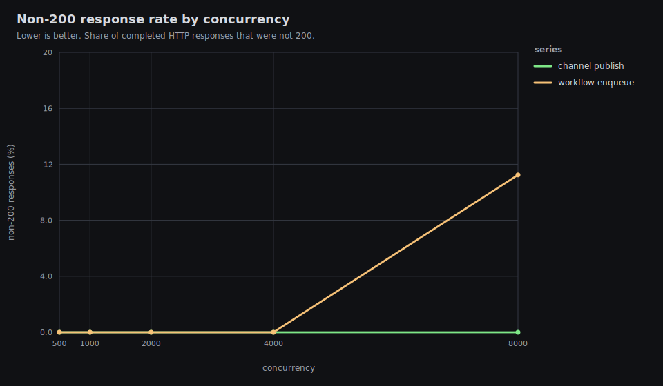
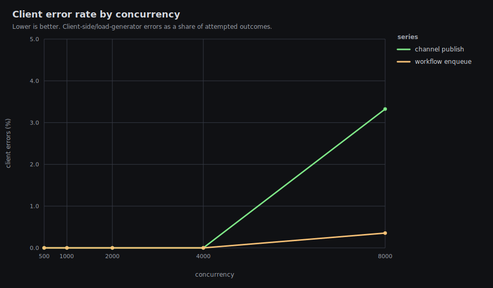

# Tako Proxy Performance

Date: 2026-05-31 UTC

This is the public single-VM performance report for Tako against nginx and
Caddy. It intentionally omits exact hostnames, public IPs, private network
addresses, peer names, and user identifiers.

The timed high-load path is VM-local: load generator, proxy, and application
all run on the same benchmark VM, with TLS enabled for every proxy.

## Executive Summary

Latest clean HTTP/TLS run:

- Tako release: `tako-server 0.0.0-850a9e2`
- HTTP data: `results/20260531T193211Z/http-vm-local`
- HTTP graphs: `results/20260531T193211Z/http-vm-local/graphs/README.md`
- Channel/workflow data: `results/20260531T195359Z/tako-features-vm-local`
- Channel/workflow graphs:
  `results/20260531T195359Z/tako-features-vm-local/graphs/README.md`

Clean single-upstream HTTP/TLS rows:

| conc | nginx 200 rps | nginx p99 | Tako 200 rps | Tako p99 | Caddy 200 rps | Caddy p99 |
|---:|---:|---:|---:|---:|---:|---:|
| 1,000 | 19,245 | 145 ms | 14,476 | 158 ms | 6,835 | 247 ms |
| 2,500 | 14,092 | 652 ms | 13,029 | 585 ms | 6,066 | 2,608 ms |
| 5,000 | 11,696 | 1,388 ms | 8,023 | 3,108 ms | 5,318 | 5,460 ms |
| 7,500 | 9,485 | 2,885 ms | 9,264 | 6,893 ms | 2,203 | 7,591 ms |

Takeaways:

- Tako still trails nginx in the lower-load clean rows. At c2500 it is within
  about 8% of nginx on successful RPS and has slightly better p99 in this run.
- Tako clearly beats Caddy in this setup. Caddy degrades sharply after c5000
  and is mostly failure/timeout mode by c15000-c20000.
- Tako gets close to nginx on successful RPS at c7500, but p99 is already
  several seconds. Treat c7500+ as overload behavior on this 2 vCPU VM.
- The 2 vCPU VM does not reach 60k-100k clean TLS RPS. CPU is saturated across
  the heavy rows, and the load generator, proxy, and app share the same CPU
  budget.
- Load-balanced mode is intentionally excluded for this exe-node result set.
  Four app processes on a 2 vCPU VM mostly measure process contention; use a
  larger or multi-node testbed for load-balancer results.

## What Changed During This Round

Before the final run, Tako had already picked up these performance fixes:

- disabled default response cache on the benchmark path;
- skipped Pingora's default downstream compression module;
- guarded request metrics so disabled metrics do not allocate timers;
- reused compiled route app/path strings via `Arc<str>`;
- replaced the async route-table hot-path lock with a synchronous route-table
  read lock;
- reused the load-balancer app name in selected backend handles.

During this round, we found one simple mismatch with nginx and fixed it in
`850a9e2`:

- Tako now sizes Pingora's upstream keepalive pool at 256 entries per proxy
  thread instead of 256 total (`tako-server/src/proxy/server.rs:128`).

The final benchmark also uses an improved sampler and controller:

- per-test graphs include total CPU plus proxy, app, and loadgen CPU;
- per-test graphs include proxy, app, and loadgen RSS;
- the controller waits for benchmark ports to be free between proxy swaps.

## Latest HTTP Rerun









### HTTP Results

| case | conc | 200 rps | p50 ms | p99 ms | non-200 | client errors | status |
|---|---:|---:|---:|---:|---:|---:|---|
| nginx-single | 1,000 | 19,245 | 45 | 145 | 0.00% | 0.00% | 200:577653 |
| caddy-single | 1,000 | 6,835 | 141 | 247 | 0.00% | 0.00% | 200:205771 |
| tako-single | 1,000 | 14,476 | 68 | 158 | 0.00% | 0.00% | 200:434887 |
| nginx-single | 2,500 | 14,092 | 134 | 652 | 0.00% | 0.00% | 200:424793 |
| caddy-single | 2,500 | 6,066 | 389 | 2,608 | 0.00% | 0.00% | 200:183579 |
| tako-single | 2,500 | 13,029 | 209 | 585 | 0.00% | 0.00% | 200:392756 |
| nginx-single | 5,000 | 11,696 | 315 | 1,388 | 0.00% | 0.00% | 200:353696 |
| caddy-single | 5,000 | 5,318 | 812 | 5,460 | 0.09% | 0.00% | 200:162345, 502:151 |
| tako-single | 5,000 | 8,023 | 486 | 3,108 | 0.00% | 0.00% | 200:243985 |
| nginx-single | 7,500 | 9,485 | 492 | 2,885 | 0.00% | 0.00% | 200:287322 |
| caddy-single | 7,500 | 2,203 | 1,420 | 7,591 | 0.00% | 6.78% | 200:67708 |
| tako-single | 7,500 | 9,264 | 732 | 6,893 | 0.00% | 0.00% | 200:283011 |
| nginx-single | 10,000 | 5,452 | 889 | 6,298 | 0.14% | 0.00% | 200:174506, 500:237 |
| caddy-single | 10,000 | 798 | 6,676 | 9,950 | 2.96% | 32.65% | 200:27300, 502:832 |
| tako-single | 10,000 | 4,409 | 1,309 | 8,733 | 0.00% | 4.96% | 200:137170 |
| nginx-single | 15,000 | 2,468 | 4,412 | 9,772 | 0.00% | 7.19% | 200:86367 |
| caddy-single | 15,000 | 203 | 7,256 | 9,760 | 0.00% | 84.80% | 200:7439 |
| tako-single | 15,000 | 1,048 | 4,197 | 9,870 | 0.00% | 45.46% | 200:34251 |
| nginx-single | 20,000 | 2,327 | 6,010 | 9,905 | 9.18% | 5.85% | 200:80872, 500:8176 |
| caddy-single | 20,000 | 130 | 9,432 | 9,948 | 13.82% | 91.02% | 200:4741, 502:760 |
| tako-single | 20,000 | 2,079 | 4,790 | 9,978 | 0.00% | 23.92% | 200:72478 |

### Resource Highlights

In these graphs, 100% CPU means the whole 2 vCPU VM is busy, not one core.
Process CPU columns are the process share of total VM CPU over each sample.

| case | conc | max CPU | proxy CPU | app CPU | loadgen CPU | proxy RSS | app RSS | loadgen RSS | max TLS conns |
|---|---:|---:|---:|---:|---:|---:|---:|---:|---:|
| nginx-single | 1,000 | 99.8% | 37.7% | 20.8% | 46.0% | 87 MiB | 34 MiB | 239 MiB | 3,115 |
| caddy-single | 1,000 | 99.6% | 58.6% | 18.3% | 18.7% | 198 MiB | 46 MiB | 113 MiB | 1,516 |
| tako-single | 1,000 | 99.2% | 46.8% | 17.8% | 35.5% | 200 MiB | 36 MiB | 104 MiB | 1,019 |
| nginx-single | 2,500 | 100.0% | 43.4% | 19.2% | 46.2% | 177 MiB | 54 MiB | 623 MiB | 7,459 |
| caddy-single | 2,500 | 99.7% | 62.5% | 19.1% | 22.0% | 369 MiB | 98 MiB | 204 MiB | 3,049 |
| tako-single | 2,500 | 99.2% | 48.2% | 18.6% | 35.1% | 456 MiB | 68 MiB | 242 MiB | 3,063 |
| nginx-single | 5,000 | 100.0% | 46.2% | 17.0% | 45.2% | 268 MiB | 118 MiB | 1,106 MiB | 13,926 |
| caddy-single | 5,000 | 99.8% | 70.3% | 17.1% | 27.3% | 644 MiB | 135 MiB | 381 MiB | 5,356 |
| tako-single | 5,000 | 99.9% | 51.0% | 17.4% | 37.1% | 1,579 MiB | 117 MiB | 872 MiB | 17,340 |
| nginx-single | 7,500 | 100.0% | 50.0% | 15.7% | 48.1% | 309 MiB | 123 MiB | 1,406 MiB | 14,864 |
| caddy-single | 7,500 | 100.0% | 74.7% | 15.3% | 30.5% | 1,075 MiB | 133 MiB | 697 MiB | 14,089 |
| tako-single | 7,500 | 99.8% | 52.6% | 17.7% | 36.8% | 1,352 MiB | 162 MiB | 681 MiB | 12,489 |
| nginx-single | 10,000 | 100.0% | 48.3% | 20.1% | 44.1% | 481 MiB | 119 MiB | 2,128 MiB | 15,474 |
| caddy-single | 10,000 | 99.9% | 72.4% | 4.9% | 39.2% | 1,185 MiB | 132 MiB | 785 MiB | 18,782 |
| tako-single | 10,000 | 100.0% | 67.4% | 13.1% | 41.4% | 1,761 MiB | 198 MiB | 1,346 MiB | 18,849 |
| nginx-single | 15,000 | 100.0% | 52.0% | 8.0% | 53.7% | 461 MiB | 93 MiB | 2,242 MiB | 15,348 |
| caddy-single | 15,000 | 100.0% | 73.0% | 6.0% | 34.5% | 1,247 MiB | 134 MiB | 885 MiB | 11,541 |
| tako-single | 15,000 | 100.0% | 60.8% | 10.7% | 50.4% | 1,965 MiB | 206 MiB | 1,268 MiB | 22,794 |
| nginx-single | 20,000 | 100.0% | 50.5% | 9.7% | 58.5% | 629 MiB | 127 MiB | 2,249 MiB | 15,559 |
| caddy-single | 20,000 | 100.0% | 72.2% | 4.5% | 44.1% | 891 MiB | 123 MiB | 1,087 MiB | 14,927 |
| tako-single | 20,000 | 100.0% | 56.3% | 15.5% | 46.3% | 2,134 MiB | 242 MiB | 1,590 MiB | 24,146 |

The main remaining resource gap is proxy RSS: Tako is materially higher than
nginx in every heavy row. That points at connection/session allocation pressure
as a better next target than upstream keepalive alone.

## Channels And Workflows

These rows use the same released `tako-server 0.0.0-850a9e2`, the same VM-local
HTTPS path, and a single Tako app instance. The endpoints are implemented with
the JavaScript SDK:

- `/channel-publish`: publishes one message to a `feed` channel.
- `/workflow-enqueue`: enqueues one `noop` workflow payload.









| case | conc | 200 rps | p50 ms | p99 ms | non-200 | client errors | status |
|---|---:|---:|---:|---:|---:|---:|---|
| channel-publish | 500 | 6,747 | 73 | 146 | 0.00% | 0.00% | 200:202780 |
| workflow-enqueue | 500 | 5,315 | 93 | 184 | 0.00% | 0.00% | 200:159841 |
| channel-publish | 1,000 | 6,510 | 152 | 282 | 0.00% | 0.00% | 200:196117 |
| workflow-enqueue | 1,000 | 5,082 | 199 | 354 | 0.00% | 0.00% | 200:153310 |
| channel-publish | 2,000 | 5,993 | 318 | 1,027 | 0.00% | 0.00% | 200:181188 |
| workflow-enqueue | 2,000 | 4,841 | 422 | 1,586 | 0.00% | 0.00% | 200:147004 |
| channel-publish | 4,000 | 5,508 | 658 | 3,482 | 0.00% | 0.00% | 200:168172 |
| workflow-enqueue | 4,000 | 4,309 | 869 | 3,970 | 0.00% | 0.00% | 200:132268 |
| channel-publish | 8,000 | 2,896 | 2,069 | 9,564 | 0.00% | 3.32% | 200:89995 |
| workflow-enqueue | 8,000 | 2,229 | 2,509 | 9,060 | 11.24% | 0.35% | 200:76042, 502:9404, 503:228 |

Channel publish and workflow enqueue are clean through c4000 on this VM. c8000
is overload mode for both paths.

## Why Tako Still Trails Nginx

Nginx is configured here as a static reverse proxy. Tako is doing product-level
work on the request path that nginx is not configured to do:

- The request filter still materializes owned path and host strings before
  routing (`tako-server/src/proxy/service/mod.rs:122`).
- Route lookup reads the shared route table on every request
  (`tako-server/src/proxy/service/mod.rs:126`).
- Source IP handling and the per-IP request limiter run for app routes
  (`tako-server/src/proxy/service/mod.rs:128`,
  `tako-server/src/proxy/service/mod.rs:163`).
- The proxy checks image, channel, and static-asset handlers before falling
  through to upstream proxying (`tako-server/src/proxy/service/mod.rs:276`,
  `tako-server/src/proxy/service/mod.rs:290`,
  `tako-server/src/proxy/service/mod.rs:297`).
- Backend resolution still does a `DashMap` app lookup, round-robin atomic, and
  selected-instance accounting (`tako-server/src/lb/mod.rs:80`,
  `tako-server/src/proxy/service/mod.rs:467`).
- Each upstream request builds a Pingora `HttpPeer` and normalizes forwarding
  headers (`tako-server/src/proxy/service/mod.rs:425`,
  `tako-server/src/proxy/service/mod.rs:451`).

Most likely next targets:

- Add a plain proxy fast path for apps without image/channel/static features so
  normal HTTP requests skip those handler probes.
- Reduce downstream connection/session RSS under high concurrency; this is the
  biggest visible gap against nginx.
- Avoid request path/host allocation on the hot path, likely by splitting pure
  routing decisions from async response handling.
- Revisit the per-IP limiter cost and compare either with equivalent nginx
  limits or with a trusted-route mode that bypasses it.
- Profile with `perf` or flamegraphs on a larger box or with an external load
  generator so the load generator does not share this 2 vCPU budget.

## Test Host And Network

### Load Generator

- OS: macOS Darwin 25.5.0 arm64
- CPU count: 10
- Memory: 16 GiB
- Pre-run desktop load was checked. The timed load generator ran on the VM, so
  local desktop CPU does not materially affect the timed path.

### Server

- OS: Ubuntu 24.04.4 LTS, Linux 6.12.90, x86_64
- VM: KVM
- CPU: 2 vCPU, AMD EPYC 9554P 64-Core Processor
- Memory: 7.8 GiB, no swap
- Disk: 25 GiB root filesystem
- Region observed from public geolocation: Tokyo, Japan
- Mac-to-VM public endpoint ping before the high-load run: about 72 ms average,
  0% packet loss

The public web access URL was not used for timed proxy comparison because it
would measure an access layer outside Tako/nginx/Caddy. The controlled route
for timed HTTP tests was:

```text
https://bench.test:18443/
Host/SNI: bench.test
Resolved to: 127.0.0.1 on the benchmark VM
TLS: same self-signed certificate for every proxy
```

## Software Versions

- Tako release used for latest HTTP and feature reruns:
  `tako-server 0.0.0-850a9e2`
- nginx: `nginx/1.24.0 (Ubuntu)`
- Caddy: `2.6.2`
- Go on VM: `go1.26.3 linux/amd64`

Intermediate Tako releases preserved in result directories:

- `0.0.0-f1d70e9`: metrics-disabled request path
- `0.0.0-660a696`: default response cache disabled
- `0.0.0-d81cc6d`: default compression module skipped
- `0.0.0-14b8da1`: route/load-balancer hot path allocation reduction
- `0.0.0-850a9e2`: upstream keepalive pool scaled by proxy threads

## Applications

### HTTP App

The HTTP comparison uses `cmd/benchapp`, a small Go application with identical
payloads behind all three proxies:

- `/plaintext`: `hello, world\n`, fixed `Content-Length: 13`
- `/json`: `{"message":"hello","ok":true}\n`
- `/status`: internal Tako health check endpoint when `Host: bench-http.tako`
- `/pid`: instance metadata for manual checks

Nginx and Caddy start the same Go binary on loopback ports. Tako runs the same
binary as a deployed app from the benchmark VM's Tako data directory.

### Channels And Workflows App

The feature benchmark uses `apps/channels-workflows`, a small Bun/Tako SDK app:

- `/channel-publish`: `feed.publish({ type: "tick", data: ... })`
- `/workflow-enqueue`: `noop.enqueue({ seq, at })`
- `/status`: JSON health response

The workflow handler performs one persisted `ctx.run("ack", ...)` step and
returns immediately.

## Methodology

- One route and TLS certificate were used for all HTTP proxy comparisons:
  `bench.test:18443`.
- The load generator resolves `bench.test:18443` to `127.0.0.1` on the VM and
  sets both Host and SNI to `bench.test`.
- TLS verification is disabled because the certificate is self-signed, but TLS
  is still active for every proxy.
- HTTP/2 is disabled in the load generator, so the comparison is HTTP/1.1 over
  TLS.
- Each timed case has a 10 second warmup followed by a 30 second measurement
  window.
- Single mode uses one upstream instance.
- Tako runs with `--metrics-port 0` and `--no-acme` during proxy comparison.
- High-concurrency runs use 16 loopback source IPs, `127.0.0.2` through
  `127.0.0.17`, to avoid turning Tako's default 2048 concurrent request cap per
  source IP into the benchmark bottleneck.
- Metrics are sampled once per second from `/proc` on the VM: total CPU,
  memory used/available, proxy/app/loadgen CPU, proxy/app/loadgen RSS, and
  established TLS connections.

This is not a pure proxy microbenchmark because the load generator, proxy, and
app processes all share the same 2 vCPU VM. It is a useful "what can this one
VM produce end-to-end?" benchmark.

## Historical Data

Older result directories are kept for comparison and regression analysis:

- `results/20260531T113110Z/http-vm-local`: active-set release rerun.
- `results/20260531T120513Z/tako-features-vm-local`: active-set feature rerun.
- `results/20260531T153937Z/http-vm-local`: metrics-disabled release rerun.
- `results/20260531T163148Z/http-vm-local`: response-cache-disabled rerun.
- `results/20260531T171211Z/http-vm-local`: compression-disabled release rerun.
- `results/20260531T173340Z/tako-features-vm-local`: compression-disabled
  feature rerun.
- `results/20260531T182907Z/http-vm-local`: route-hot-path release rerun before
  the upstream keepalive fix.
- `results/20260531T193211Z/http-vm-local`: latest clean HTTP rerun.
- `results/20260531T195359Z/tako-features-vm-local`: latest feature rerun.

## Reproducing

Sync the repo to the VM, install the current Tako release as
`/usr/local/bin/tako-server`, then run:

```bash
BENCH_VM=<ssh-host> \
SOURCE_IPS='127.0.0.2,127.0.0.3,127.0.0.4,127.0.0.5,127.0.0.6,127.0.0.7,127.0.0.8,127.0.0.9,127.0.0.10,127.0.0.11,127.0.0.12,127.0.0.13,127.0.0.14,127.0.0.15,127.0.0.16,127.0.0.17' \
CONCURRENCY_LIST='1000 2500 5000 7500 10000 15000 20000' \
WARMUP=10s \
DURATION=30s \
METRICS_INTERVAL=1 \
METRICS_CONNECTIONS=1 \
MODES=single \
ENDPOINTS=plaintext \
./scripts/run-vm-local-http-benchmarks.sh
```

Feature endpoints:

```bash
BENCH_VM=<ssh-host> \
SOURCE_IPS='127.0.0.2,127.0.0.3,127.0.0.4,127.0.0.5,127.0.0.6,127.0.0.7,127.0.0.8,127.0.0.9,127.0.0.10,127.0.0.11,127.0.0.12,127.0.0.13,127.0.0.14,127.0.0.15,127.0.0.16,127.0.0.17' \
CONCURRENCY_LIST='500 1000 2000 4000 8000' \
WARMUP=10s \
DURATION=30s \
METRICS_INTERVAL=1 \
METRICS_CONNECTIONS=1 \
./scripts/run-vm-local-tako-feature-benchmarks.sh
```

Regenerate graphs after editing result CSVs or the graph renderer:

```bash
./scripts/render-metrics-graphs.sh results/<timestamp>/http-vm-local
./scripts/render-metrics-graphs.sh results/<timestamp>/tako-features-vm-local
```
