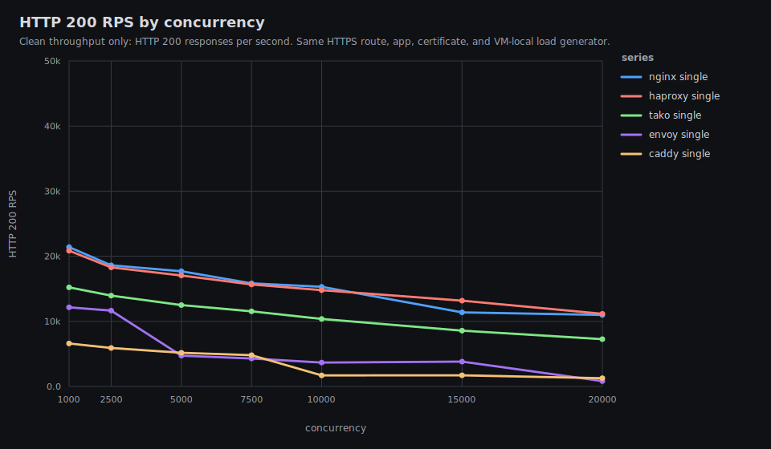
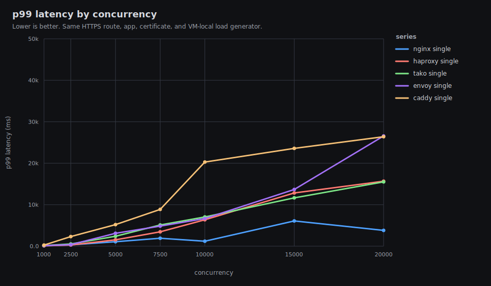
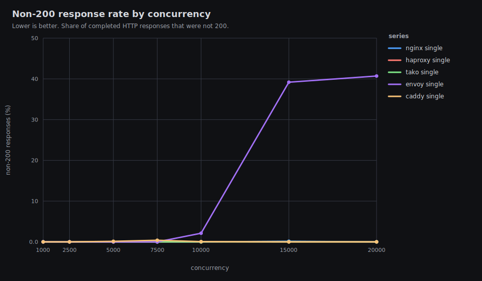
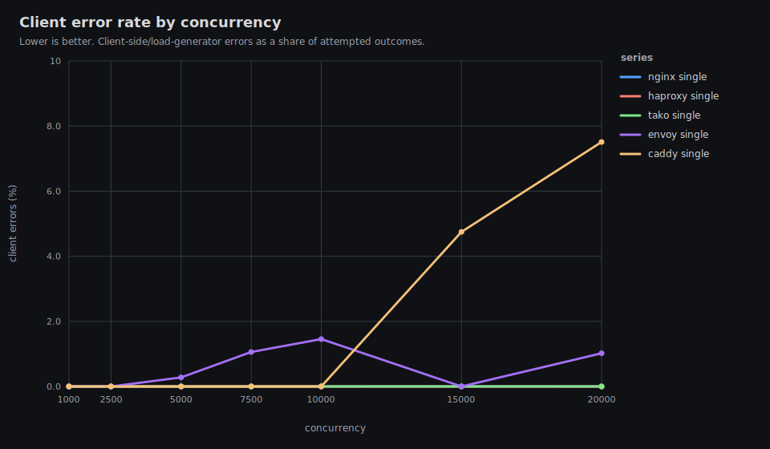
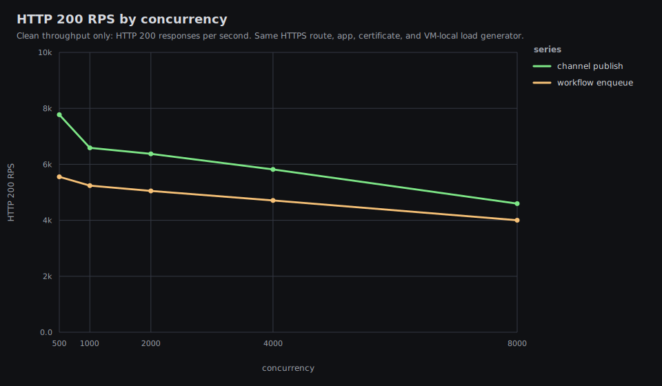
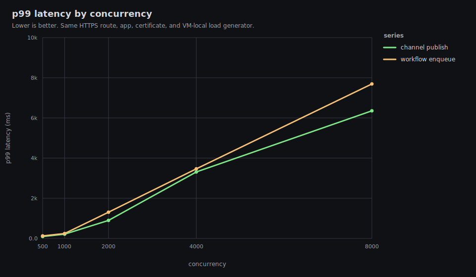
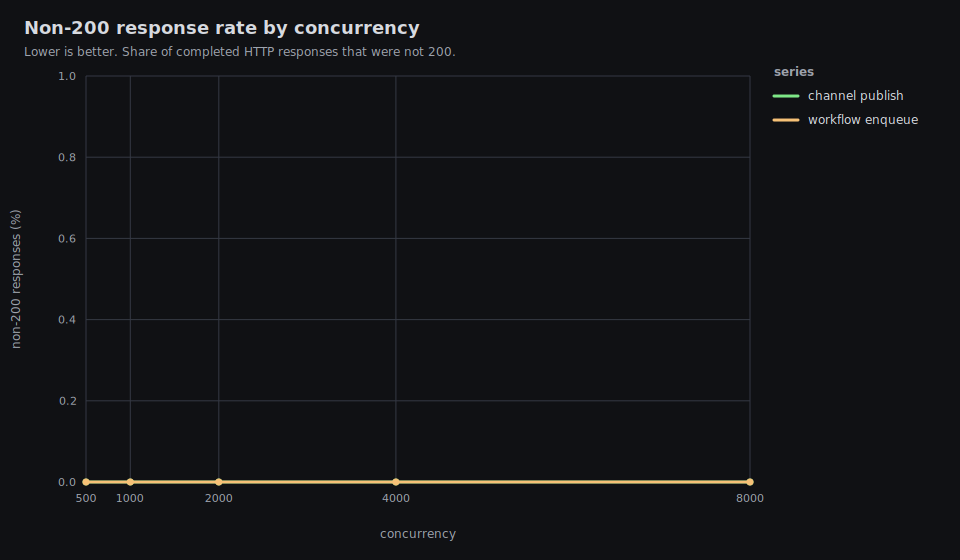

# Tako Proxy Performance Results

Date: 2026-06-04 UTC feature rerun

This is the public single-VM performance report for Tako against nginx,
HAProxy, Envoy, and Caddy. It intentionally omits exact hostnames, public IPs,
private network addresses, peer names, and user identifiers.

The timed path is VM-local: the load generator, proxy, and application all run
on the same benchmark VM, with TLS enabled for every proxy.

## Executive Summary

Latest release HTTP run and current master feature rerun:

- Tako release: `tako-server 0.0.0-09b3dc6`
- HTTP data: `results/20260602T052009Z/http-vm-local`
- HTTP graphs: `results/20260602T052009Z/http-vm-local/graphs/README.md`
- Feature rerun build: `tako-server 0.0.0-958986f`
- Channel/workflow data: `results/20260604T055839Z/tako-features-vm-local`
- Channel/workflow graphs:
  `results/20260604T055839Z/tako-features-vm-local/graphs/README.md`

TLDR:

- Nginx and HAProxy are the raw HTTPS reverse-proxy throughput leaders on this
  2 vCPU exe.dev VM. HAProxy stays close to nginx on RPS, but its high-load p99
  latency is materially worse.
- Tako is faster and cleaner than Caddy and Envoy in the heavy rows. At c5000
  and above, Envoy and Caddy either return non-200 responses or hit client
  timeouts; Tako stays all-200 with 0 client errors through c20000.
- Tako still does not match nginx or HAProxy on raw proxy throughput. Across
  c5000-c20000, Tako reaches about 66-75% of nginx 200 RPS and about 65-73% of
  HAProxy 200 RPS.
- Tako p99 latency is worse than nginx at every high-load row. It is also worse
  than HAProxy at c5000-c10000, then roughly comparable to HAProxy at c15000
  and c20000.
- A focused five-proxy Memory rerun using process PSS shows Tako at 511 MiB
  c5000, 911 MiB c10000, and 1.7 GiB c20000 while returning 100% 200. Caddy is
  1.5 GiB at c20000 but only 94.14% 200; Envoy is 1.0 GiB but only 51.41% 200.
- The current master feature rerun is clean through c8000 on this VM: channel
  publish reaches 4.6k 200 RPS at c8000 and workflow enqueue reaches 4.0k,
  with 0 non-200 responses and 0 client errors.
- This VM does not produce 60k-100k clean TLS RPS. In the heavy rows the load
  generator, proxy, and app share the same 2 vCPU budget and CPU reaches
  saturation.
- Load-balanced mode is intentionally excluded from this result set. Four local
  app processes on a 2 vCPU VM mostly measure process contention.

Judgement: this is a good stability result for Tako versus Caddy and Envoy, but
not a strong nginx/HAProxy parity result. The biggest remaining issues are raw
RPS and p99 latency versus nginx/HAProxy. Memory is materially lower when
measured as process PSS rather than RSS, but Tako still carries a higher
connection-state cost than nginx and HAProxy at the largest row.

## Headline HTTP Results









| proxy | conc | 200 rps | p50 | p99 | non-200 | client errors | status | error kinds |
|---|---:|---:|---:|---:|---:|---:|---|---|
| nginx | 1,000 | 21,404 | 43 ms | 100 ms | 0.00% | 0 (0.00%) | 200:642693 |  |
| haproxy | 1,000 | 20,848 | 43 ms | 103 ms | 0.00% | 0 (0.00%) | 200:625794 |  |
| tako | 1,000 | 15,223 | 64 ms | 154 ms | 0.00% | 0 (0.00%) | 200:456820 |  |
| envoy | 1,000 | 12,153 | 78 ms | 145 ms | 0.00% | 0 (0.00%) | 200:365160 |  |
| caddy | 1,000 | 6,599 | 147 ms | 260 ms | 0.00% | 0 (0.00%) | 200:198657 |  |
| nginx | 2,500 | 18,607 | 117 ms | 315 ms | 0.00% | 0 (0.00%) | 200:558847 |  |
| haproxy | 2,500 | 18,284 | 119 ms | 278 ms | 0.00% | 0 (0.00%) | 200:549833 |  |
| tako | 2,500 | 13,957 | 189 ms | 527 ms | 0.00% | 0 (0.00%) | 200:420578 |  |
| envoy | 2,500 | 11,651 | 200 ms | 374 ms | 0.00% | 0 (0.00%) | 200:350918 |  |
| caddy | 2,500 | 5,912 | 401 ms | 2,313 ms | 0.00% | 0 (0.00%) | 200:178844 |  |
| nginx | 5,000 | 17,698 | 242 ms | 1,077 ms | 0.00% | 0 (0.00%) | 200:532442 |  |
| haproxy | 5,000 | 17,050 | 237 ms | 1,528 ms | 0.00% | 0 (0.00%) | 200:514840 |  |
| tako | 5,000 | 12,504 | 435 ms | 2,392 ms | 0.00% | 0 (0.00%) | 200:379112 |  |
| envoy | 5,000 | 4,735 | 352 ms | 3,104 ms | 0.00% | 872 (0.28%) | 200:312643 | timeout:872 |
| caddy | 5,000 | 5,174 | 850 ms | 5,198 ms | 0.14% | 0 (0.00%) | 200:158054, 502:214 |  |
| nginx | 7,500 | 15,834 | 397 ms | 1,906 ms | 0.00% | 0 (0.00%) | 200:477192 |  |
| haproxy | 7,500 | 15,666 | 365 ms | 3,457 ms | 0.00% | 0 (0.00%) | 200:472402 |  |
| tako | 7,500 | 11,543 | 653 ms | 5,114 ms | 0.00% | 0 (0.00%) | 200:351706 |  |
| envoy | 7,500 | 4,303 | 348 ms | 4,843 ms | 0.00% | 3,216 (1.06%) | 200:300460 | timeout:3216 |
| caddy | 7,500 | 4,804 | 1,240 ms | 8,871 ms | 0.39% | 0 (0.00%) | 200:148016, 502:581 |  |
| nginx | 10,000 | 15,309 | 598 ms | 1,193 ms | 0.00% | 0 (0.00%) | 200:464122 |  |
| haproxy | 10,000 | 14,788 | 496 ms | 6,365 ms | 0.00% | 0 (0.00%) | 200:447490 |  |
| tako | 10,000 | 10,373 | 913 ms | 7,050 ms | 0.00% | 0 (0.00%) | 200:318037 |  |
| envoy | 10,000 | 3,664 | 537 ms | 6,660 ms | 2.12% | 3,984 (1.46%) | 200:263947, 503:5728 | timeout:3984 |
| caddy | 10,000 | 1,705 | 2,790 ms | 20,281 ms | 0.06% | 0 (0.00%) | 200:71204, 502:44 |  |
| nginx | 15,000 | 11,384 | 1,007 ms | 6,083 ms | 0.15% | 12 (0.00%) | 200:348100, 500:511 | eof:12 |
| haproxy | 15,000 | 13,176 | 683 ms | 12,836 ms | 0.00% | 0 (0.00%) | 200:403922 |  |
| tako | 15,000 | 8,566 | 1,421 ms | 11,648 ms | 0.00% | 0 (0.00%) | 200:266322 |  |
| envoy | 15,000 | 3,814 | 1,274 ms | 13,665 ms | 39.19% | 0 (0.00%) | 200:117239, 503:75555 |  |
| caddy | 15,000 | 1,715 | 6,855 ms | 23,587 ms | 0.00% | 2,797 (4.75%) | 200:56106 | timeout:2797 |
| nginx | 20,000 | 10,991 | 1,637 ms | 3,808 ms | 0.00% | 0 (0.00%) | 200:338855 |  |
| haproxy | 20,000 | 11,162 | 893 ms | 15,659 ms | 0.00% | 0 (0.00%) | 200:338881 |  |
| tako | 20,000 | 7,266 | 1,904 ms | 15,502 ms | 0.00% | 0 (0.00%) | 200:230025 |  |
| envoy | 20,000 | 828 | 3,679 ms | 26,570 ms | 40.70% | 891 (1.02%) | 200:51240, 503:35164 | timeout:891 |
| caddy | 20,000 | 1,271 | 9,655 ms | 26,386 ms | 0.00% | 5,052 (7.51%) | 200:62216 | timeout:5052 |

## Resource Highlights

Every row below is from the same HTTP result directory. `max CPU` is total VM
CPU, where 100% means both vCPUs are busy. Process CPU is the sampled share of
total VM CPU. Memory is broken out separately below using PSS/private sampling.

| proxy | conc | max CPU | proxy CPU | app CPU | loadgen CPU | max TLS conns |
|---|---:|---:|---:|---:|---:|---:|
| nginx | 5,000 | 100.0% | 49.5% | 24.3% | 39.5% | 5,023 |
| haproxy | 5,000 | 100.0% | 45.4% | 19.3% | 45.5% | 5,000 |
| tako | 5,000 | 99.7% | 49.5% | 19.9% | 41.1% | 5,035 |
| envoy | 5,000 | 99.3% | 67.9% | 14.4% | 32.6% | 5,008 |
| caddy | 5,000 | 99.2% | 70.5% | 16.8% | 26.8% | 5,000 |
| nginx | 10,000 | 100.0% | 47.4% | 18.8% | 54.2% | 9,491 |
| haproxy | 10,000 | 100.0% | 51.4% | 19.4% | 46.3% | 10,000 |
| tako | 10,000 | 99.9% | 61.5% | 19.2% | 36.5% | 10,059 |
| envoy | 10,000 | 100.0% | 66.1% | 13.2% | 48.2% | 10,076 |
| caddy | 10,000 | 99.7% | 80.0% | 7.8% | 41.6% | 10,000 |
| nginx | 15,000 | 100.0% | 55.4% | 19.4% | 39.8% | 12,940 |
| haproxy | 15,000 | 100.0% | 51.7% | 18.5% | 49.8% | 15,115 |
| tako | 15,000 | 99.9% | 60.5% | 18.9% | 37.7% | 15,280 |
| envoy | 15,000 | 99.9% | 92.2% | 7.1% | 43.4% | 15,107 |
| caddy | 15,000 | 99.9% | 78.6% | 6.1% | 52.7% | 15,000 |
| nginx | 20,000 | 100.0% | 40.8% | 18.0% | 41.2% | 14,168 |
| haproxy | 20,000 | 100.0% | 54.5% | 17.4% | 49.6% | 20,012 |
| tako | 20,000 | 99.9% | 60.1% | 18.6% | 44.0% | 20,396 |
| envoy | 20,000 | 99.9% | 99.4% | 7.0% | 72.6% | 20,175 |
| caddy | 20,000 | 100.0% | 76.1% | 7.8% | 27.1% | 20,000 |

CPU is not the main differentiator in the heavy rows because all proxies can
saturate the VM. The important user-visible gaps are clean throughput, tail
latency under saturation, and memory per active downstream connection. A 5k
keepalive control measured full Tako only about 14 MiB above a comparable
fixed-upstream Pingora reverse proxy, so the RSS gap should be read mostly as a
Pingora/TLS connection-state cost rather than a Tako routing/LB leak.

## Memory Comparison

Raw data: `results/20260605T071808Z/http-vm-local`

This focused rerun uses the same five public proxies at c5000, c10000, and
c20000. Memory is process PSS from `/proc/<pid>/smaps_rollup`, so shared mapped
pages are not double-counted. The c20000 200 column stays beside Memory because
Envoy and Caddy are degraded at the largest row.

| proxy | c5000 Memory | c10000 Memory | c20000 Memory | c20000 200 | private memory at c20000 |
|---|---:|---:|---:|---:|---:|
| nginx | 159 MiB | 159 MiB | 451 MiB | 99.43% | 445 MiB |
| HAProxy | 248 MiB | 406 MiB | 624 MiB | 100% | 624 MiB |
| Tako | 511 MiB | 911 MiB | 1.7 GiB | 100% | 1.6 GiB |
| Envoy | 323 MiB | 554 MiB | 1.0 GiB | 51.41% | 1.0 GiB |
| Caddy | 621 MiB | 1.2 GiB | 1.5 GiB | 94.14% | 1.5 GiB |

Conclusion: the old c20000 resident-memory readout overstated Tako's footprint
by about 1 GiB. With PSS, Tako is still higher than nginx and HAProxy at
c20000, but it is 1.7 GiB while staying at 100% 200. Caddy is close on Memory
at c20000, but that row is not equivalent capacity because 5.86% of attempted
outcomes are client timeouts.

## Channels And Workflows

These rows use `tako-server 0.0.0-958986f` from current master, the same
VM-local HTTPS path, 16 loopback source IPs, and a single Tako app instance.
The endpoints are implemented with the JavaScript SDK:

- `/channel-publish`: publishes one message to a `feed` channel.
- `/workflow-enqueue`: enqueues one `noop` workflow payload.

The workflow handler performs one persisted `ctx.run("ack", ...)` step and
returns immediately.








| endpoint | conc | 200 rps | p50 | p99 | non-200 | client errors | status |
|---|---:|---:|---:|---:|---:|---:|---|
| channel-publish | 500 | 7,773 | 65 ms | 94 ms | 0.00% | 0 (0.00%) | 200:233529 |
| workflow-enqueue | 500 | 5,555 | 90 ms | 126 ms | 0.00% | 0 (0.00%) | 200:167120 |
| channel-publish | 1,000 | 6,589 | 146 ms | 213 ms | 0.00% | 0 (0.00%) | 200:198536 |
| workflow-enqueue | 1,000 | 5,239 | 187 ms | 243 ms | 0.00% | 0 (0.00%) | 200:158061 |
| channel-publish | 2,000 | 6,375 | 297 ms | 896 ms | 0.00% | 0 (0.00%) | 200:192869 |
| workflow-enqueue | 2,000 | 5,049 | 378 ms | 1,305 ms | 0.00% | 0 (0.00%) | 200:153080 |
| channel-publish | 4,000 | 5,818 | 618 ms | 3,311 ms | 0.00% | 0 (0.00%) | 200:177961 |
| workflow-enqueue | 4,000 | 4,709 | 772 ms | 3,466 ms | 0.00% | 0 (0.00%) | 200:144652 |
| channel-publish | 8,000 | 4,595 | 1,417 ms | 6,355 ms | 0.00% | 0 (0.00%) | 200:143792 |
| workflow-enqueue | 8,000 | 4,001 | 1,640 ms | 7,693 ms | 0.00% | 0 (0.00%) | 200:126129 |

### Feature Resource Highlights

| endpoint | conc | max CPU | proxy CPU | app CPU | loadgen CPU | max TLS conns |
|---|---:|---:|---:|---:|---:|---:|
| channel-publish | 4,000 | 91.8% | 61.6% | 16.0% | 36.7% | 4,000 |
| workflow-enqueue | 4,000 | 95.8% | 43.1% | 13.8% | 31.7% | 4,191 |
| channel-publish | 8,000 | 99.8% | 63.7% | 18.3% | 33.0% | 8,124 |
| workflow-enqueue | 8,000 | 99.5% | 60.8% | 18.8% | 46.4% | 8,038 |

Judgement: the current master feature path is clean through c8000 on this small
VM. Both endpoints persist state, so the proxy, app, Bun runtime,
SQLite-backed feature store, workflow dispatcher, and load generator still
compete inside the same 2 vCPU budget. The c8000 rows show saturation through
tail latency, not response failures.

## What Changed

This result set adds HAProxy and Envoy to the proxy matrix under the same
VM-local TLS route and upstream app.

The benchmark harness was also corrected:

- high-concurrency proxy rows use 16 loopback source IPs so Tako's released
  per-IP active-request guard does not become the benchmark bottleneck;
- HAProxy and Envoy configs are first-class benchmark targets;
- Envoy's default cluster circuit breakers are raised for the final matrix;
  otherwise Envoy returns 503s at moderate concurrency because the defaults
  become the result;
- row cleanup/fetch now runs defensively so a failed file transfer cannot leave
  a proxy or metrics sampler running on the VM;
- the metrics sampler captures HAProxy and the extracted Envoy binary.

## Why Tako Still Trails Nginx And HAProxy

Nginx is configured here as a static reverse proxy. Tako still does
product-level work on the request path:

- app route lookup;
- source IP derivation;
- per-client limiter accounting;
- app/instance selection;
- selected-instance in-flight accounting;
- upstream peer construction;
- forwarding header normalization;
- Pingora session/connection state.

Several obvious suspects have already been checked. Metrics are disabled in the
timed proxy path, load-balanced mode is excluded on this 2 vCPU VM, and earlier
diagnostics showed that route lookup and limiter accounting alone do not explain
the gap.

Additional 2026-06-02 diagnostics:

- RSS attribution: on the same 2 vCPU exe.dev VM at 5k live HTTPS keepalive
  connections, raw Tokio + OpenSSL used ~136.6 MiB RSS, a Pingora HTTPS
  responder used ~341.4 MiB, a fixed-upstream Pingora reverse proxy used
  ~535.3 MiB, and full Tako used ~549.0 MiB after deploy. The large jump is
  the generic Pingora reverse-proxy path; full Tako was only ~14 MiB above the
  comparable fixed Pingora reverse proxy in that control.
- Fixed Pingora RPS control: a minimal fixed-upstream Pingora reverse proxy was
  not faster than Tako on this harness. It reached ~7.1k RPS at c10000, ~4.7k
  at c15000, and ~1.6k at c20000 with 502s. This makes it unlikely that Tako's
  route lookup, load-balancer lookup, or limiter accounting alone explains the
  nginx/HAProxy gap.
- A local patched Tako build with a cheaper existing-IP limiter path was noisy:
  c10000 was roughly flat, c15000 looked better in one run but release rerun
  results overlapped, and c20000 still collapsed. Treat it as a small cleanup,
  not a proven headline win.

Recommended next steps:

- Profile `tako-server` with `perf`/flamegraphs on a larger VM or with an
  external same-region load generator so the load generator does not share the
  same 2 vCPU budget.
- Investigate Pingora downstream session behavior and upstream proxy tuning
  under 10k-20k TLS connections.
- Investigate whether Tako can reuse or precompute more per-instance upstream
  peer/header state without changing behavior.
- Add a larger or multi-node load-balanced benchmark when a suitable testbed is
  available.
- Keep profiling channel/workflow c8000+ tail latency and Memory now that the
  current master run stays clean at that load.

## Test Host And Network

### Load Generator

The timed load generator ran on the benchmark VM, not on the laptop. The laptop
only orchestrated over SSH and received result files. Local desktop CPU load
therefore does not materially affect these timed results.

### Server

- Provider: exe.dev
- OS: Ubuntu 24.04.4 LTS, Linux 6.12.90, x86_64
- VM: KVM
- CPU: 2 vCPU, AMD EPYC 9554P 64-Core Processor
- Memory: 7.8 GiB, no swap
- Disk: 25 GiB root filesystem
- Region observed from public geolocation: Tokyo, Japan
- Mac-to-VM public endpoint ping from the earlier environment check: about
  72 ms average, 0% packet loss

The public web access URL was not used for timed proxy comparison because it
would measure an access layer outside Tako/nginx/HAProxy/Envoy/Caddy. The
controlled route for timed HTTP tests was:

```text
https://bench.test:18443/
Host/SNI: bench.test
Resolved to: 127.0.0.1 on the benchmark VM
TLS: same self-signed certificate for every proxy
```

## Software Versions

- Tako HTTP matrix: `tako-server 0.0.0-09b3dc6`
- Tako feature rerun: `tako-server 0.0.0-958986f`
- nginx: `nginx/1.24.0 (Ubuntu)`
- HAProxy: `2.8.16-0ubuntu0.24.04.2`
- Envoy: `1.38.0`, extracted from the official Envoy image and run directly
- Caddy: `v2.11.3` custom build with `github.com/mholt/caddy-ratelimit`
- Go on VM: `go1.26.3 linux/amd64`
- Bun runtime for feature app: `1.3.14`

## Applications

### HTTP App

The HTTP comparison uses `cmd/benchapp`, a small Go application with identical
payloads behind all five proxies:

- `/plaintext`: `hello, world\n`, fixed `Content-Length: 13`
- `/json`: `{"message":"hello","ok":true}\n`
- `/status`: internal Tako health check endpoint when `Host: bench-http.tako`
- `/pid`: instance metadata for manual checks

Nginx, HAProxy, Envoy, and Caddy start the same Go binary on loopback ports.
Tako runs the same binary as a deployed app from the benchmark VM's Tako data
directory.

### Channels And Workflows App

The feature benchmark uses `apps/channels-workflows`, a small Bun/Tako SDK app:

- `/channel-publish`: `feed.publish({ type: "tick", data: ... })`
- `/workflow-enqueue`: `noop.enqueue({ seq, at })`
- `/status`: JSON health response

The workflow handler performs one persisted `ctx.run("ack", ...)` step and
returns immediately.

## Methodology

- One route and TLS certificate were used for all HTTP proxy comparisons:
  `bench.test:18443`.
- The load generator resolves `bench.test:18443` to `127.0.0.1` on the VM and
  sets both Host and SNI to `bench.test`.
- TLS verification is disabled because the certificate is self-signed, but TLS
  is still active for every proxy.
- HTTP/2 is disabled in the load generator, so the comparison is HTTP/1.1 over
  TLS.
- Each timed case has a 10 second warmup followed by a 30 second measurement
  window. Rows may run longer while outstanding requests drain or time out.
- Current scripts use `REQUEST_TIMEOUT=60s`; each result JSON records the
  effective `request_timeout_sec`.
- Single mode uses one upstream instance.
- Tako runs with `--metrics-port 0` and `--no-acme` during proxy comparison.
- High-concurrency runs use 16 loopback source IPs, `127.0.0.2` through
  `127.0.0.17`, to avoid turning Tako's default 2048 concurrent request cap per
  source IP into the benchmark bottleneck.
- Proxy configs include comparable request/connection protection where the
  proxy exposes a practical knob. Tako's released default enforces 2048 active
  requests per derived client IP, so the final run uses 16 loopback source IPs
  instead of turning that safety limit into the result. Nginx and HAProxy use
  high per-IP connection guards. Caddy uses `github.com/mholt/caddy-ratelimit`
  with a high per-IP request-rate ceiling. Envoy uses a high local rate limit
  and raised cluster circuit-breaker thresholds for the benchmark.
- Metrics are sampled once per second from `/proc` on the VM: total CPU, memory
  used/available, proxy/app/loadgen CPU, proxy/app/loadgen Memory, and established
  TLS connections.
- Before each row, the harness stops the previous proxy and app processes. The
  final HTTP run uses `PROXIES='nginx haproxy envoy tako caddy'` and
  `COOLDOWN_SECONDS=10`.

This is not a pure proxy microbenchmark because the load generator, proxy, and
app processes all share the same 2 vCPU VM. It is a useful "what can this one VM
produce end-to-end?" benchmark.

## Reproducing

Sync the repo to the VM, install the current Tako release, pass its absolute
path as `TAKO_SERVER_BIN`, then run:

```bash
BENCH_VM=<ssh-host> \
TAKO_SERVER_BIN=/opt/tako-performance/bin/<tako-server-release> \
SOURCE_IPS='127.0.0.2,127.0.0.3,127.0.0.4,127.0.0.5,127.0.0.6,127.0.0.7,127.0.0.8,127.0.0.9,127.0.0.10,127.0.0.11,127.0.0.12,127.0.0.13,127.0.0.14,127.0.0.15,127.0.0.16,127.0.0.17' \
CONCURRENCY_LIST='1000 2500 5000 7500 10000 15000 20000' \
WARMUP=10s \
DURATION=30s \
REQUEST_TIMEOUT=60s \
METRICS_INTERVAL=1 \
METRICS_CONNECTIONS=1 \
COOLDOWN_SECONDS=10 \
PROXIES='nginx haproxy envoy tako caddy' \
MODES=single \
ENDPOINTS=plaintext \
./scripts/run-vm-local-http-benchmarks.sh
```

Feature endpoints:

```bash
BENCH_VM=<ssh-host> \
TAKO_SERVER_BIN=/opt/tako-performance/bin/<tako-server-release> \
SOURCE_IPS='127.0.0.2,127.0.0.3,127.0.0.4,127.0.0.5,127.0.0.6,127.0.0.7,127.0.0.8,127.0.0.9,127.0.0.10,127.0.0.11,127.0.0.12,127.0.0.13,127.0.0.14,127.0.0.15,127.0.0.16,127.0.0.17' \
CONCURRENCY_LIST='500 1000 2000 4000 8000' \
WARMUP=10s \
DURATION=30s \
REQUEST_TIMEOUT=60s \
METRICS_INTERVAL=1 \
METRICS_CONNECTIONS=1 \
COOLDOWN_SECONDS=10 \
./scripts/run-vm-local-tako-feature-benchmarks.sh
```

Regenerate graphs after editing result CSVs or the graph renderer:

```bash
./scripts/render-metrics-graphs.sh results/<timestamp>/http-vm-local
./scripts/render-metrics-graphs.sh results/<timestamp>/tako-features-vm-local
```
