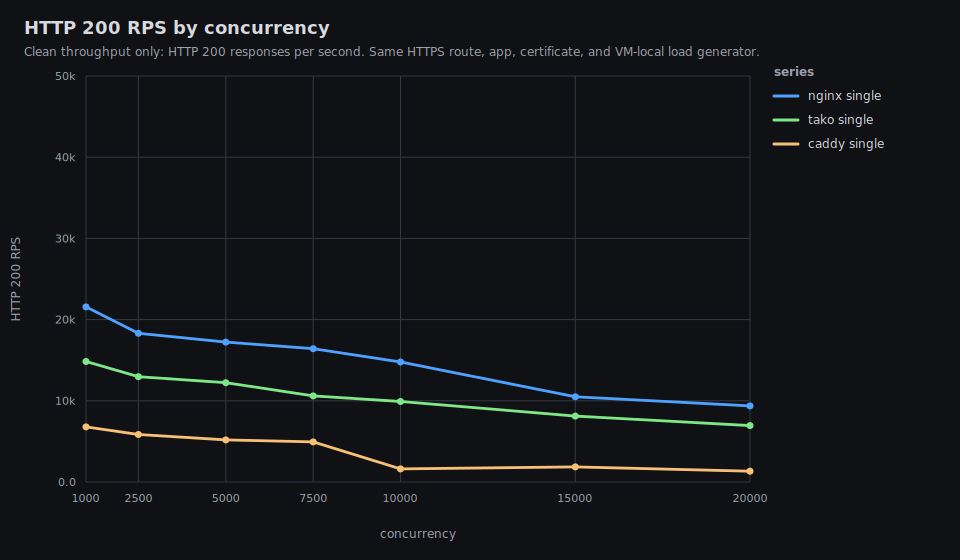
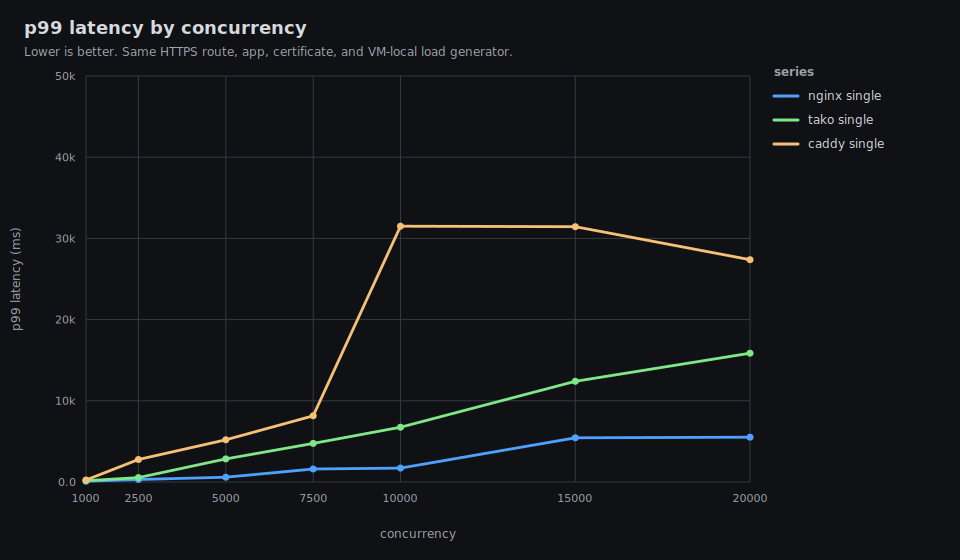
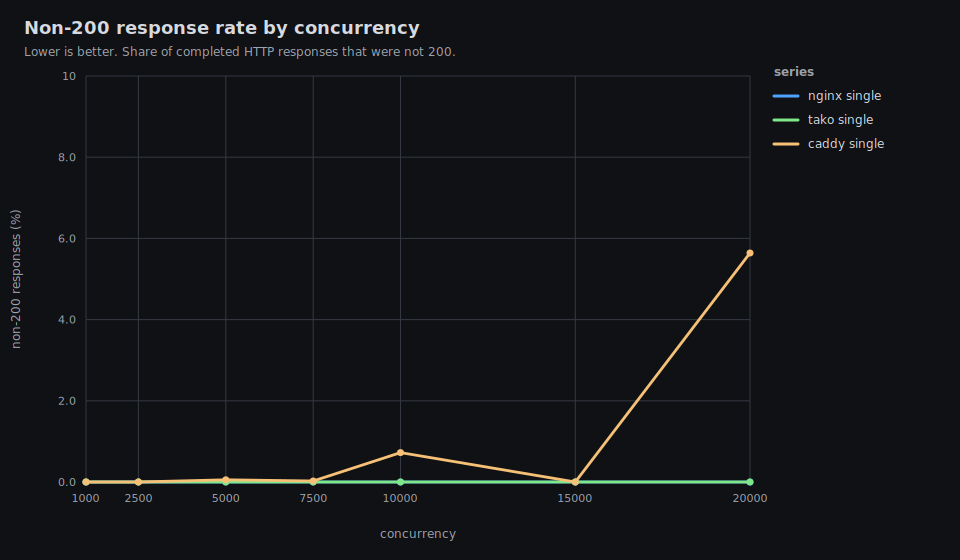
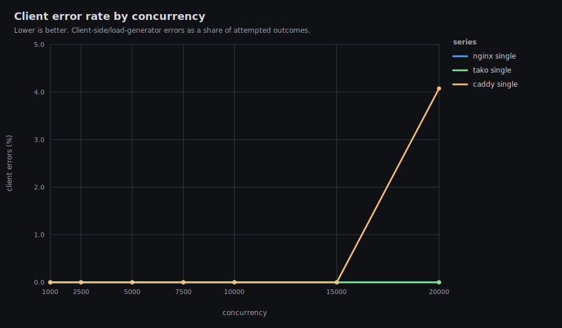
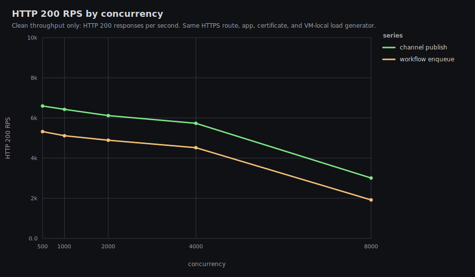
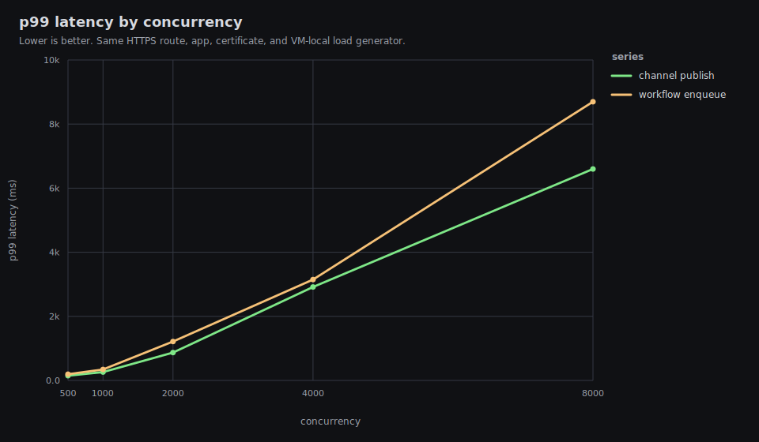
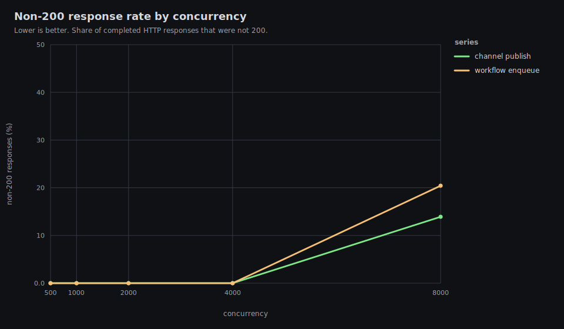

# Tako Proxy Performance Results

Date: 2026-06-01 UTC

This is the public single-VM performance report for Tako against nginx and
Caddy. It intentionally omits exact hostnames, public IPs, private network
addresses, peer names, and user identifiers.

The timed path is VM-local: the load generator, proxy, and application all run
on the same benchmark VM, with TLS enabled for every proxy.

## Executive Summary

Latest release run:

- Tako release: `tako-server 0.0.0-339c020`
- HTTP data: `results/20260601T070108Z/http-vm-local`
- HTTP graphs: `results/20260601T070108Z/http-vm-local/graphs/README.md`
- Channel/workflow data: `results/20260601T064522Z/tako-features-vm-local`
- Channel/workflow graphs:
  `results/20260601T064522Z/tako-features-vm-local/graphs/README.md`

TLDR:

- Tako improved materially after the proxy hot-path release, but it still does
  not match nginx on raw HTTPS reverse-proxy throughput.
- Tako is consistently faster and more stable than Caddy in this setup.
- In the clean single-upstream HTTP/TLS run, Tako is roughly 65-74% of nginx
  200 RPS across the heavier rows and has materially worse p99 latency.
- Tako stays clean through c20000 in the final run: 0 client errors and 0
  non-200 responses. Caddy enters clear failure mode at c20000. Nginx also
  stays clean in the final run.
- Channels/workflows are good through c4000 on this 2 vCPU VM, but not
  excellent overall: at c8000 they enter overload with 14-20% non-200
  responses.
- The main visible gap is proxy RSS under high concurrency. At c20000, sampled
  proxy RSS peaks at about 2.6 GiB for Tako, 1.6 GiB for Caddy, and 321 MiB for
  nginx.
- This VM does not reach 60k-100k clean TLS RPS. CPU saturates across the
  heavy rows, and the load generator shares the same 2 vCPU budget as the
  proxy and app.
- Load-balanced mode is intentionally excluded from this exe-node result set.
  Four local app processes on a 2 vCPU VM mostly measure process contention.

## Headline HTTP Results









| proxy | conc | 200 rps | p50 | p99 | non-200 | client errors | status | error kinds |
|---|---:|---:|---:|---:|---:|---:|---|---|
| caddy | 1,000 | 6,784 | 143 ms | 252 ms | 0.00% | 0.00% | 200:204174 | |
| nginx | 1,000 | 21,565 | 43 ms | 96 ms | 0.00% | 0.00% | 200:647534 | |
| tako | 1,000 | 14,836 | 65 ms | 154 ms | 0.00% | 0.00% | 200:445542 | |
| caddy | 2,500 | 5,850 | 401 ms | 2,772 ms | 0.00% | 0.00% | 200:176883 | |
| nginx | 2,500 | 18,310 | 123 ms | 303 ms | 0.00% | 0.00% | 200:551263 | |
| tako | 2,500 | 12,971 | 205 ms | 543 ms | 0.00% | 0.00% | 200:390983 | |
| caddy | 5,000 | 5,191 | 850 ms | 5,199 ms | 0.05% | 0.00% | 200:158259, 502:84 | |
| nginx | 5,000 | 17,230 | 250 ms | 595 ms | 0.00% | 0.00% | 200:518679 | |
| tako | 5,000 | 12,229 | 445 ms | 2,847 ms | 0.00% | 0.00% | 200:370772 | |
| caddy | 7,500 | 4,934 | 1,204 ms | 8,156 ms | 0.02% | 0.00% | 200:152868, 502:37 | |
| nginx | 7,500 | 16,414 | 402 ms | 1,607 ms | 0.00% | 0.00% | 200:494569 | |
| tako | 7,500 | 10,608 | 697 ms | 4,757 ms | 0.00% | 0.00% | 200:322539 | |
| caddy | 10,000 | 1,616 | 3,130 ms | 31,500 ms | 0.72% | 0.00% | 200:64810, 502:472 | |
| nginx | 10,000 | 14,779 | 599 ms | 1,710 ms | 0.00% | 0.00% | 200:446282 | |
| tako | 10,000 | 9,914 | 954 ms | 6,746 ms | 0.00% | 0.00% | 200:304452 | |
| caddy | 15,000 | 1,860 | 5,929 ms | 31,441 ms | 0.00% | 0.00% | 200:60098 | |
| nginx | 15,000 | 10,490 | 1,150 ms | 5,439 ms | 0.00% | 0.00% | 200:326072 | |
| tako | 15,000 | 8,120 | 1,426 ms | 12,404 ms | 0.00% | 0.00% | 200:252541 | |
| caddy | 20,000 | 1,334 | 9,507 ms | 27,377 ms | 5.64% | 4.08% | 200:58937, 502:3523 | timeout:2654 |
| nginx | 20,000 | 9,376 | 1,823 ms | 5,518 ms | 0.00% | 0.00% | 200:296377 | |
| tako | 20,000 | 6,943 | 1,969 ms | 15,856 ms | 0.00% | 0.00% | 200:217845 | |

## Resource Highlights

Every row below is from the same HTTP result directory. `max CPU` is total VM
CPU, where 100% means both vCPUs are busy. Process CPU is the sampled share of
total VM CPU. RSS values are peak sampled resident memory.

| proxy | conc | max CPU | proxy CPU | app CPU | loadgen CPU | proxy RSS | app RSS | loadgen RSS | max TLS conns |
|---|---:|---:|---:|---:|---:|---:|---:|---:|---:|
| nginx | 1,000 | 98.7% | 31.1% | 21.9% | 43.5% | 56 MiB | 33 MiB | 105 MiB | 1,000 |
| caddy | 1,000 | 98.2% | 56.6% | 18.7% | 18.5% | 219 MiB | 46 MiB | 96 MiB | 1,000 |
| tako | 1,000 | 99.9% | 49.1% | 19.3% | 40.1% | 198 MiB | 36 MiB | 104 MiB | 1,002 |
| nginx | 5,000 | 99.9% | 47.0% | 23.8% | 50.7% | 199 MiB | 97 MiB | 384 MiB | 5,097 |
| caddy | 5,000 | 99.0% | 68.5% | 17.5% | 26.6% | 662 MiB | 129 MiB | 369 MiB | 5,000 |
| tako | 5,000 | 99.2% | 49.0% | 18.7% | 34.2% | 737 MiB | 116 MiB | 386 MiB | 5,029 |
| nginx | 10,000 | 100.0% | 45.4% | 23.0% | 44.6% | 416 MiB | 126 MiB | 671 MiB | 10,000 |
| caddy | 10,000 | 100.0% | 84.1% | 7.3% | 37.1% | 1,257 MiB | 127 MiB | 678 MiB | 10,000 |
| tako | 10,000 | 99.9% | 52.0% | 18.7% | 47.8% | 1,365 MiB | 214 MiB | 725 MiB | 10,066 |
| nginx | 20,000 | 100.0% | 47.2% | 16.3% | 47.3% | 321 MiB | 131 MiB | 1,124 MiB | 12,082 |
| caddy | 20,000 | 100.0% | 79.6% | 5.6% | 41.8% | 1,607 MiB | 133 MiB | 1,119 MiB | 20,000 |
| tako | 20,000 | 100.0% | 64.0% | 18.2% | 46.1% | 2,604 MiB | 389 MiB | 1,304 MiB | 20,126 |

The important resource result is not CPU, because all heavy rows saturate the
VM. The important gap is memory per active downstream connection/session. Tako
uses much more proxy RSS than nginx under high concurrency, and that remains
the clearest optimization target.

## Channels And Workflows

These rows use the same released `tako-server 0.0.0-339c020`, the same VM-local
HTTPS path, and a single Tako app instance. The endpoints are implemented with
the JavaScript SDK:

- `/channel-publish`: publishes one message to a `feed` channel.
- `/workflow-enqueue`: enqueues one `noop` workflow payload.








| endpoint | conc | 200 rps | p50 | p99 | non-200 | client errors | status |
|---|---:|---:|---:|---:|---:|---:|---|
| channel-publish | 500 | 6,594 | 74 ms | 148 ms | 0.00% | 0.00% | 200:198216 |
| workflow-enqueue | 500 | 5,321 | 94 ms | 195 ms | 0.00% | 0.00% | 200:160094 |
| channel-publish | 1,000 | 6,426 | 155 ms | 261 ms | 0.00% | 0.00% | 200:193461 |
| workflow-enqueue | 1,000 | 5,114 | 198 ms | 342 ms | 0.00% | 0.00% | 200:154320 |
| channel-publish | 2,000 | 6,116 | 329 ms | 869 ms | 0.00% | 0.00% | 200:185121 |
| workflow-enqueue | 2,000 | 4,890 | 417 ms | 1,215 ms | 0.00% | 0.00% | 200:148347 |
| channel-publish | 4,000 | 5,731 | 669 ms | 2,917 ms | 0.00% | 0.00% | 200:174912 |
| workflow-enqueue | 4,000 | 4,518 | 879 ms | 3,149 ms | 0.00% | 0.00% | 200:138943 |
| channel-publish | 8,000 | 3,007 | 1,560 ms | 6,598 ms | 13.91% | 0.00% | 200:100209, 502:16138, 503:60 |
| workflow-enqueue | 8,000 | 1,916 | 2,238 ms | 8,698 ms | 20.43% | 0.00% | 200:64724, 502:16536, 503:83 |

Judgement: good, not excellent. Through c4000, both feature endpoints remain
clean and produce useful throughput on a tiny VM. At c8000, the app/proxy path
is overloaded and starts returning 502/503 responses. For a normal latency SLO,
c1000 is the realistic healthy point in this run; c4000 is already a
high-pressure row with multi-second p99.

## What Changed In `339c020`

The release under test includes the latest proxy hot-path work:

- Normal upstream proxy requests skip image/channel/static handler probes unless
  the route actually needs those features.
- Plain proxy routing avoids extra path/host allocation on the common path.
- HTTPS request handling skips forwarded-header scheme parsing when the
  downstream transport is already TLS.
- Static and image handlers avoid method string allocation.
- Instance idle timestamps are updated only when in-flight requests return to
  zero instead of on every completed request.
- The benchmark harness now resets remote app release state before HTTP runs,
  so a prior feature benchmark cannot leave stale restore state behind.

This release improved Tako's clean mid-range HTTP throughput, but the nginx gap
is still material. At c5000, Tako reaches 12.2k clean 200 RPS; at c10000 it
reaches 9.9k; at c20000 it reaches 6.9k. Those are good overload-stability
numbers for this VM, but they are not nginx parity.

## Why Tako Still Trails Nginx

Nginx is configured here as a static reverse proxy. Tako still does
product-level work on the request path:

- app route lookup;
- source IP derivation;
- per-client limiter accounting;
- app/instance selection;
- selected-instance in-flight accounting;
- upstream peer construction;
- forwarding header normalization;
- Pingora session/connection state.

The final run points at downstream connection/session memory pressure as the
next best target. CPU is saturated for every proxy under heavy load, but Tako's
RSS grows much faster than nginx as concurrency rises. That can also make p99
latency worse under pressure because more CPU time is spent managing connection
state and memory.

Recommended next steps:

- Profile `tako-server` with `perf`/flamegraphs under c5000-c10000 on a larger
  testbed or with an external load generator, so the load generator does not
  share the same 2 vCPU budget.
- Inspect Pingora downstream session allocations and any Tako per-session state
  retained across requests.
- Audit whether limiter/client-IP metadata can be represented without per-request
  owned allocations or large per-connection maps.
- Add a second-VM same-region benchmark before making public max-RPS claims.

## Test Host And Network

### Load Generator

The timed load generator ran on the benchmark VM, not on the laptop. The laptop
only orchestrated over SSH and received result files. Local desktop CPU load
therefore does not materially affect these timed results.

### Server

- Provider: exe.dev
- OS: Ubuntu 24.04.4 LTS, Linux 6.12.90, x86_64
- VM: KVM
- CPU: 2 vCPU, AMD EPYC 9554P 64-Core Processor
- Memory: 7.8 GiB, no swap
- Disk: 25 GiB root filesystem
- Region observed from public geolocation: Tokyo, Japan
- Mac-to-VM public endpoint ping from the earlier environment check: about
  72 ms average, 0% packet loss

The public web access URL was not used for timed proxy comparison because it
would measure an access layer outside Tako/nginx/Caddy. The controlled route
for timed HTTP tests was:

```text
https://bench.test:18443/
Host/SNI: bench.test
Resolved to: 127.0.0.1 on the benchmark VM
TLS: same self-signed certificate for every proxy
```

## Software Versions

- Tako: `tako-server 0.0.0-339c020`
- nginx: `nginx/1.24.0 (Ubuntu)`
- Caddy: `v2.11.3` custom build with `github.com/mholt/caddy-ratelimit`
- Go on VM: `go1.26.3 linux/amd64`

## Applications

### HTTP App

The HTTP comparison uses `cmd/benchapp`, a small Go application with identical
payloads behind all three proxies:

- `/plaintext`: `hello, world\n`, fixed `Content-Length: 13`
- `/json`: `{"message":"hello","ok":true}\n`
- `/status`: internal Tako health check endpoint when `Host: bench-http.tako`
- `/pid`: instance metadata for manual checks

Nginx and Caddy start the same Go binary on loopback ports. Tako runs the same
binary as a deployed app from the benchmark VM's Tako data directory.

### Channels And Workflows App

The feature benchmark uses `apps/channels-workflows`, a small Bun/Tako SDK app:

- `/channel-publish`: `feed.publish({ type: "tick", data: ... })`
- `/workflow-enqueue`: `noop.enqueue({ seq, at })`
- `/status`: JSON health response

The workflow handler performs one persisted `ctx.run("ack", ...)` step and
returns immediately.

## Methodology

- One route and TLS certificate were used for all HTTP proxy comparisons:
  `bench.test:18443`.
- The load generator resolves `bench.test:18443` to `127.0.0.1` on the VM and
  sets both Host and SNI to `bench.test`.
- TLS verification is disabled because the certificate is self-signed, but TLS
  is still active for every proxy.
- HTTP/2 is disabled in the load generator, so the comparison is HTTP/1.1 over
  TLS.
- Each timed case has a 10 second warmup followed by a 30 second measurement
  window. Rows may run longer while outstanding requests drain or time out.
- Current scripts use `REQUEST_TIMEOUT=60s`; each result JSON records the
  effective `request_timeout_sec`.
- Single mode uses one upstream instance.
- Tako runs with `--metrics-port 0` and `--no-acme` during proxy comparison.
- High-concurrency runs use 16 loopback source IPs, `127.0.0.2` through
  `127.0.0.17`, to avoid turning Tako's default 2048 concurrent request cap per
  source IP into the benchmark bottleneck.
- Proxy configs include comparable per-client limiter work where the proxy
  supports it. Tako enforces 2048 concurrent requests per derived client IP.
  nginx uses `limit_conn` with the same 2048 per-IP cap and returns `429` when
  exceeded. Caddy uses `github.com/mholt/caddy-ratelimit` with a high per-IP
  request-rate ceiling by default, because the Caddy module is rate/window
  based rather than an exact concurrent-request limiter.
- Metrics are sampled once per second from `/proc` on the VM: total CPU,
  memory used/available, proxy/app/loadgen CPU, proxy/app/loadgen RSS, and
  established TLS connections.
- Before each proxy row, the harness stops the previous proxy and app processes.
  When Tako is running, nginx and Caddy are stopped; when nginx is running,
  Tako and Caddy are stopped; and so on.

This is not a pure proxy microbenchmark because the load generator, proxy, and
app processes all share the same 2 vCPU VM. It is a useful "what can this one
VM produce end-to-end?" benchmark.

## Historical Data

Older result directories are kept for comparison and regression analysis:

- `results/20260531T113110Z/http-vm-local`: active-set release rerun.
- `results/20260531T120513Z/tako-features-vm-local`: active-set feature rerun.
- `results/20260531T153937Z/http-vm-local`: metrics-disabled release rerun.
- `results/20260531T163148Z/http-vm-local`: response-cache-disabled rerun.
- `results/20260531T171211Z/http-vm-local`: compression-disabled release rerun.
- `results/20260531T173340Z/tako-features-vm-local`: compression-disabled
  feature rerun.
- `results/20260531T182907Z/http-vm-local`: route-hot-path release rerun before
  the upstream keepalive fix.
- `results/20260531T193211Z/http-vm-local`: full clean HTTP baseline rerun.
- `results/20260531T195359Z/tako-features-vm-local`: earlier feature rerun.
- `results/20260531T205609Z/http-vm-local`: fixed load-generator high-load
  client-error rerun.
- `results/20260601T064522Z/tako-features-vm-local`: latest feature rerun.
- `results/20260601T070108Z/http-vm-local`: latest HTTP release rerun.

## Reproducing

Sync the repo to the VM, install the current Tako release as
`/usr/local/bin/tako-server`, then run:

```bash
BENCH_VM=<ssh-host> \
SOURCE_IPS='127.0.0.2,127.0.0.3,127.0.0.4,127.0.0.5,127.0.0.6,127.0.0.7,127.0.0.8,127.0.0.9,127.0.0.10,127.0.0.11,127.0.0.12,127.0.0.13,127.0.0.14,127.0.0.15,127.0.0.16,127.0.0.17' \
CONCURRENCY_LIST='1000 2500 5000 7500 10000 15000 20000' \
WARMUP=10s \
DURATION=30s \
REQUEST_TIMEOUT=60s \
METRICS_INTERVAL=1 \
METRICS_CONNECTIONS=1 \
PROXIES='nginx caddy tako' \
MODES=single \
ENDPOINTS=plaintext \
./scripts/run-vm-local-http-benchmarks.sh
```

Feature endpoints:

```bash
BENCH_VM=<ssh-host> \
SOURCE_IPS='127.0.0.2,127.0.0.3,127.0.0.4,127.0.0.5,127.0.0.6,127.0.0.7,127.0.0.8,127.0.0.9,127.0.0.10,127.0.0.11,127.0.0.12,127.0.0.13,127.0.0.14,127.0.0.15,127.0.0.16,127.0.0.17' \
CONCURRENCY_LIST='500 1000 2000 4000 8000' \
WARMUP=10s \
DURATION=30s \
REQUEST_TIMEOUT=60s \
METRICS_INTERVAL=1 \
METRICS_CONNECTIONS=1 \
./scripts/run-vm-local-tako-feature-benchmarks.sh
```

Regenerate graphs after editing result CSVs or the graph renderer:

```bash
./scripts/render-metrics-graphs.sh results/<timestamp>/http-vm-local
./scripts/render-metrics-graphs.sh results/<timestamp>/tako-features-vm-local
```
