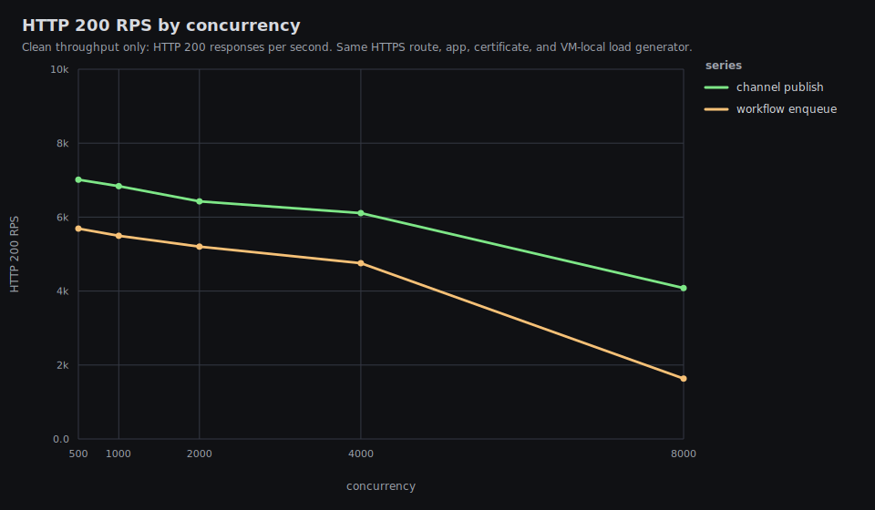
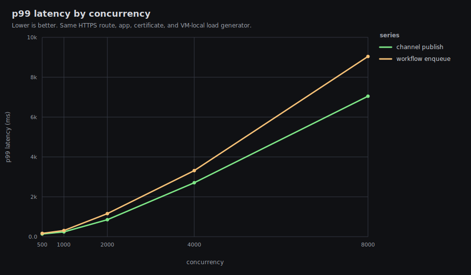
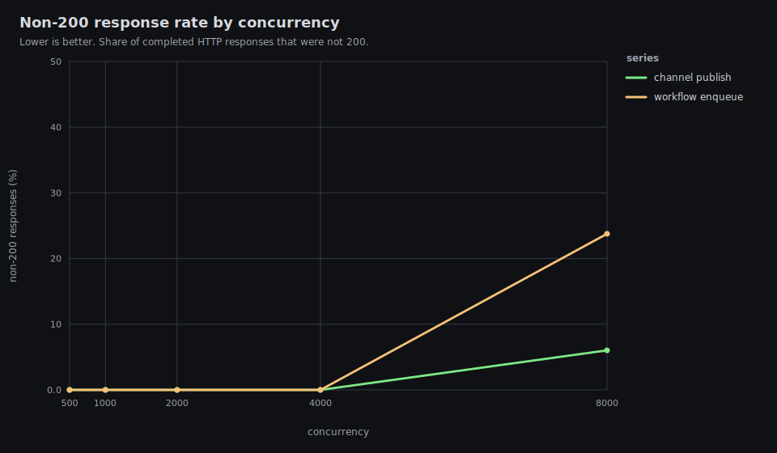

# Tako Proxy Performance Results

Date: 2026-06-01 UTC

This is the public single-VM performance report for Tako against nginx and
Caddy. It intentionally omits exact hostnames, public IPs, private network
addresses, peer names, and user identifiers.

The timed path is VM-local: the load generator, proxy, and application all run
on the same benchmark VM, with TLS enabled for every proxy.

## Executive Summary

Latest release run:

- Tako release: `tako-server 0.0.0-770afb0`
- HTTP data: `results/20260601T180530Z/http-vm-local`
- HTTP graphs: `results/20260601T180530Z/http-vm-local/graphs/README.md`
- Channel/workflow data: `results/20260601T183112Z/tako-features-vm-local`
- Channel/workflow graphs:
  `results/20260601T183112Z/tako-features-vm-local/graphs/README.md`

TLDR:

- Tako is much faster and cleaner than Caddy in this setup.
- Tako still does not match nginx on raw HTTPS reverse-proxy throughput. Across
  the fixed high-load rows c5000-c20000, Tako reaches about 52-72% of nginx
  200 RPS in the final same-matrix run.
- Tako stayed clean through c20000: 0 client errors and 0 non-200 responses.
  Caddy returned 502s and client timeouts in overload. Nginx was mostly clean,
  with small 500/error rates at c10000 and c15000 in this run.
- Tako p99 latency is materially worse than nginx at every high-load row.
- Tako proxy RSS is still too high under concurrency. At c20000, sampled proxy
  RSS peaked at about 2.5 GiB for Tako, 1.6 GiB for Caddy, and 282 MiB for
  nginx.
- Channels/workflows are good through c4000 on this 2 vCPU VM. At c8000 they
  are overloaded: channel publish returns 6.03% non-200 responses and workflow
  enqueue returns 23.77%.
- This VM does not produce 60k-100k clean TLS RPS. In the heavy rows the load
  generator, proxy, and app share the same 2 vCPU budget and CPU reaches
  saturation.
- Load-balanced mode is intentionally excluded from this result set. Four local
  app processes on a 2 vCPU VM mostly measure process contention.

Judgement: this is a solid small-VM stability result versus Caddy, but it is
not yet a strong nginx-parity result. The biggest remaining issues are raw RPS,
p99 latency, and proxy RSS under high downstream concurrency.

## Headline HTTP Results


| proxy | conc | 200 rps | p50 | p99 | non-200 | client errors | status | error kinds |
|---|---:|---:|---:|---:|---:|---:|---|---|
| nginx | 1,000 | 21,201 | 43 ms | 94 ms | 0.00% | 0 (0.00%) | 200:636425 |  |
| tako | 1,000 | 15,472 | 62 ms | 150 ms | 0.00% | 0 (0.00%) | 200:464839 |  |
| caddy | 1,000 | 6,616 | 147 ms | 258 ms | 0.00% | 0 (0.00%) | 200:199248 |  |
| nginx | 2,500 | 18,692 | 122 ms | 243 ms | 0.00% | 0 (0.00%) | 200:562511 |  |
| tako | 2,500 | 13,647 | 194 ms | 532 ms | 0.00% | 0 (0.00%) | 200:411600 |  |
| caddy | 2,500 | 5,812 | 404 ms | 2,563 ms | 0.00% | 0 (0.00%) | 200:175669 |  |
| nginx | 5,000 | 17,174 | 262 ms | 674 ms | 0.00% | 0 (0.00%) | 200:516322 |  |
| tako | 5,000 | 12,429 | 433 ms | 2,546 ms | 0.00% | 0 (0.00%) | 200:376649 |  |
| caddy | 5,000 | 5,085 | 853 ms | 5,324 ms | 0.12% | 0 (0.00%) | 200:156750, 502:189 |  |
| nginx | 7,500 | 15,505 | 412 ms | 3,331 ms | 0.00% | 0 (0.00%) | 200:467234 |  |
| tako | 7,500 | 11,315 | 677 ms | 4,776 ms | 0.00% | 0 (0.00%) | 200:344540 |  |
| caddy | 7,500 | 4,623 | 1,273 ms | 8,411 ms | 0.53% | 0 (0.00%) | 200:142671, 502:756 |  |
| nginx | 10,000 | 13,006 | 597 ms | 5,757 ms | 0.32% | 9 (0.00%) | 200:395139, 500:1275 | eof:9 |
| tako | 10,000 | 10,208 | 914 ms | 6,943 ms | 0.00% | 0 (0.00%) | 200:313184 |  |
| caddy | 10,000 | 1,722 | 2,887 ms | 31,302 ms | 1.26% | 0 (0.00%) | 200:69441, 502:883 |  |
| nginx | 15,000 | 12,666 | 993 ms | 4,357 ms | 0.36% | 0 (0.00%) | 200:386052, 500:1383 |  |
| tako | 15,000 | 8,248 | 1,438 ms | 12,176 ms | 0.00% | 0 (0.00%) | 200:255563 |  |
| caddy | 15,000 | 2,071 | 6,046 ms | 19,386 ms | 0.00% | 0 (0.00%) | 200:66383 |  |
| nginx | 20,000 | 13,056 | 1,238 ms | 4,797 ms | 0.00% | 0 (0.00%) | 200:404266 |  |
| tako | 20,000 | 6,806 | 1,904 ms | 16,262 ms | 0.00% | 0 (0.00%) | 200:213228 |  |
| caddy | 20,000 | 1,158 | 10,708 ms | 26,711 ms | 4.62% | 4,183 (7.60%) | 200:52489, 502:2545 | timeout:4183 |

## Resource Highlights

Every row below is from the same HTTP result directory. `max CPU` is total VM
CPU, where 100% means both vCPUs are busy. Process CPU is the sampled share of
total VM CPU. RSS values are peak sampled resident memory for the benchmark
processes only.

| proxy | conc | max CPU | proxy CPU | app CPU | loadgen CPU | proxy RSS | app RSS | loadgen RSS | max TLS conns |
|---|---:|---:|---:|---:|---:|---:|---:|---:|---:|
| nginx | 5,000 | 99.9% | 55.5% | 21.3% | 42.9% | 169 MiB | 82 MiB | 382 MiB | 5,000 |
| tako | 5,000 | 99.8% | 58.0% | 19.1% | 31.5% | 750 MiB | 115 MiB | 378 MiB | 5,017 |
| caddy | 5,000 | 99.0% | 70.6% | 17.8% | 22.9% | 639 MiB | 135 MiB | 363 MiB | 5,000 |
| nginx | 10,000 | 100.0% | 49.8% | 21.3% | 45.8% | 431 MiB | 122 MiB | 716 MiB | 10,026 |
| tako | 10,000 | 99.8% | 57.3% | 18.8% | 50.4% | 1,361 MiB | 208 MiB | 720 MiB | 10,090 |
| caddy | 10,000 | 100.0% | 79.3% | 8.4% | 33.6% | 1,191 MiB | 131 MiB | 689 MiB | 10,000 |
| nginx | 15,000 | 99.9% | 48.4% | 20.8% | 43.6% | 384 MiB | 101 MiB | 927 MiB | 11,754 |
| tako | 15,000 | 99.8% | 58.6% | 18.4% | 39.2% | 1,814 MiB | 290 MiB | 981 MiB | 15,005 |
| caddy | 15,000 | 99.9% | 76.7% | 9.1% | 30.5% | 1,490 MiB | 132 MiB | 864 MiB | 15,000 |
| nginx | 20,000 | 100.0% | 53.9% | 17.2% | 47.0% | 282 MiB | 114 MiB | 1,221 MiB | 13,998 |
| tako | 20,000 | 99.9% | 59.1% | 18.6% | 43.2% | 2,528 MiB | 407 MiB | 1,349 MiB | 20,282 |
| caddy | 20,000 | 100.0% | 95.1% | 5.5% | 33.5% | 1,595 MiB | 132 MiB | 1,048 MiB | 20,000 |

CPU is not the main differentiator in the heavy rows because all proxies can
saturate the VM. The important gap is memory per active downstream connection
and tail latency under saturation.

## Channels And Workflows

These rows use the same released `tako-server 0.0.0-770afb0`, the same VM-local
HTTPS path, and a single Tako app instance. The endpoints are implemented with
the JavaScript SDK:

- `/channel-publish`: publishes one message to a `feed` channel.
- `/workflow-enqueue`: enqueues one `noop` workflow payload.

The workflow handler performs one persisted `ctx.run("ack", ...)` step and
returns immediately.








| endpoint | conc | 200 rps | p50 | p99 | non-200 | client errors | status |
|---|---:|---:|---:|---:|---:|---:|---|
| channel-publish | 500 | 7,012 | 70 ms | 136 ms | 0.00% | 0 (0.00%) | 200:210601 |
| workflow-enqueue | 500 | 5,689 | 88 ms | 167 ms | 0.00% | 0 (0.00%) | 200:171196 |
| channel-publish | 1,000 | 6,837 | 145 ms | 240 ms | 0.00% | 0 (0.00%) | 200:205906 |
| workflow-enqueue | 1,000 | 5,495 | 182 ms | 310 ms | 0.00% | 0 (0.00%) | 200:165668 |
| channel-publish | 2,000 | 6,425 | 306 ms | 853 ms | 0.00% | 0 (0.00%) | 200:194414 |
| workflow-enqueue | 2,000 | 5,201 | 389 ms | 1,159 ms | 0.00% | 0 (0.00%) | 200:157802 |
| channel-publish | 4,000 | 6,110 | 621 ms | 2,706 ms | 0.00% | 0 (0.00%) | 200:186358 |
| workflow-enqueue | 4,000 | 4,753 | 809 ms | 3,314 ms | 0.00% | 0 (0.00%) | 200:145941 |
| channel-publish | 8,000 | 4,081 | 1,265 ms | 7,048 ms | 6.03% | 0 (0.00%) | 200:126162, 502:8060, 503:33 |
| workflow-enqueue | 8,000 | 1,633 | 2,567 ms | 9,039 ms | 23.77% | 0 (0.00%) | 200:53185, 502:16405, 503:179 |

### Feature Resource Highlights

| endpoint | conc | max CPU | proxy CPU | app CPU | loadgen CPU | proxy RSS | app RSS | loadgen RSS | max TLS conns |
|---|---:|---:|---:|---:|---:|---:|---:|---:|---:|
| channel-publish | 4,000 | 95.6% | 46.4% | 29.5% | 23.4% | 701 MiB | 165 MiB | 318 MiB | 4,065 |
| workflow-enqueue | 4,000 | 94.2% | 45.1% | 23.8% | 24.1% | 668 MiB | 217 MiB | 315 MiB | 4,036 |
| channel-publish | 8,000 | 99.4% | 54.9% | 30.5% | 33.1% | 1,255 MiB | 252 MiB | 623 MiB | 8,100 |
| workflow-enqueue | 8,000 | 99.4% | 56.5% | 25.4% | 34.0% | 1,200 MiB | 277 MiB | 616 MiB | 8,063 |

Judgement: channels/workflows are good through c4000 on this small VM, but not
excellent at overload. Both endpoints persist state, so the proxy, app, Bun
runtime, SQLite-backed feature store, and load generator compete inside the
same 2 vCPU budget. The c8000 workflow row needs better overload behavior
before it can be called excellent.

## What Changed

The latest release adds a small proxy memory patch:

- instance request counters are sharded to reduce contention on hot app
  instances;
- OpenSSL's internal server-side TLS session cache is disabled for the proxy.

The final full matrix does not show a broad throughput win from this change.
Tako remains clean, but still trails nginx. Proxy RSS improved in some rows and
regressed or varied in others, so the memory issue should be treated as still
open.

The benchmark harness was also corrected:

- `TAKO_SERVER_BIN` is now passed to the remote VM-local HTTP runner, preventing
  accidental stale `/usr/local/bin/tako-server` benchmarks.
- The metrics sampler now excludes unrelated system nginx processes.
- The final HTTP run keeps Caddy last and stops/cools down between rows so
  Caddy overload does not bias the immediately following Tako row.

## Why Tako Still Trails Nginx

Nginx is configured here as a static reverse proxy. Tako still does
product-level work on the request path:

- app route lookup;
- source IP derivation;
- per-client limiter accounting;
- app/instance selection;
- selected-instance in-flight accounting;
- upstream peer construction;
- forwarding header normalization;
- Pingora session/connection state.

Several obvious suspects have already been checked. Metrics are disabled in the
timed proxy path, load-balanced mode is excluded on this 2 vCPU VM, and earlier
diagnostics showed that route lookup and limiter accounting alone do not explain
the gap.

Recommended next steps:

- Profile `tako-server` with `perf`/flamegraphs on a larger VM or with an
  external same-region load generator so the load generator does not share the
  same 2 vCPU budget.
- Investigate Pingora downstream session allocation and read-buffer memory under
  10k-20k TLS connections.
- Investigate whether Tako can reuse or precompute more per-instance upstream
  peer/header state without changing behavior.
- Add a larger or multi-node load-balanced benchmark when a suitable testbed is
  available.
- Add explicit overload/backpressure behavior for channel/workflow c8000+
  instead of letting the app return many 502/503 responses.

## Test Host And Network

### Load Generator

The timed load generator ran on the benchmark VM, not on the laptop. The laptop
only orchestrated over SSH and received result files. Local desktop CPU load
therefore does not materially affect these timed results.

### Server

- Provider: exe.dev
- OS: Ubuntu 24.04.4 LTS, Linux 6.12.90, x86_64
- VM: KVM
- CPU: 2 vCPU, AMD EPYC 9554P 64-Core Processor
- Memory: 7.8 GiB, no swap
- Disk: 25 GiB root filesystem
- Region observed from public geolocation: Tokyo, Japan
- Mac-to-VM public endpoint ping from the earlier environment check: about
  72 ms average, 0% packet loss

The public web access URL was not used for timed proxy comparison because it
would measure an access layer outside Tako/nginx/Caddy. The controlled route for
timed HTTP tests was:

```text
https://bench.test:18443/
Host/SNI: bench.test
Resolved to: 127.0.0.1 on the benchmark VM
TLS: same self-signed certificate for every proxy
```

## Software Versions

- Tako: `tako-server 0.0.0-770afb0`
- nginx: `nginx/1.24.0 (Ubuntu)`
- Caddy: `v2.11.3` custom build with `github.com/mholt/caddy-ratelimit`
- Go on VM: `go1.26.3 linux/amd64`
- Bun runtime for feature app: `1.3.14`

## Applications

### HTTP App

The HTTP comparison uses `cmd/benchapp`, a small Go application with identical
payloads behind all three proxies:

- `/plaintext`: `hello, world\n`, fixed `Content-Length: 13`
- `/json`: `{"message":"hello","ok":true}\n`
- `/status`: internal Tako health check endpoint when `Host: bench-http.tako`
- `/pid`: instance metadata for manual checks

Nginx and Caddy start the same Go binary on loopback ports. Tako runs the same
binary as a deployed app from the benchmark VM's Tako data directory.

### Channels And Workflows App

The feature benchmark uses `apps/channels-workflows`, a small Bun/Tako SDK app:

- `/channel-publish`: `feed.publish({ type: "tick", data: ... })`
- `/workflow-enqueue`: `noop.enqueue({ seq, at })`
- `/status`: JSON health response

The workflow handler performs one persisted `ctx.run("ack", ...)` step and
returns immediately.

## Methodology

- One route and TLS certificate were used for all HTTP proxy comparisons:
  `bench.test:18443`.
- The load generator resolves `bench.test:18443` to `127.0.0.1` on the VM and
  sets both Host and SNI to `bench.test`.
- TLS verification is disabled because the certificate is self-signed, but TLS
  is still active for every proxy.
- HTTP/2 is disabled in the load generator, so the comparison is HTTP/1.1 over
  TLS.
- Each timed case has a 10 second warmup followed by a 30 second measurement
  window. Rows may run longer while outstanding requests drain or time out.
- Current scripts use `REQUEST_TIMEOUT=60s`; each result JSON records the
  effective `request_timeout_sec`.
- Single mode uses one upstream instance.
- Tako runs with `--metrics-port 0` and `--no-acme` during proxy comparison.
- High-concurrency runs use 16 loopback source IPs, `127.0.0.2` through
  `127.0.0.17`, to avoid turning Tako's default 2048 concurrent request cap per
  source IP into the benchmark bottleneck.
- Proxy configs include comparable per-client limiter work where the proxy
  supports it. Tako enforces 2048 concurrent requests per derived client IP.
  nginx uses `limit_conn` with the same 2048 per-IP cap and returns `429` when
  exceeded. Caddy uses `github.com/mholt/caddy-ratelimit` with a high per-IP
  request-rate ceiling by default, because the Caddy module is rate/window based
  rather than an exact concurrent-request limiter.
- Metrics are sampled once per second from `/proc` on the VM: total CPU, memory
  used/available, proxy/app/loadgen CPU, proxy/app/loadgen RSS, and established
  TLS connections.
- Before each row, the harness stops the previous proxy and app processes. The
  final HTTP run uses `PROXIES='nginx tako caddy'` and `COOLDOWN_SECONDS=10`.

This is not a pure proxy microbenchmark because the load generator, proxy, and
app processes all share the same 2 vCPU VM. It is a useful "what can this one VM
produce end-to-end?" benchmark.

## Reproducing

Sync the repo to the VM, install the current Tako release, pass its absolute
path as `TAKO_SERVER_BIN`, then run:

```bash
BENCH_VM=<ssh-host> \
TAKO_SERVER_BIN=/opt/tako-performance/bin/<tako-server-release> \
SOURCE_IPS='127.0.0.2,127.0.0.3,127.0.0.4,127.0.0.5,127.0.0.6,127.0.0.7,127.0.0.8,127.0.0.9,127.0.0.10,127.0.0.11,127.0.0.12,127.0.0.13,127.0.0.14,127.0.0.15,127.0.0.16,127.0.0.17' \
CONCURRENCY_LIST='1000 2500 5000 7500 10000 15000 20000' \
WARMUP=10s \
DURATION=30s \
REQUEST_TIMEOUT=60s \
METRICS_INTERVAL=1 \
METRICS_CONNECTIONS=1 \
COOLDOWN_SECONDS=10 \
PROXIES='nginx tako caddy' \
MODES=single \
ENDPOINTS=plaintext \
./scripts/run-vm-local-http-benchmarks.sh
```

Feature endpoints:

```bash
BENCH_VM=<ssh-host> \
TAKO_SERVER_BIN=/opt/tako-performance/bin/<tako-server-release> \
SOURCE_IPS='127.0.0.2,127.0.0.3,127.0.0.4,127.0.0.5,127.0.0.6,127.0.0.7,127.0.0.8,127.0.0.9,127.0.0.10,127.0.0.11,127.0.0.12,127.0.0.13,127.0.0.14,127.0.0.15,127.0.0.16,127.0.0.17' \
CONCURRENCY_LIST='500 1000 2000 4000 8000' \
WARMUP=10s \
DURATION=30s \
REQUEST_TIMEOUT=60s \
METRICS_INTERVAL=1 \
METRICS_CONNECTIONS=1 \
COOLDOWN_SECONDS=10 \
./scripts/run-vm-local-tako-feature-benchmarks.sh
```

Regenerate graphs after editing result CSVs or the graph renderer:

```bash
./scripts/render-metrics-graphs.sh results/<timestamp>/http-vm-local
./scripts/render-metrics-graphs.sh results/<timestamp>/tako-features-vm-local
```
