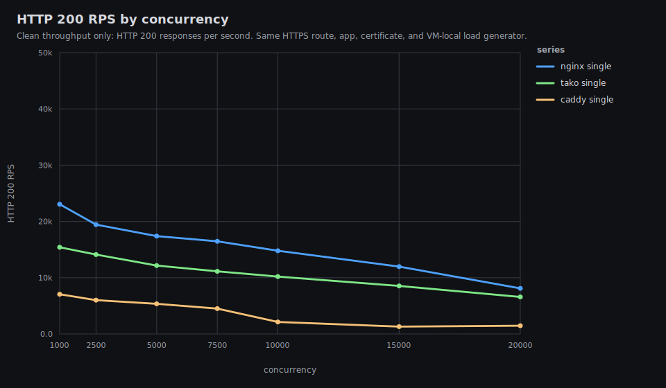
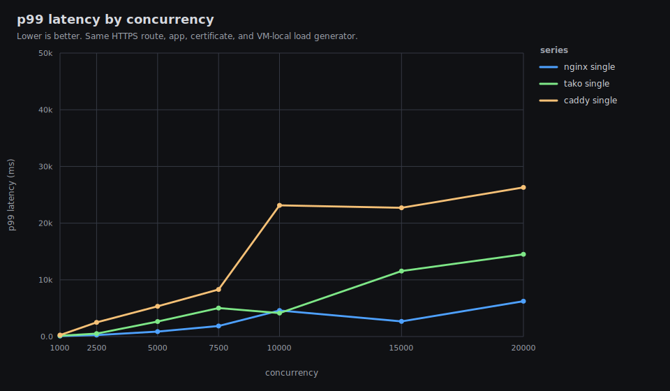
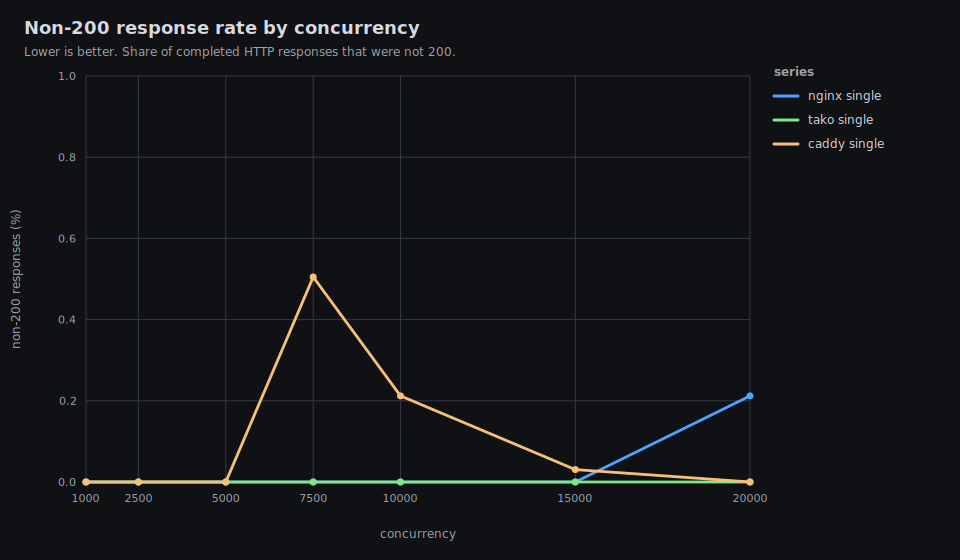
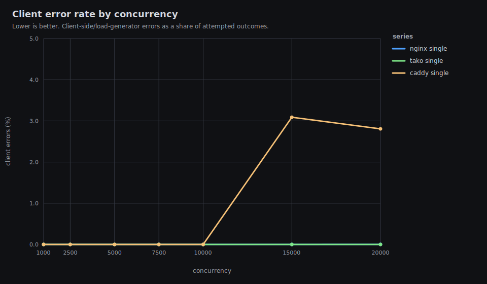

# Tako Proxy Performance Results

Date: 2026-06-01 UTC

This is the public single-VM performance report for Tako against nginx and
Caddy. It intentionally omits exact hostnames, public IPs, private network
addresses, peer names, and user identifiers.

The timed path is VM-local: the load generator, proxy, and application all run
on the same benchmark VM, with TLS enabled for every proxy.

## Executive Summary

Latest release run:

- Tako release: `tako-server 0.0.0-510c153`
- HTTP data: `results/20260601T114243Z/http-vm-local`
- HTTP graphs: `results/20260601T114243Z/http-vm-local/graphs/README.md`
- Channel/workflow data: `results/20260601T120330Z/tako-features-vm-local`
- Channel/workflow graphs:
  `results/20260601T120330Z/tako-features-vm-local/graphs/README.md`

TLDR:

- Tako is faster and more stable than Caddy in this setup.
- Tako still does not match nginx on raw HTTPS reverse-proxy throughput. Across
  c1000-c15000, Tako reaches about 67-73% of nginx 200 RPS. At c20000 it
  reaches 81% of nginx, but nginx also shows a small non-200/error rate there.
- Tako is clean through c20000 in this run: 0 client errors and 0 non-200
  responses. Caddy returns 502s or client timeouts in the high-concurrency
  rows; nginx is mostly clean but has 1 EOF at c10000 and 500s plus 4 EOFs at
  c20000.
- Tako p99 latency is still materially worse than nginx in most heavy rows.
  The c10000 row is the exception in this run; c5000, c7500, c15000, and
  c20000 are still worse.
- The main resource gap remains proxy RSS under concurrency. At c20000, sampled
  proxy RSS peaks at about 2.25 GiB for Tako, 1.49 GiB for Caddy, and 407 MiB
  for nginx.
- Channels/workflows improved in the latest release. They are clean through
  c4000 on this 2 vCPU VM. At c8000 they enter overload: channel publish has
  6.28% non-200 responses, workflow enqueue has 19.68% non-200 responses.
- This VM does not reach 60k-100k clean TLS RPS. CPU saturates across the heavy
  rows, and the load generator shares the same 2 vCPU budget as the proxy and
  app.
- Load-balanced mode is intentionally excluded from this result set. Four local
  app processes on a 2 vCPU VM mostly measure process contention.

Judgement: this is a good stability result versus Caddy and a useful small-VM
capacity result, but it is not good enough if the target is nginx parity. The
next Tako work should focus on downstream connection/session memory, p99 latency
under heavy concurrency, and feature overload behavior at c8000+.

## Headline HTTP Results









| proxy | conc | 200 rps | p50 | p99 | non-200 | client errors | status | error kinds |
|---|---:|---:|---:|---:|---:|---:|---|---|
| caddy | 1,000 | 7,057 | 137 ms | 256 ms | 0.00% | 0 (0.00%) | 200:212198 |  |
| nginx | 1,000 | 23,049 | 39 ms | 92 ms | 0.00% | 0 (0.00%) | 200:691715 |  |
| tako | 1,000 | 15,405 | 63 ms | 152 ms | 0.00% | 0 (0.00%) | 200:462748 |  |
| caddy | 2,500 | 6,006 | 393 ms | 2,505 ms | 0.00% | 0 (0.00%) | 200:181485 |  |
| nginx | 2,500 | 19,429 | 116 ms | 259 ms | 0.00% | 0 (0.00%) | 200:583381 |  |
| tako | 2,500 | 14,115 | 191 ms | 517 ms | 0.00% | 0 (0.00%) | 200:425046 |  |
| caddy | 5,000 | 5,353 | 809 ms | 5,327 ms | 0.00% | 0 (0.00%) | 200:163858 |  |
| nginx | 5,000 | 17,389 | 247 ms | 870 ms | 0.00% | 0 (0.00%) | 200:523060 |  |
| tako | 5,000 | 12,155 | 440 ms | 2,647 ms | 0.00% | 0 (0.00%) | 200:367859 |  |
| caddy | 7,500 | 4,512 | 1,262 ms | 8,296 ms | 0.51% | 0 (0.00%) | 200:140271, 502:712 |  |
| nginx | 7,500 | 16,471 | 386 ms | 1,865 ms | 0.00% | 0 (0.00%) | 200:497744 |  |
| tako | 7,500 | 11,136 | 674 ms | 5,029 ms | 0.00% | 0 (0.00%) | 200:338652 |  |
| caddy | 10,000 | 2,134 | 3,252 ms | 23,145 ms | 0.21% | 0 (0.00%) | 200:67275, 502:143 |  |
| nginx | 10,000 | 14,792 | 535 ms | 4,589 ms | 0.00% | 1 (0.00%) | 200:446471 | eof:1 |
| tako | 10,000 | 10,192 | 950 ms | 4,137 ms | 0.00% | 0 (0.00%) | 200:312632 |  |
| caddy | 15,000 | 1,304 | 6,642 ms | 22,707 ms | 0.03% | 1,779 (3.09%) | 200:55810, 502:17 | timeout:1779 |
| nginx | 15,000 | 11,973 | 1,097 ms | 2,674 ms | 0.00% | 0 (0.00%) | 200:374939 |  |
| tako | 15,000 | 8,532 | 1,432 ms | 11,551 ms | 0.00% | 0 (0.00%) | 200:264125 |  |
| caddy | 20,000 | 1,462 | 9,185 ms | 26,300 ms | 0.00% | 1,925 (2.81%) | 200:66664 | timeout:1925 |
| nginx | 20,000 | 8,109 | 1,897 ms | 6,228 ms | 0.21% | 4 (0.00%) | 200:253622, 500:539 | eof:4 |
| tako | 20,000 | 6,574 | 2,050 ms | 14,512 ms | 0.00% | 0 (0.00%) | 200:206204 |  |

## Resource Highlights

Every row below is from the same HTTP result directory. `max CPU` is total VM
CPU, where 100% means both vCPUs are busy. Process CPU is the sampled share of
total VM CPU. RSS values are peak sampled resident memory.

| proxy | conc | max CPU | proxy CPU | app CPU | loadgen CPU | proxy RSS | app RSS | loadgen RSS | max TLS conns |
|---|---:|---:|---:|---:|---:|---:|---:|---:|---:|
| nginx | 1,000 | 98.6% | 34.2% | 23.0% | 42.2% | 66 MiB | 38 MiB | 105 MiB | 1,000 |
| caddy | 1,000 | 98.6% | 57.6% | 18.7% | 17.7% | 225 MiB | 45 MiB | 97 MiB | 1,000 |
| tako | 1,000 | 100.0% | 45.8% | 18.4% | 34.1% | 195 MiB | 37 MiB | 103 MiB | 1,000 |
| nginx | 5,000 | 100.0% | 45.1% | 23.0% | 46.1% | 211 MiB | 100 MiB | 393 MiB | 5,027 |
| caddy | 5,000 | 99.5% | 76.0% | 18.2% | 22.1% | 650 MiB | 125 MiB | 374 MiB | 5,000 |
| tako | 5,000 | 99.6% | 54.0% | 19.3% | 37.3% | 738 MiB | 114 MiB | 387 MiB | 5,064 |
| nginx | 10,000 | 100.0% | 50.2% | 21.8% | 47.3% | 332 MiB | 119 MiB | 723 MiB | 10,045 |
| caddy | 10,000 | 99.9% | 82.6% | 8.0% | 31.2% | 1,163 MiB | 135 MiB | 626 MiB | 10,000 |
| tako | 10,000 | 99.5% | 57.9% | 19.1% | 44.0% | 1,369 MiB | 217 MiB | 729 MiB | 10,064 |
| nginx | 20,000 | 100.0% | 49.4% | 16.1% | 50.7% | 407 MiB | 123 MiB | 1,261 MiB | 14,989 |
| caddy | 20,000 | 100.0% | 77.2% | 7.6% | 44.1% | 1,527 MiB | 134 MiB | 1,042 MiB | 20,000 |
| tako | 20,000 | 99.7% | 58.0% | 18.2% | 48.4% | 2,254 MiB | 380 MiB | 1,260 MiB | 20,143 |

The important resource result is not CPU, because all heavy rows saturate the
VM. The important gap is memory per active downstream connection/session. Tako
uses much more proxy RSS than nginx under high concurrency, and that remains the
clearest optimization target.

## Channels And Workflows

These rows use the same released `tako-server 0.0.0-510c153`, the same VM-local
HTTPS path, and a single Tako app instance. The endpoints are implemented with
the JavaScript SDK:

- `/channel-publish`: publishes one message to a `feed` channel.
- `/workflow-enqueue`: enqueues one `noop` workflow payload.

The workflow handler performs one persisted `ctx.run("ack", ...)` step and
returns immediately.


| endpoint | conc | 200 rps | p50 | p99 | non-200 | client errors | status |
|---|---:|---:|---:|---:|---:|---:|---|
| channel-publish | 500 | 7,020 | 69 ms | 137 ms | 0.00% | 0 (0.00%) | 200:210856 |
| workflow-enqueue | 500 | 5,499 | 89 ms | 181 ms | 0.00% | 0 (0.00%) | 200:165407 |
| channel-publish | 1,000 | 6,620 | 150 ms | 254 ms | 0.00% | 0 (0.00%) | 200:199505 |
| workflow-enqueue | 1,000 | 5,121 | 196 ms | 356 ms | 0.00% | 0 (0.00%) | 200:154455 |
| channel-publish | 2,000 | 6,388 | 316 ms | 694 ms | 0.00% | 0 (0.00%) | 200:193357 |
| workflow-enqueue | 2,000 | 4,935 | 416 ms | 1,490 ms | 0.00% | 0 (0.00%) | 200:149639 |
| channel-publish | 4,000 | 5,977 | 648 ms | 1,940 ms | 0.00% | 0 (0.00%) | 200:182235 |
| workflow-enqueue | 4,000 | 4,616 | 870 ms | 3,291 ms | 0.00% | 0 (0.00%) | 200:142139 |
| channel-publish | 8,000 | 3,898 | 1,303 ms | 7,332 ms | 6.28% | 0 (0.00%) | 200:120844, 502:8093 |
| workflow-enqueue | 8,000 | 1,992 | 2,603 ms | 8,472 ms | 19.68% | 0 (0.00%) | 200:67653, 502:16185, 503:393 |

### Feature Resource Highlights

| endpoint | conc | max CPU | proxy CPU | app CPU | loadgen CPU | proxy RSS | app RSS | loadgen RSS | max TLS conns |
|---|---:|---:|---:|---:|---:|---:|---:|---:|---:|
| channel-publish | 4,000 | 98.0% | 55.0% | 31.3% | 30.4% | 713 MiB | 172 MiB | 310 MiB | 4,031 |
| workflow-enqueue | 4,000 | 98.5% | 51.4% | 27.4% | 31.1% | 726 MiB | 227 MiB | 308 MiB | 4,000 |
| channel-publish | 8,000 | 99.9% | 56.4% | 28.2% | 41.2% | 1,273 MiB | 201 MiB | 606 MiB | 8,099 |
| workflow-enqueue | 8,000 | 100.0% | 56.8% | 24.4% | 41.5% | 1,261 MiB | 243 MiB | 598 MiB | 8,096 |

Judgement: channels/workflows are good through c4000 on this small VM, but not
excellent at overload. Both endpoints write persisted state, so the app, proxy,
SQLite-backed feature store, and load generator all compete inside the same 2
vCPU budget. Channel publish improved clearly after the latest feature hot-path
work. Workflow enqueue improved only modestly and still has the weaker c8000
row.

## Change From Previous Release

The latest feature-oriented release is `0.0.0-510c153`. The previous published
benchmark in this report used `0.0.0-339c020`.

| endpoint | conc | previous 200 rps | latest 200 rps | change | previous non-200 | latest non-200 |
|---|---:|---:|---:|---:|---:|---:|
| channel-publish | 500 | 6,594 | 7,020 | +6.5% | 0.00% | 0.00% |
| channel-publish | 1,000 | 6,426 | 6,620 | +3.0% | 0.00% | 0.00% |
| channel-publish | 2,000 | 6,116 | 6,388 | +4.5% | 0.00% | 0.00% |
| channel-publish | 4,000 | 5,731 | 5,977 | +4.3% | 0.00% | 0.00% |
| channel-publish | 8,000 | 3,007 | 3,898 | +29.6% | 13.91% | 6.28% |
| workflow-enqueue | 500 | 5,321 | 5,499 | +3.3% | 0.00% | 0.00% |
| workflow-enqueue | 1,000 | 5,114 | 5,121 | +0.1% | 0.00% | 0.00% |
| workflow-enqueue | 2,000 | 4,890 | 4,935 | +0.9% | 0.00% | 0.00% |
| workflow-enqueue | 4,000 | 4,518 | 4,616 | +2.2% | 0.00% | 0.00% |
| workflow-enqueue | 8,000 | 1,916 | 1,992 | +4.0% | 20.43% | 19.68% |

The current release includes the previous proxy hot-path work plus these feature
hot-path changes:

- Channel publish persists the message and updates channel metadata in one
  SQLite transaction instead of splitting them across separate writes.
- Workflow internal socket lookup avoids allocating new handler closures on the
  hot path.
- HTTP feature rows were rerun from the published release, not a local build.

The HTTP proxy comparison did not change enough to alter the main conclusion:
Tako still beats Caddy and still trails nginx on raw throughput and most p99
latency rows.

## Why Tako Still Trails Nginx

Nginx is configured here as a static reverse proxy. Tako still does product-level
work on the request path:

- app route lookup;
- source IP derivation;
- per-client limiter accounting;
- app/instance selection;
- selected-instance in-flight accounting;
- upstream peer construction;
- forwarding header normalization;
- Pingora session/connection state.

The final run points at downstream connection/session memory pressure as the
next best target. CPU is saturated for every proxy under heavy load, but Tako's
RSS grows much faster than nginx as concurrency rises. That can also make p99
latency worse under pressure because more CPU time is spent managing connection
state and memory.

Recommended next steps:

- Profile `tako-server` with `perf` or flamegraphs under c5000-c10000 on a
  larger testbed or with an external load generator, so the load generator does
  not share the same 2 vCPU budget.
- Inspect Pingora downstream session allocations and any Tako per-session state
  retained across requests.
- Audit limiter/client-IP metadata for owned allocations or large per-connection
  state.
- Add a second-VM same-region benchmark before making public max-RPS claims.
- Add a larger or multi-node load-balanced benchmark when a suitable testbed is
  available.

## Test Host And Network

### Load Generator

The timed load generator ran on the benchmark VM, not on the laptop. The laptop
only orchestrated over SSH and received result files. Local desktop CPU load
therefore does not materially affect these timed results.

### Server

- Provider: exe.dev
- OS: Ubuntu 24.04.4 LTS, Linux 6.12.90, x86_64
- VM: KVM
- CPU: 2 vCPU, AMD EPYC 9554P 64-Core Processor
- Memory: 7.8 GiB, no swap
- Disk: 25 GiB root filesystem
- Region observed from public geolocation: Tokyo, Japan
- Mac-to-VM public endpoint ping from the earlier environment check: about
  72 ms average, 0% packet loss

The public web access URL was not used for timed proxy comparison because it
would measure an access layer outside Tako/nginx/Caddy. The controlled route for
timed HTTP tests was:

```text
https://bench.test:18443/
Host/SNI: bench.test
Resolved to: 127.0.0.1 on the benchmark VM
TLS: same self-signed certificate for every proxy
```

## Software Versions

- Tako: `tako-server 0.0.0-510c153`
- nginx: `nginx/1.24.0 (Ubuntu)`
- Caddy: `v2.11.3` custom build with `github.com/mholt/caddy-ratelimit`
- Go on VM: `go1.26.3 linux/amd64`

## Applications

### HTTP App

The HTTP comparison uses `cmd/benchapp`, a small Go application with identical
payloads behind all three proxies:

- `/plaintext`: `hello, world\n`, fixed `Content-Length: 13`
- `/json`: `{"message":"hello","ok":true}\n`
- `/status`: internal Tako health check endpoint when `Host: bench-http.tako`
- `/pid`: instance metadata for manual checks

Nginx and Caddy start the same Go binary on loopback ports. Tako runs the same
binary as a deployed app from the benchmark VM's Tako data directory.

### Channels And Workflows App

The feature benchmark uses `apps/channels-workflows`, a small Bun/Tako SDK app:

- `/channel-publish`: `feed.publish({ type: "tick", data: ... })`
- `/workflow-enqueue`: `noop.enqueue({ seq, at })`
- `/status`: JSON health response

The workflow handler performs one persisted `ctx.run("ack", ...)` step and
returns immediately.

## Methodology

- One route and TLS certificate were used for all HTTP proxy comparisons:
  `bench.test:18443`.
- The load generator resolves `bench.test:18443` to `127.0.0.1` on the VM and
  sets both Host and SNI to `bench.test`.
- TLS verification is disabled because the certificate is self-signed, but TLS
  is still active for every proxy.
- HTTP/2 is disabled in the load generator, so the comparison is HTTP/1.1 over
  TLS.
- Each timed case has a 10 second warmup followed by a 30 second measurement
  window. Rows may run longer while outstanding requests drain or time out.
- Current scripts use `REQUEST_TIMEOUT=60s`; each result JSON records the
  effective `request_timeout_sec`.
- Single mode uses one upstream instance.
- Tako runs with `--metrics-port 0` and `--no-acme` during proxy comparison.
- High-concurrency runs use 16 loopback source IPs, `127.0.0.2` through
  `127.0.0.17`, to avoid turning Tako's default 2048 concurrent request cap per
  source IP into the benchmark bottleneck.
- Proxy configs include comparable per-client limiter work where the proxy
  supports it. Tako enforces 2048 concurrent requests per derived client IP.
  nginx uses `limit_conn` with the same 2048 per-IP cap and returns `429` when
  exceeded. Caddy uses `github.com/mholt/caddy-ratelimit` with a high per-IP
  request-rate ceiling by default, because the Caddy module is rate/window based
  rather than an exact concurrent-request limiter.
- Metrics are sampled once per second from `/proc` on the VM: total CPU, memory
  used/available, proxy/app/loadgen CPU, proxy/app/loadgen RSS, and established
  TLS connections.
- Before each proxy row, the harness stops the previous proxy and app processes.
  When Tako is running, nginx and Caddy are stopped; when nginx is running, Tako
  and Caddy are stopped; and so on.

This is not a pure proxy microbenchmark because the load generator, proxy, and
app processes all share the same 2 vCPU VM. It is a useful "what can this one VM
produce end-to-end?" benchmark.

## Historical Data

Older result directories are kept for comparison and regression analysis:

- `results/20260531T113110Z/http-vm-local`: active-set release rerun.
- `results/20260531T120513Z/tako-features-vm-local`: active-set feature rerun.
- `results/20260531T153937Z/http-vm-local`: metrics-disabled release rerun.
- `results/20260531T163148Z/http-vm-local`: response-cache-disabled rerun.
- `results/20260531T171211Z/http-vm-local`: compression-disabled release rerun.
- `results/20260531T173340Z/tako-features-vm-local`: compression-disabled
  feature rerun.
- `results/20260531T182907Z/http-vm-local`: route-hot-path release rerun before
  the upstream keepalive fix.
- `results/20260531T193211Z/http-vm-local`: full clean HTTP baseline rerun.
- `results/20260531T195359Z/tako-features-vm-local`: earlier feature rerun.
- `results/20260531T205609Z/http-vm-local`: fixed load-generator high-load
  client-error rerun.
- `results/20260601T064522Z/tako-features-vm-local`: previous feature release
  rerun.
- `results/20260601T070108Z/http-vm-local`: previous HTTP release rerun.
- `results/20260601T114243Z/http-vm-local`: latest HTTP release rerun.
- `results/20260601T120330Z/tako-features-vm-local`: latest feature release
  rerun.

## Reproducing

Sync the repo to the VM, install the current Tako release as
`/usr/local/bin/tako-server`, then run:

```bash
BENCH_VM=<ssh-host> \
SOURCE_IPS='127.0.0.2,127.0.0.3,127.0.0.4,127.0.0.5,127.0.0.6,127.0.0.7,127.0.0.8,127.0.0.9,127.0.0.10,127.0.0.11,127.0.0.12,127.0.0.13,127.0.0.14,127.0.0.15,127.0.0.16,127.0.0.17' \
CONCURRENCY_LIST='1000 2500 5000 7500 10000 15000 20000' \
WARMUP=10s \
DURATION=30s \
REQUEST_TIMEOUT=60s \
METRICS_INTERVAL=1 \
METRICS_CONNECTIONS=1 \
PROXIES='nginx caddy tako' \
MODES=single \
ENDPOINTS=plaintext \
./scripts/run-vm-local-http-benchmarks.sh
```

Feature endpoints:

```bash
BENCH_VM=<ssh-host> \
SOURCE_IPS='127.0.0.2,127.0.0.3,127.0.0.4,127.0.0.5,127.0.0.6,127.0.0.7,127.0.0.8,127.0.0.9,127.0.0.10,127.0.0.11,127.0.0.12,127.0.0.13,127.0.0.14,127.0.0.15,127.0.0.16,127.0.0.17' \
CONCURRENCY_LIST='500 1000 2000 4000 8000' \
WARMUP=10s \
DURATION=30s \
REQUEST_TIMEOUT=60s \
METRICS_INTERVAL=1 \
METRICS_CONNECTIONS=1 \
./scripts/run-vm-local-tako-feature-benchmarks.sh
```

Regenerate graphs after editing result CSVs or the graph renderer:

```bash
./scripts/render-metrics-graphs.sh results/<timestamp>/http-vm-local
./scripts/render-metrics-graphs.sh results/<timestamp>/tako-features-vm-local
```
