# Benchmark Graphs

Generated from result JSON and per-test metrics CSV files in `http-vm-local`.

## Summary

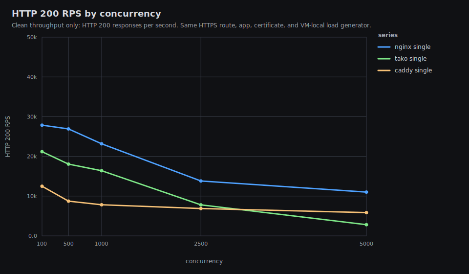

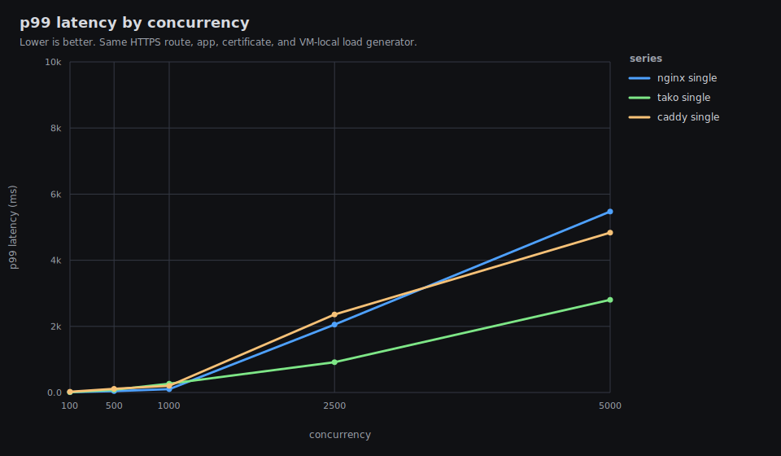

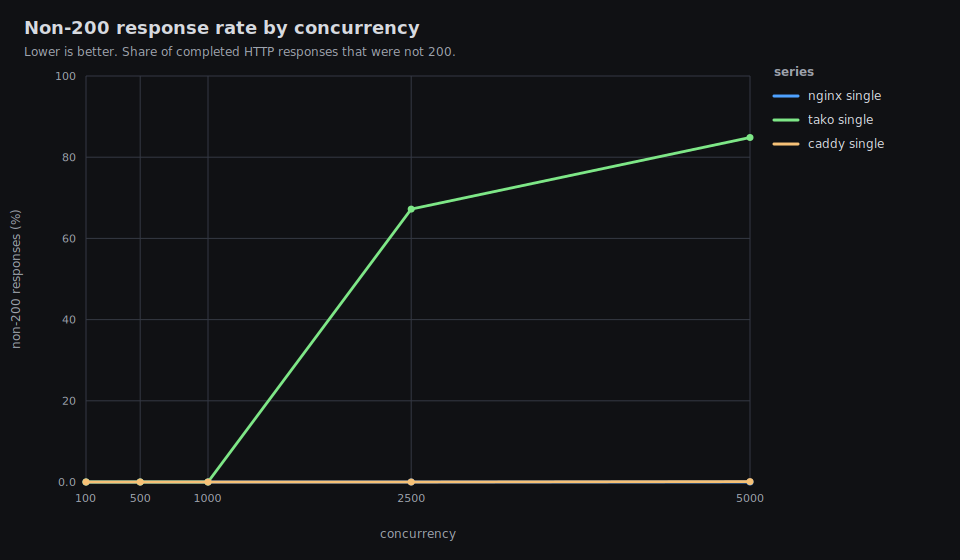

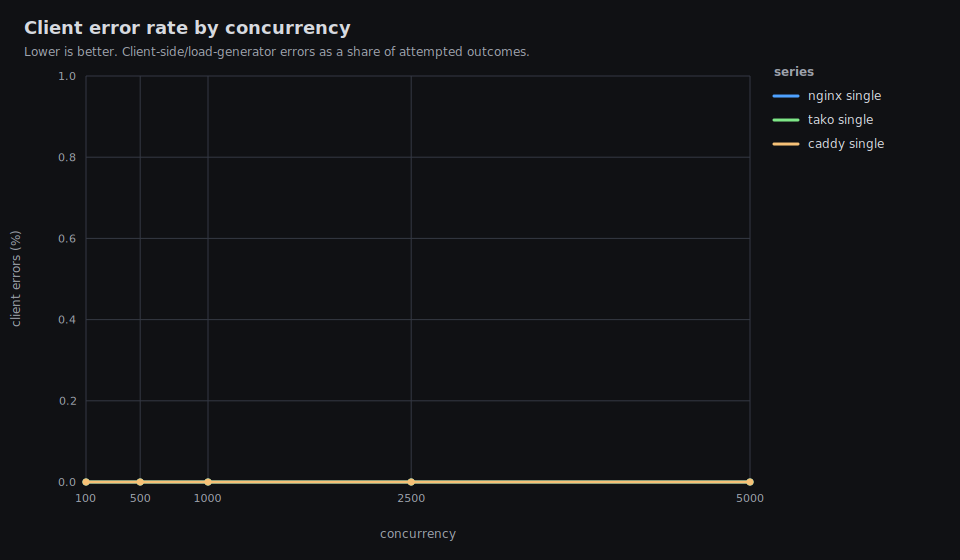

## caddy-single-plaintext-c100

200 rps 12482.97 | total rps 12482.97 | p99 22.1 ms | non-200 0% | errors 0

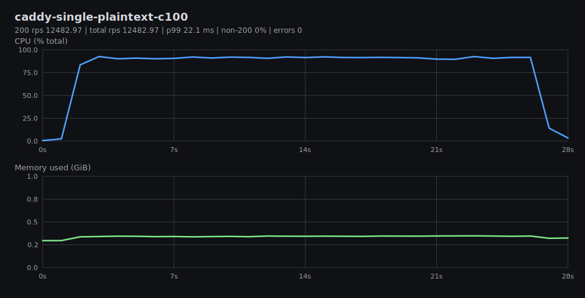

## caddy-single-plaintext-c1000

200 rps 7814.68 | total rps 7814.68 | p99 200.94 ms | non-200 0% | errors 0

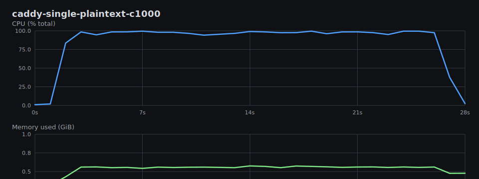

## caddy-single-plaintext-c2500

200 rps 6875.9 | total rps 6875.9 | p99 2360.67 ms | non-200 0% | errors 0

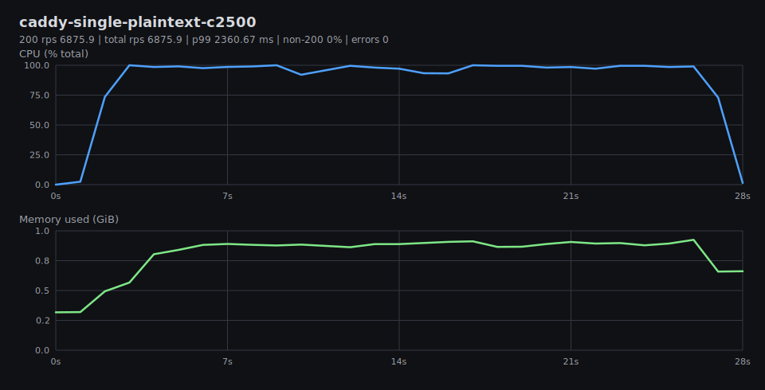

## caddy-single-plaintext-c500

200 rps 8730.89 | total rps 8730.89 | p99 110.15 ms | non-200 0% | errors 0

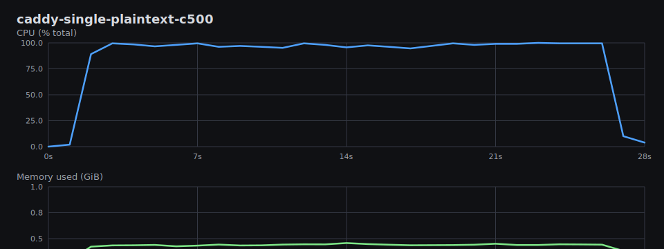

## caddy-single-plaintext-c5000

200 rps 5843.78 | total rps 5849.96 | p99 4834.04 ms | non-200 0.11% | errors 0

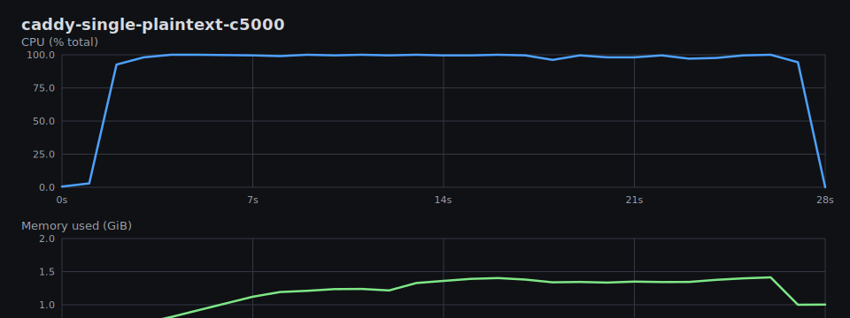

## nginx-single-plaintext-c100

200 rps 27857.66 | total rps 27857.66 | p99 9.89 ms | non-200 0% | errors 0

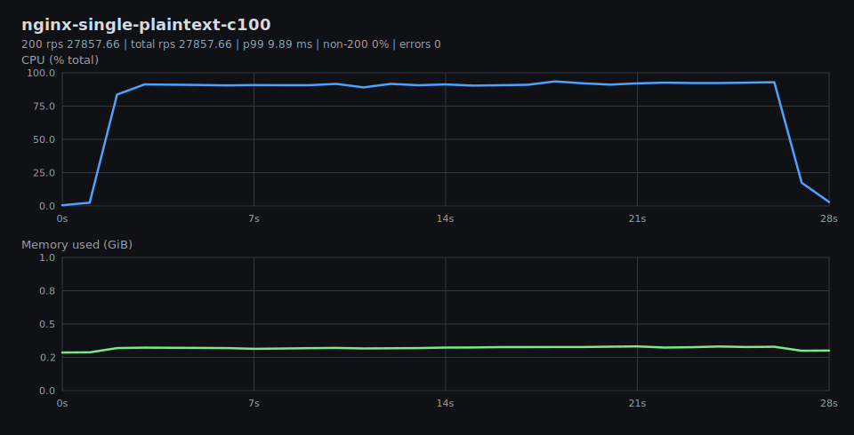

## nginx-single-plaintext-c1000

200 rps 23159.89 | total rps 23159.89 | p99 100.01 ms | non-200 0% | errors 0

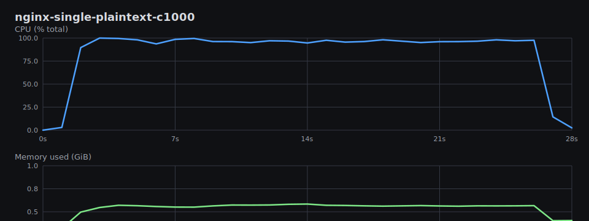

## nginx-single-plaintext-c2500

200 rps 13799.56 | total rps 13799.56 | p99 2055.41 ms | non-200 0% | errors 0

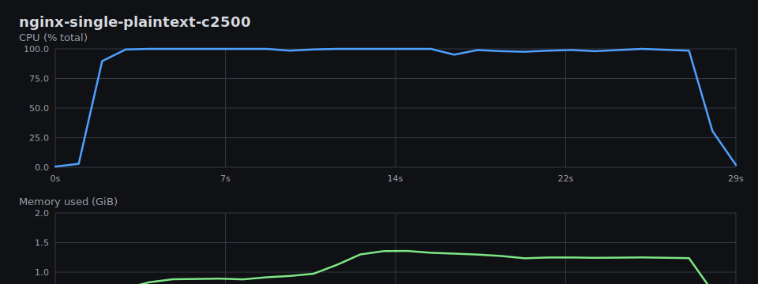

## nginx-single-plaintext-c500

200 rps 26912.44 | total rps 26912.44 | p99 42.18 ms | non-200 0% | errors 0

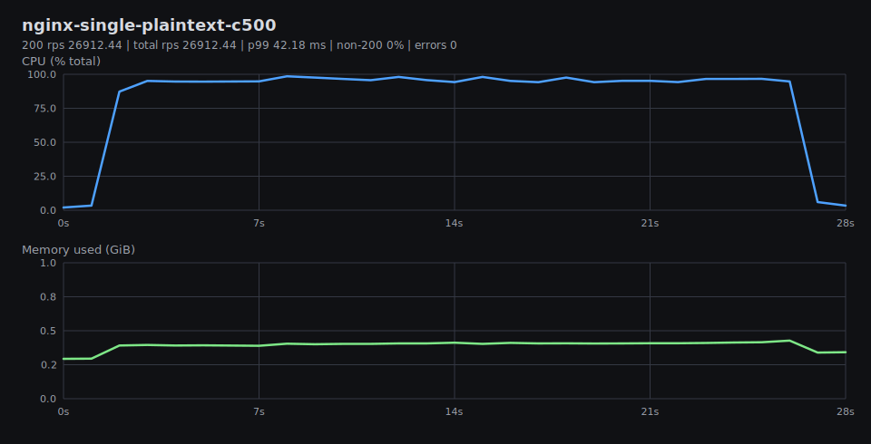

## nginx-single-plaintext-c5000

200 rps 11008.42 | total rps 11008.42 | p99 5471.84 ms | non-200 0% | errors 0

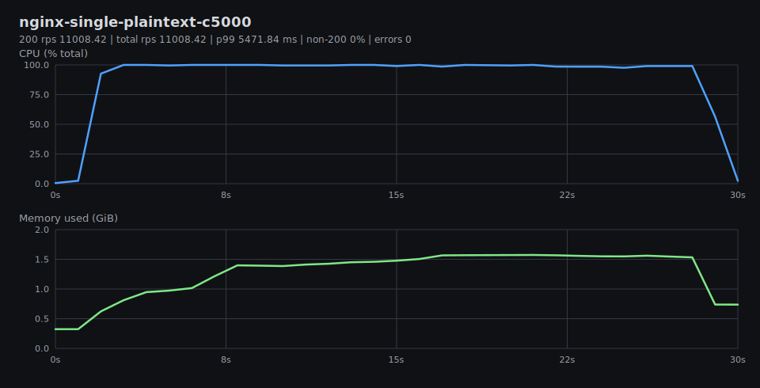

## tako-single-plaintext-c100

200 rps 21179.52 | total rps 21179.52 | p99 10.18 ms | non-200 0% | errors 0

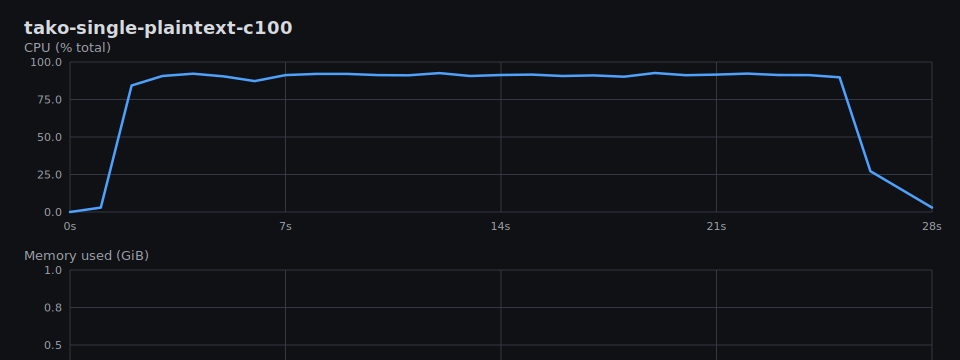

## tako-single-plaintext-c1000

200 rps 16392.94 | total rps 16392.94 | p99 266.66 ms | non-200 0% | errors 0

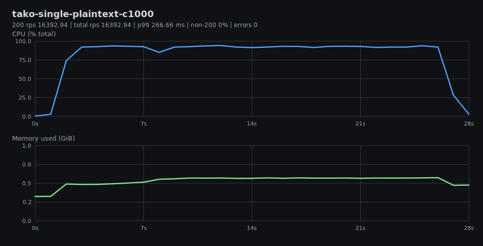

## tako-single-plaintext-c2500

200 rps 7797.02 | total rps 23784.16 | p99 916.6 ms | non-200 67.22% | errors 0

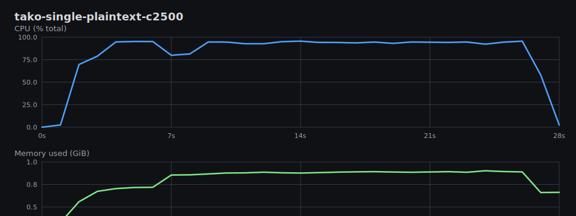

## tako-single-plaintext-c500

200 rps 18052.01 | total rps 18052.01 | p99 81.29 ms | non-200 0% | errors 0

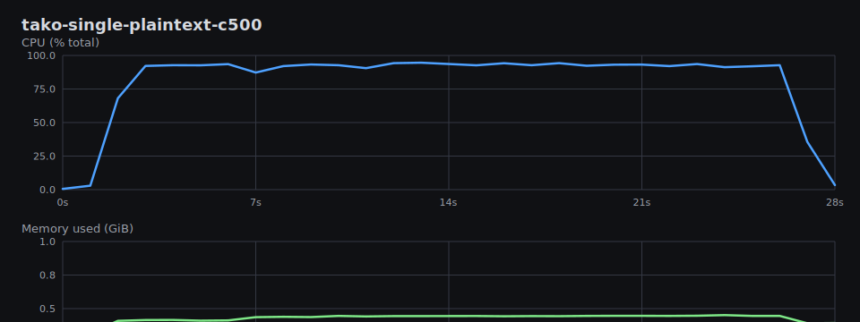

## tako-single-plaintext-c5000

200 rps 2807.44 | total rps 18545.43 | p99 2802.09 ms | non-200 84.86% | errors 0

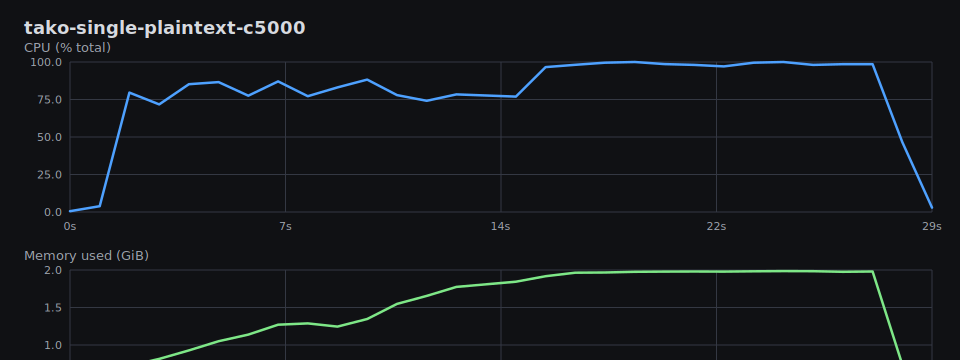

