# Benchmark Graphs

Generated from result JSON and per-test metrics CSV files in `http-vm-local`.

## Summary

## caddy-single-plaintext-c10000

200 rps 577.58 | total rps 577.58 | p99 9782.47 ms | non-200 0% | errors 17831

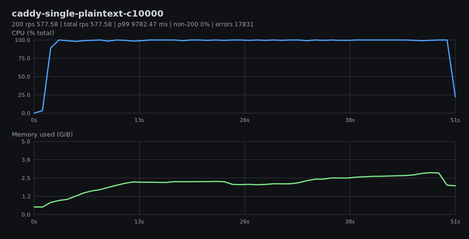

## caddy-single-plaintext-c15000

200 rps 291.17 | total rps 291.17 | p99 9982.56 ms | non-200 0% | errors 39314

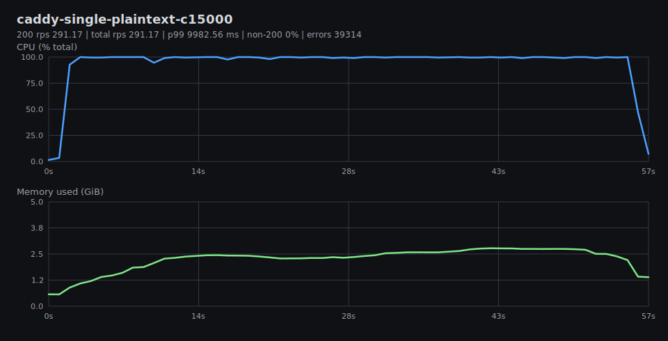

## caddy-single-plaintext-c2500

200 rps 7205.35 | total rps 7205.35 | p99 2152.45 ms | non-200 0% | errors 0

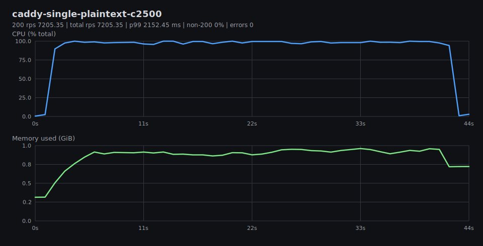

## caddy-single-plaintext-c5000

200 rps 6351.76 | total rps 6356.85 | p99 4749.99 ms | non-200 0.08% | errors 0

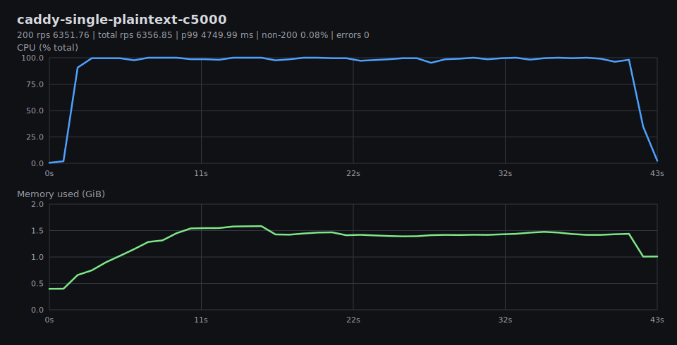

## caddy-single-plaintext-c7500

200 rps 5987.42 | total rps 6015.29 | p99 7450.41 ms | non-200 0.46% | errors 0

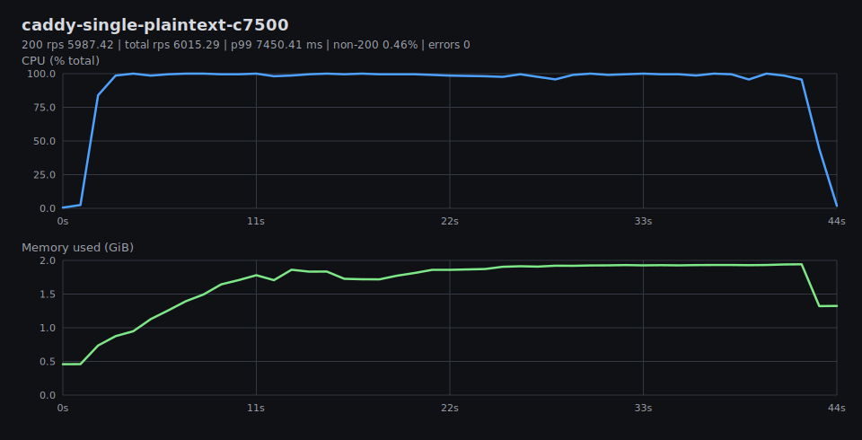

## nginx-single-plaintext-c10000

200 rps 3294.29 | total rps 3298.44 | p99 6625.9 ms | non-200 0.13% | errors 2211

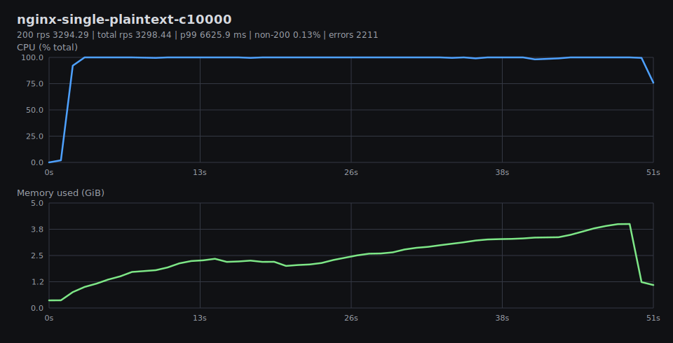

## nginx-single-plaintext-c15000

200 rps 2400.89 | total rps 2400.89 | p99 9807.19 ms | non-200 0% | errors 8305

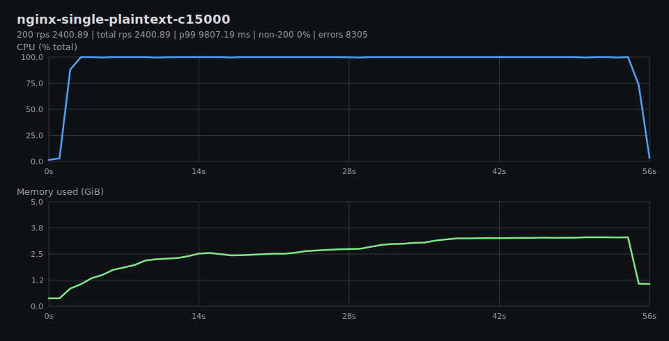

## nginx-single-plaintext-c2500

200 rps 18781.09 | total rps 18781.09 | p99 369.84 ms | non-200 0% | errors 0

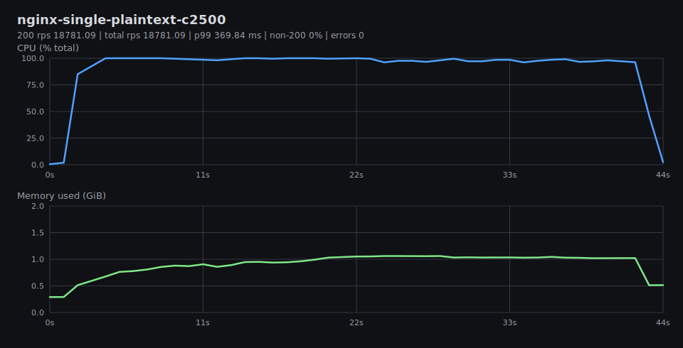

## nginx-single-plaintext-c5000

200 rps 12729.3 | total rps 12729.3 | p99 1037.74 ms | non-200 0% | errors 0

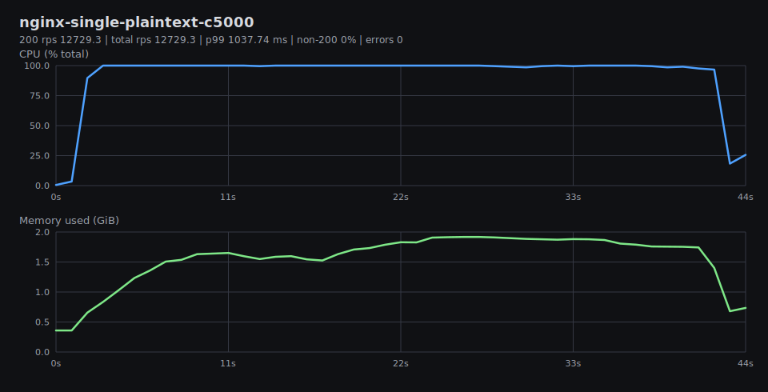

## nginx-single-plaintext-c7500

200 rps 10658.9 | total rps 10658.9 | p99 2588.33 ms | non-200 0% | errors 0

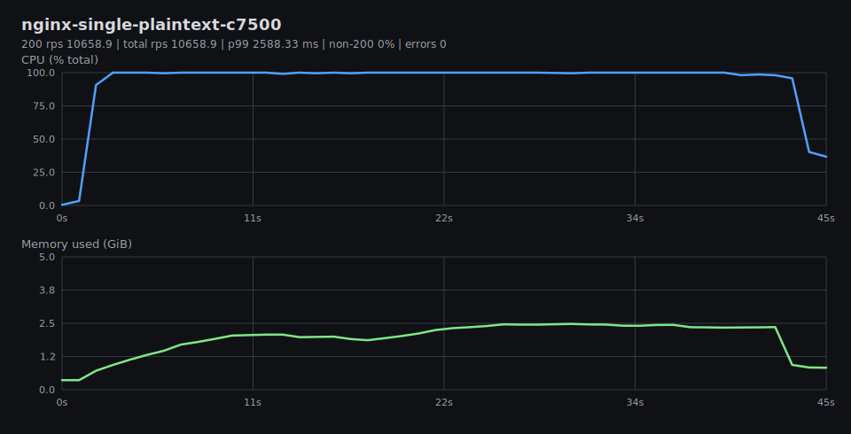

## tako-single-plaintext-c10000

200 rps 10963.61 | total rps 10963.61 | p99 7164.19 ms | non-200 0% | errors 312

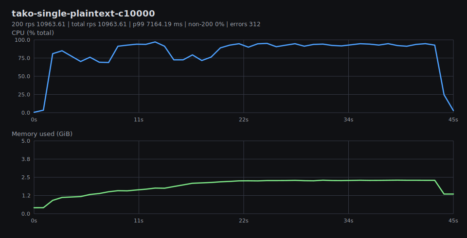

## tako-single-plaintext-c15000

200 rps 77.25 | total rps 77.25 | p99 9855.83 ms | non-200 0% | errors 43526

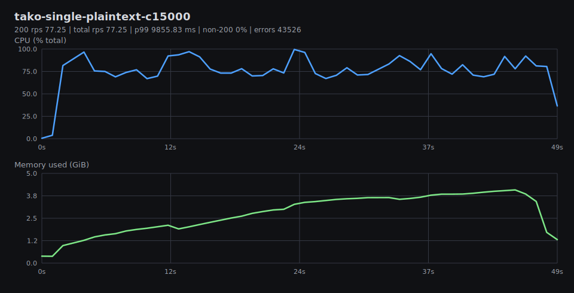

## tako-single-plaintext-c2500

200 rps 15280.23 | total rps 15280.23 | p99 793.81 ms | non-200 0% | errors 0

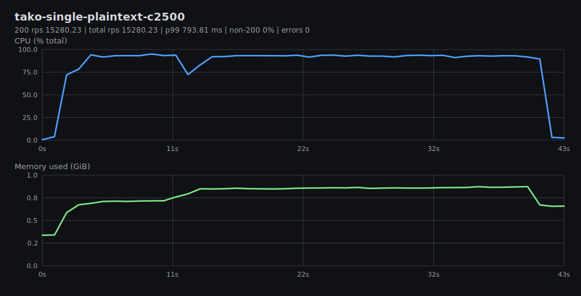

## tako-single-plaintext-c5000

200 rps 13371.05 | total rps 13371.05 | p99 3097.65 ms | non-200 0% | errors 0

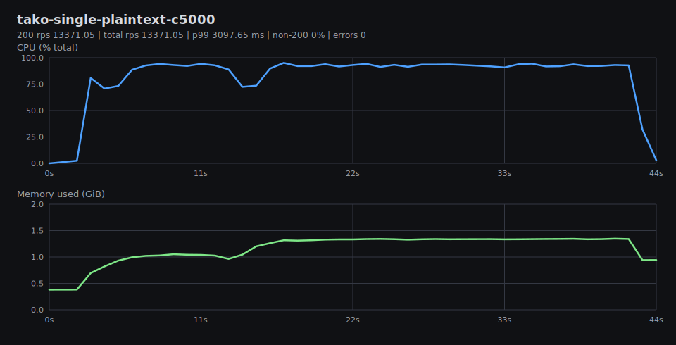

## tako-single-plaintext-c7500

200 rps 12013.68 | total rps 12013.68 | p99 5852.77 ms | non-200 0% | errors 0

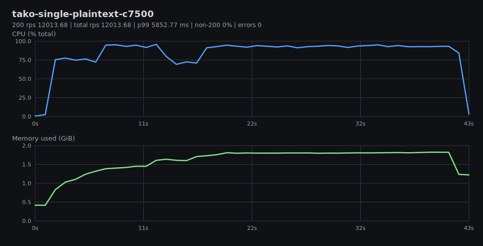

