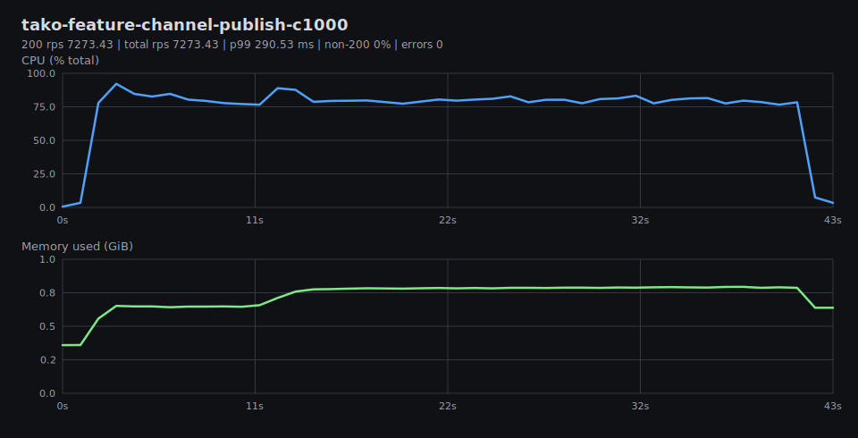
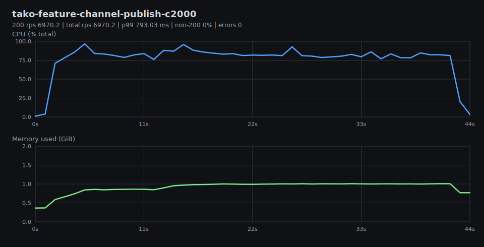
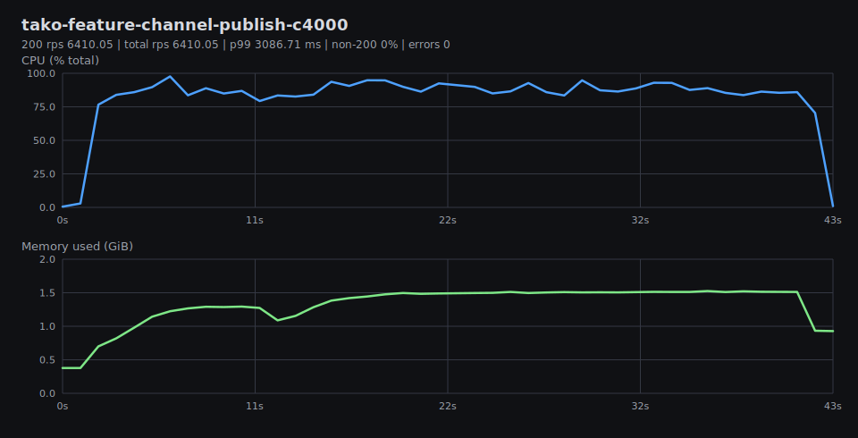
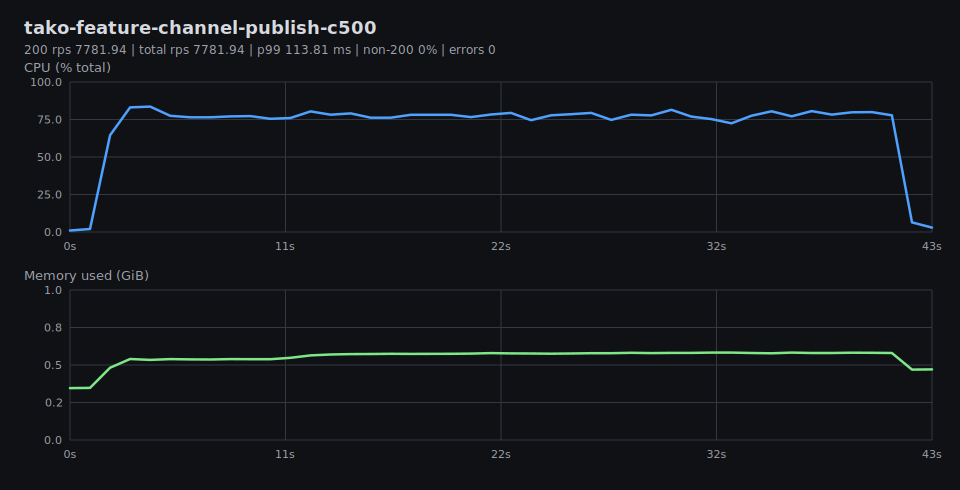
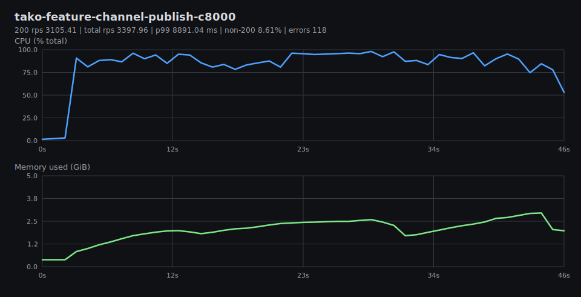
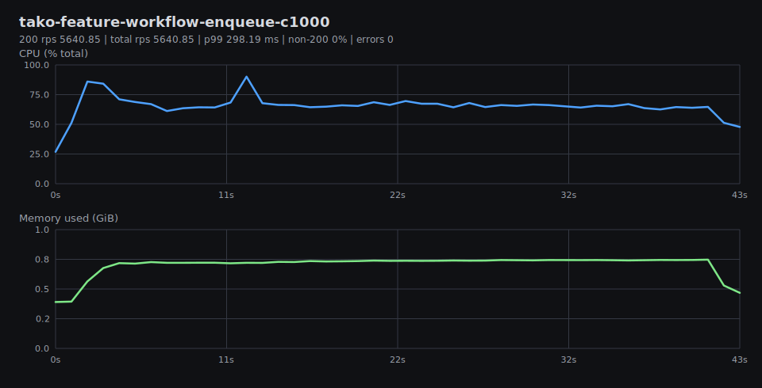
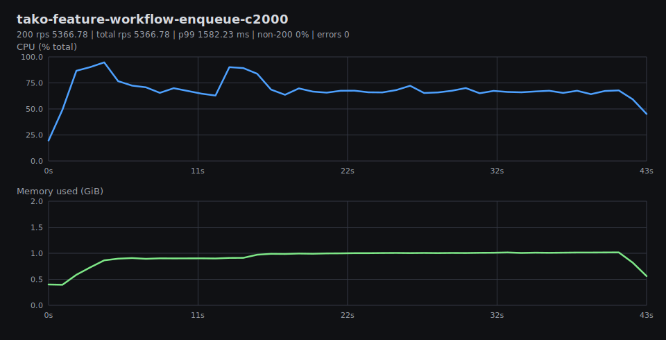
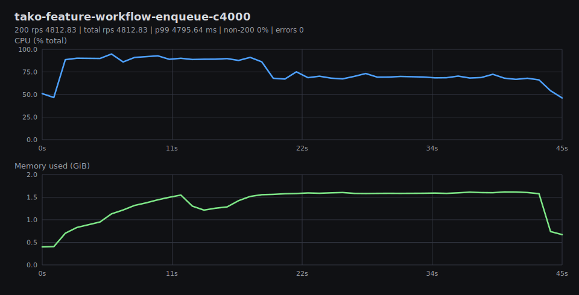
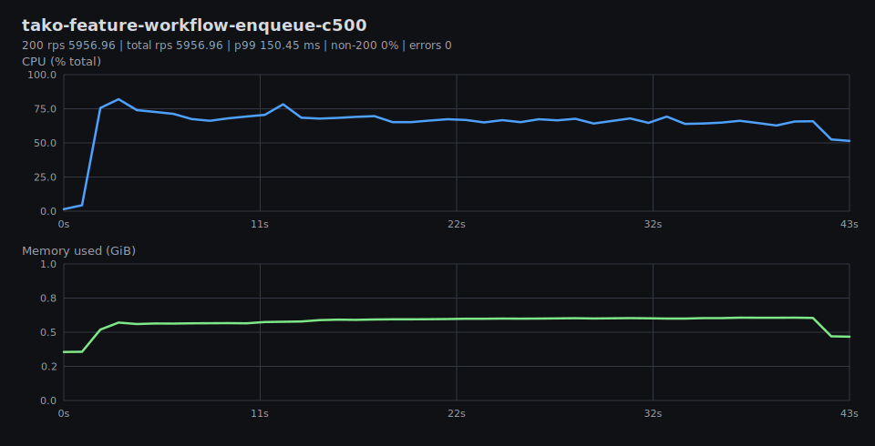
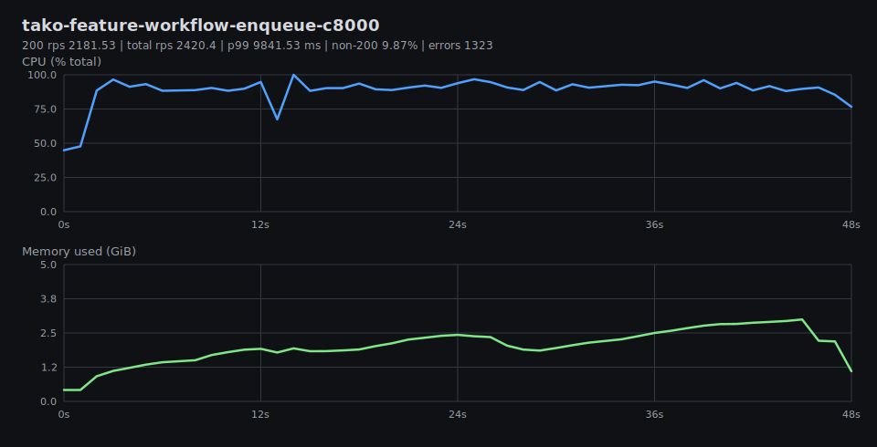

# Benchmark Graphs

Generated from result JSON and per-test metrics CSV files in `tako-features-vm-local`.

## Summary

## tako-feature-channel-publish-c1000

200 rps 7273.43 | total rps 7273.43 | p99 290.53 ms | non-200 0% | errors 0

## tako-feature-channel-publish-c2000

200 rps 6970.2 | total rps 6970.2 | p99 793.03 ms | non-200 0% | errors 0

## tako-feature-channel-publish-c4000

200 rps 6410.05 | total rps 6410.05 | p99 3086.71 ms | non-200 0% | errors 0

## tako-feature-channel-publish-c500

200 rps 7781.94 | total rps 7781.94 | p99 113.81 ms | non-200 0% | errors 0

## tako-feature-channel-publish-c8000

200 rps 3105.41 | total rps 3397.96 | p99 8891.04 ms | non-200 8.61% | errors 118

## tako-feature-workflow-enqueue-c1000

200 rps 5640.85 | total rps 5640.85 | p99 298.19 ms | non-200 0% | errors 0

## tako-feature-workflow-enqueue-c2000

200 rps 5366.78 | total rps 5366.78 | p99 1582.23 ms | non-200 0% | errors 0

## tako-feature-workflow-enqueue-c4000

200 rps 4812.83 | total rps 4812.83 | p99 4795.64 ms | non-200 0% | errors 0

## tako-feature-workflow-enqueue-c500

200 rps 5956.96 | total rps 5956.96 | p99 150.45 ms | non-200 0% | errors 0

## tako-feature-workflow-enqueue-c8000

200 rps 2181.53 | total rps 2420.4 | p99 9841.53 ms | non-200 9.87% | errors 1323

