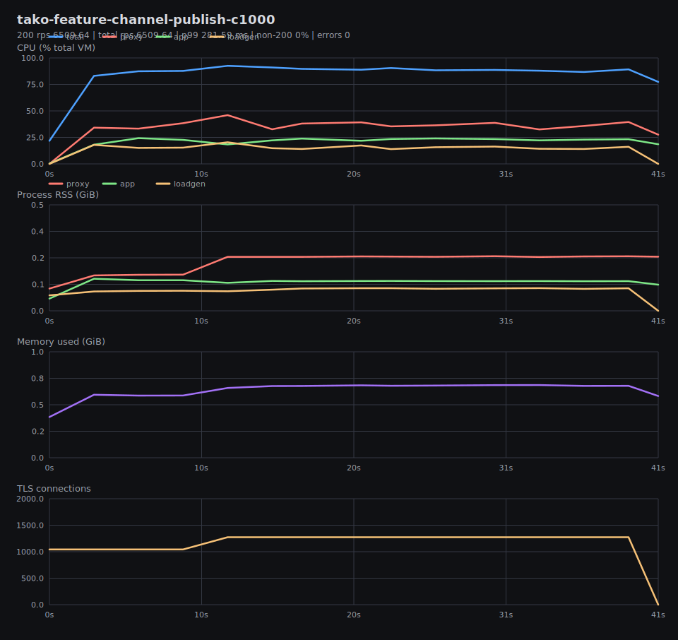
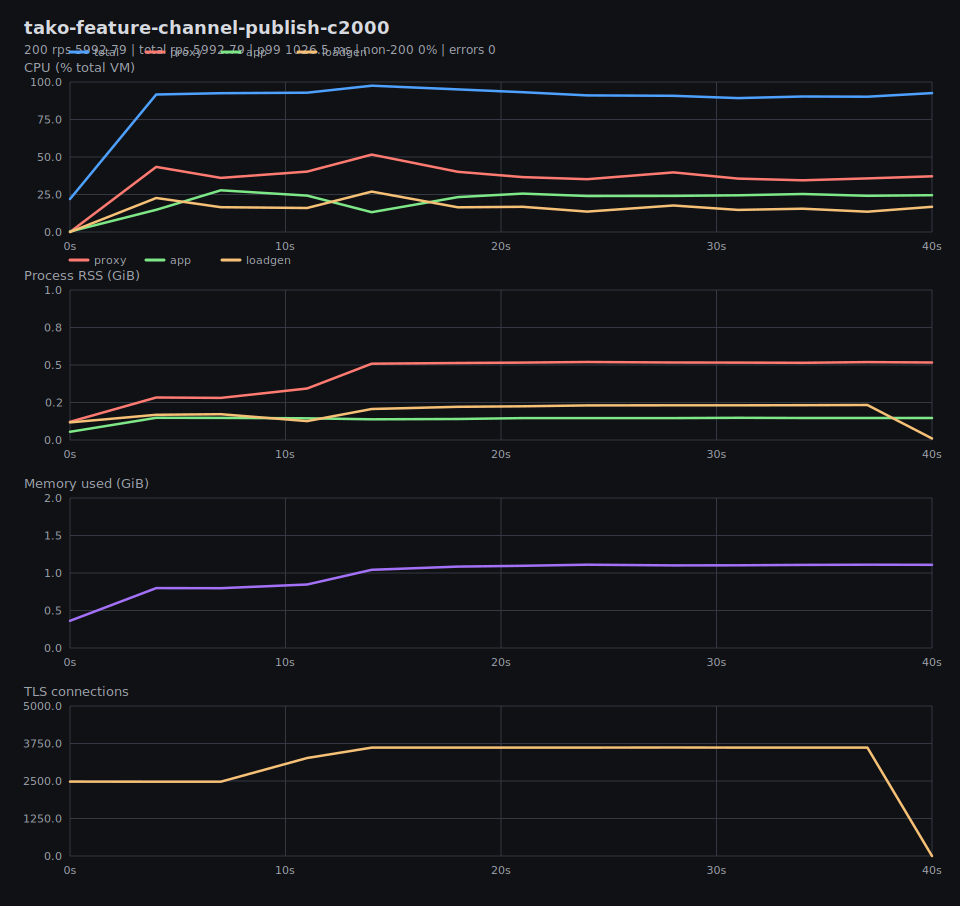
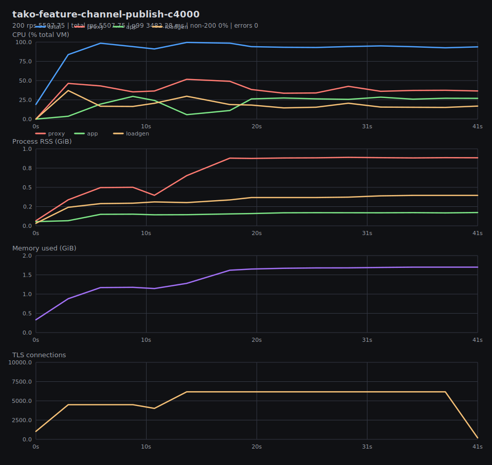
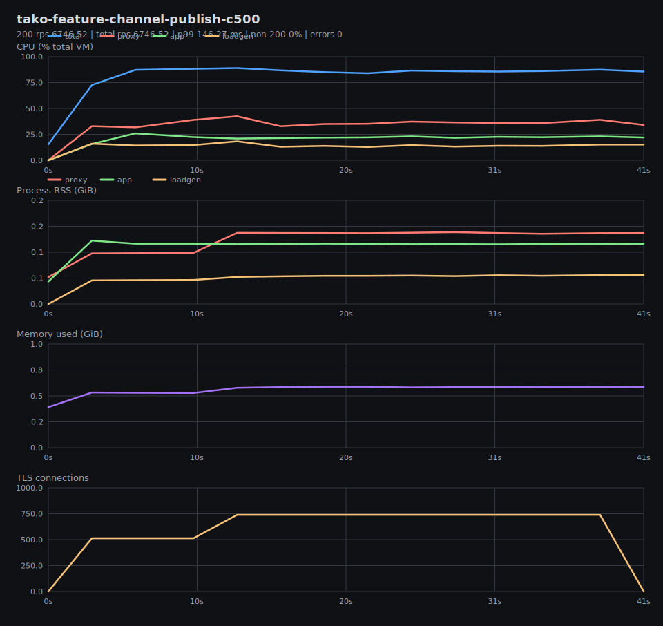
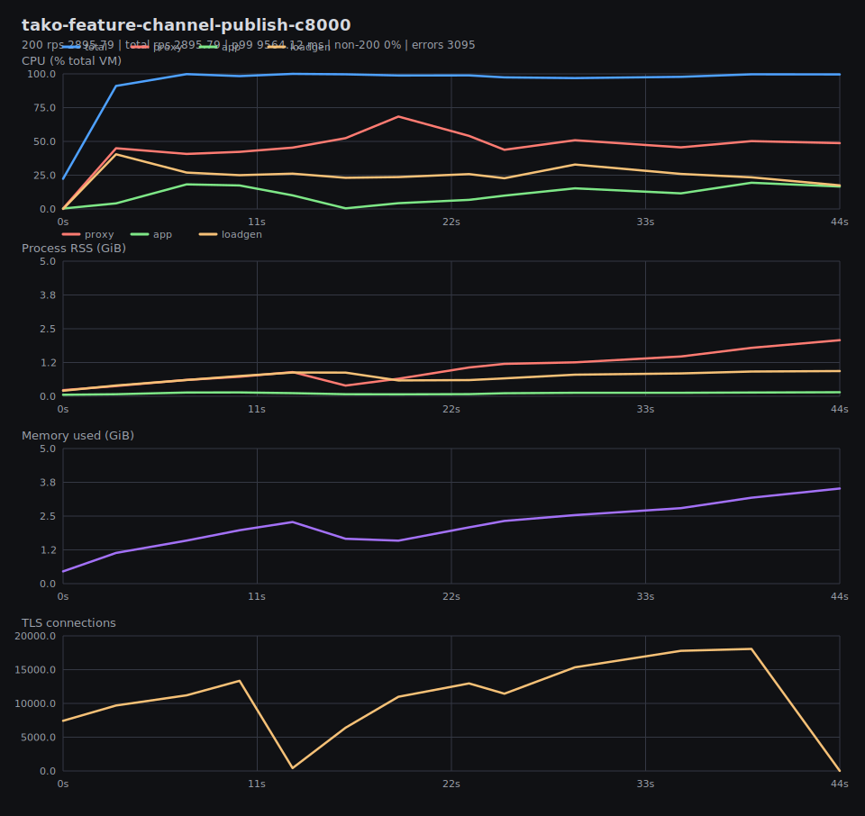
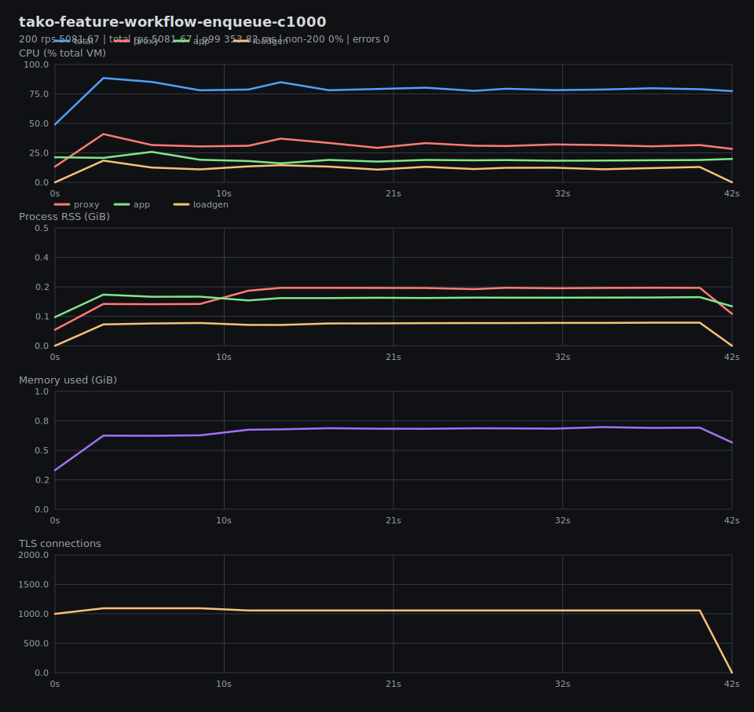
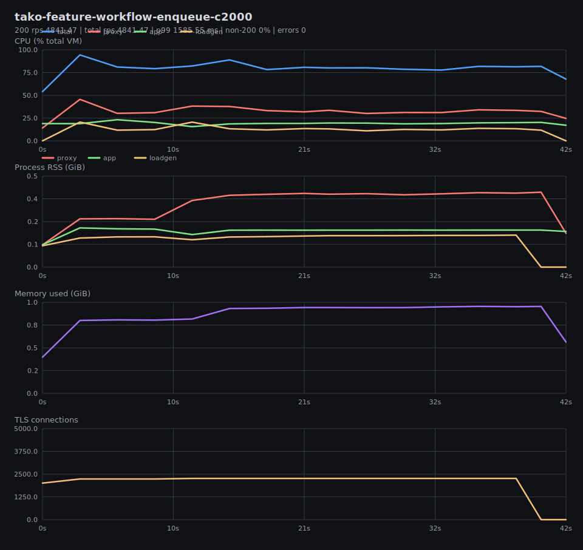
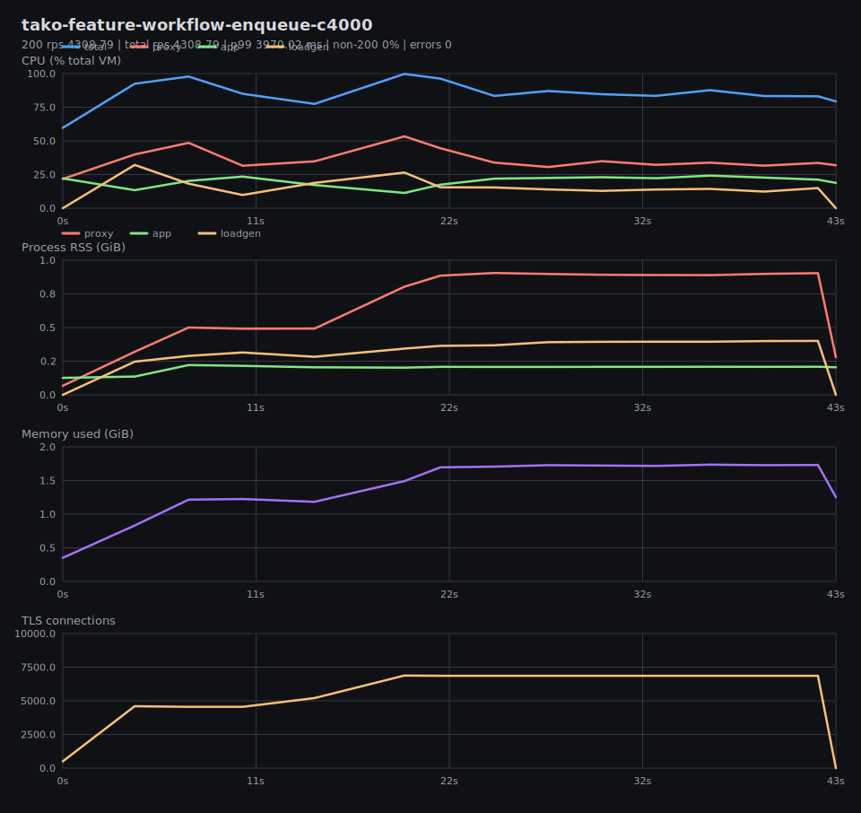
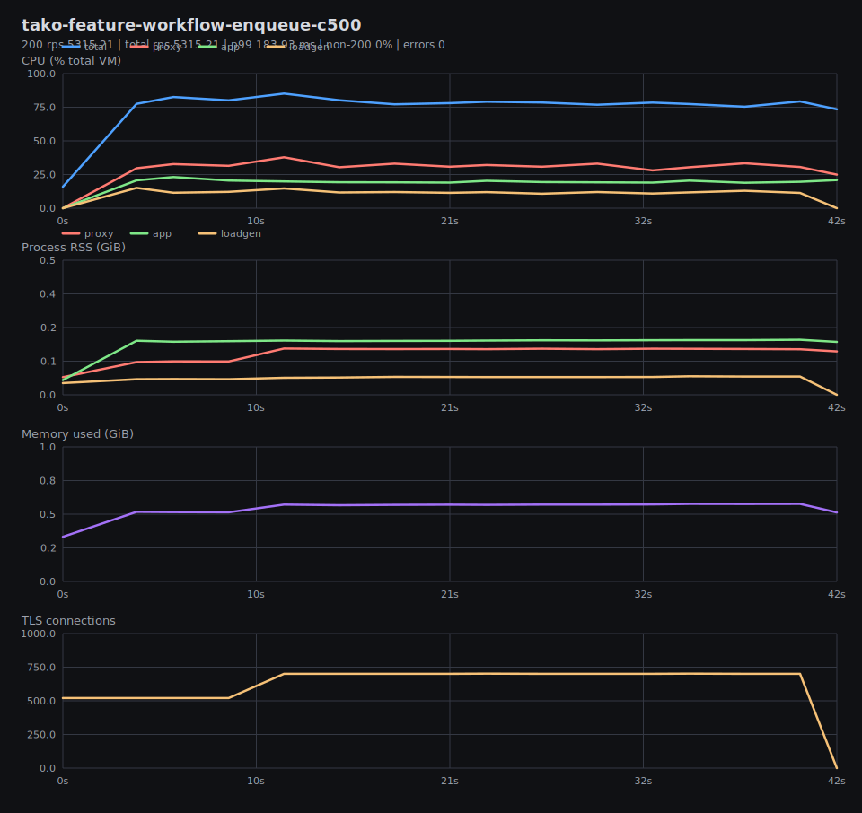
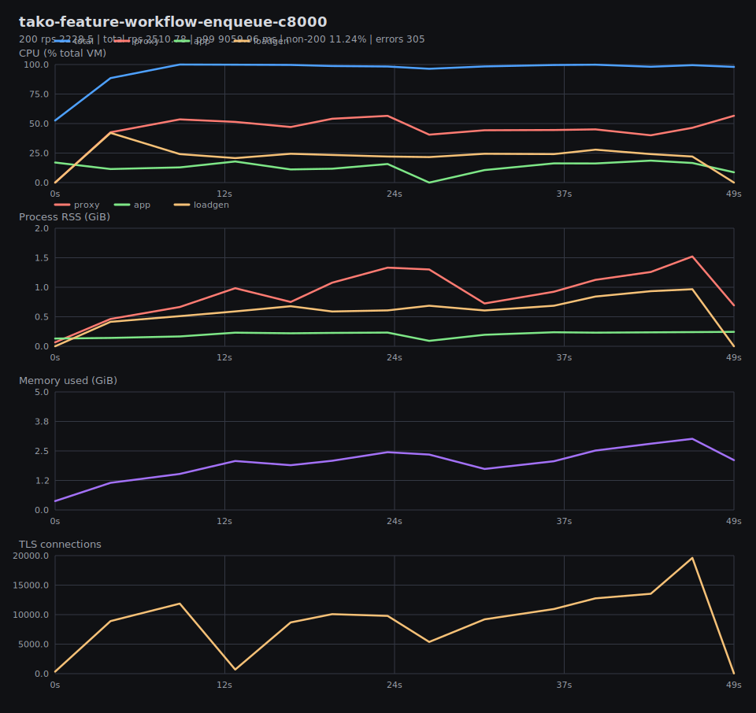

# Benchmark Graphs

Generated from result JSON and per-test metrics CSV files in `tako-features-vm-local`.

## Summary

## tako-feature-channel-publish-c1000

200 rps 6509.64 | total rps 6509.64 | p99 281.59 ms | non-200 0% | errors 0

## tako-feature-channel-publish-c2000

200 rps 5992.79 | total rps 5992.79 | p99 1026.5 ms | non-200 0% | errors 0

## tako-feature-channel-publish-c4000

200 rps 5507.75 | total rps 5507.75 | p99 3482.28 ms | non-200 0% | errors 0

## tako-feature-channel-publish-c500

200 rps 6746.52 | total rps 6746.52 | p99 146.27 ms | non-200 0% | errors 0

## tako-feature-channel-publish-c8000

200 rps 2895.79 | total rps 2895.79 | p99 9564.12 ms | non-200 0% | errors 3095

## tako-feature-workflow-enqueue-c1000

200 rps 5081.67 | total rps 5081.67 | p99 353.82 ms | non-200 0% | errors 0

## tako-feature-workflow-enqueue-c2000

200 rps 4841.47 | total rps 4841.47 | p99 1585.55 ms | non-200 0% | errors 0

## tako-feature-workflow-enqueue-c4000

200 rps 4308.79 | total rps 4308.79 | p99 3970.02 ms | non-200 0% | errors 0

## tako-feature-workflow-enqueue-c500

200 rps 5315.21 | total rps 5315.21 | p99 183.93 ms | non-200 0% | errors 0

## tako-feature-workflow-enqueue-c8000

200 rps 2228.5 | total rps 2510.78 | p99 9059.96 ms | non-200 11.24% | errors 305

