# Benchmark Graphs

Generated from result JSON and per-test metrics CSV files in `http-vm-local`.

## Summary

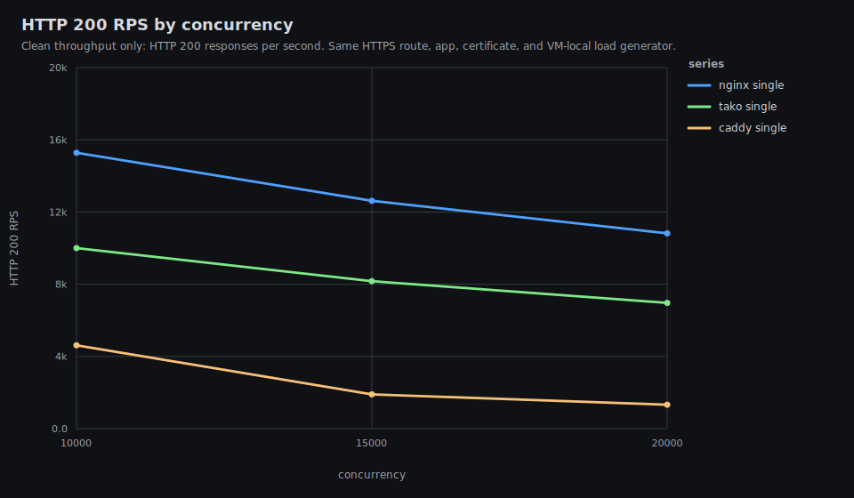

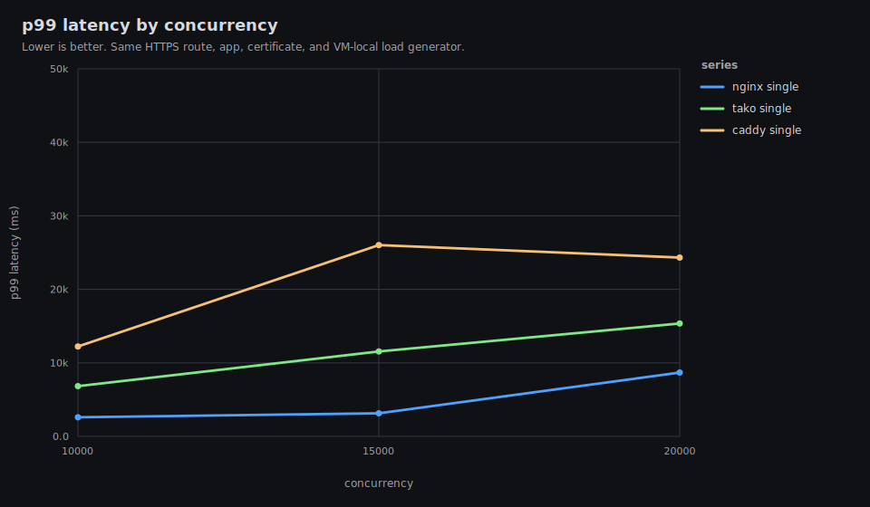

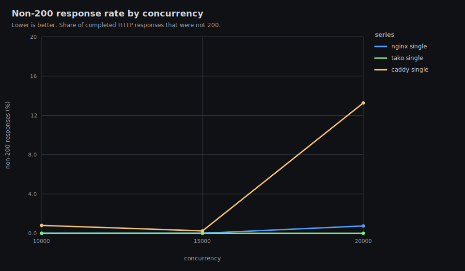

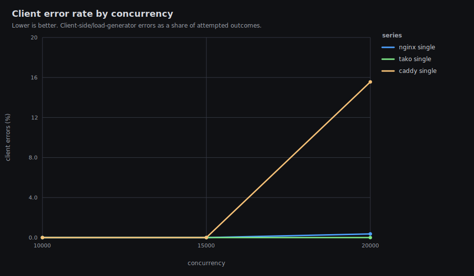

## caddy-single-plaintext-c10000

200 rps 4618.06 | total rps 4655.32 | p99 12226.25 ms | non-200 0.8% | errors 0

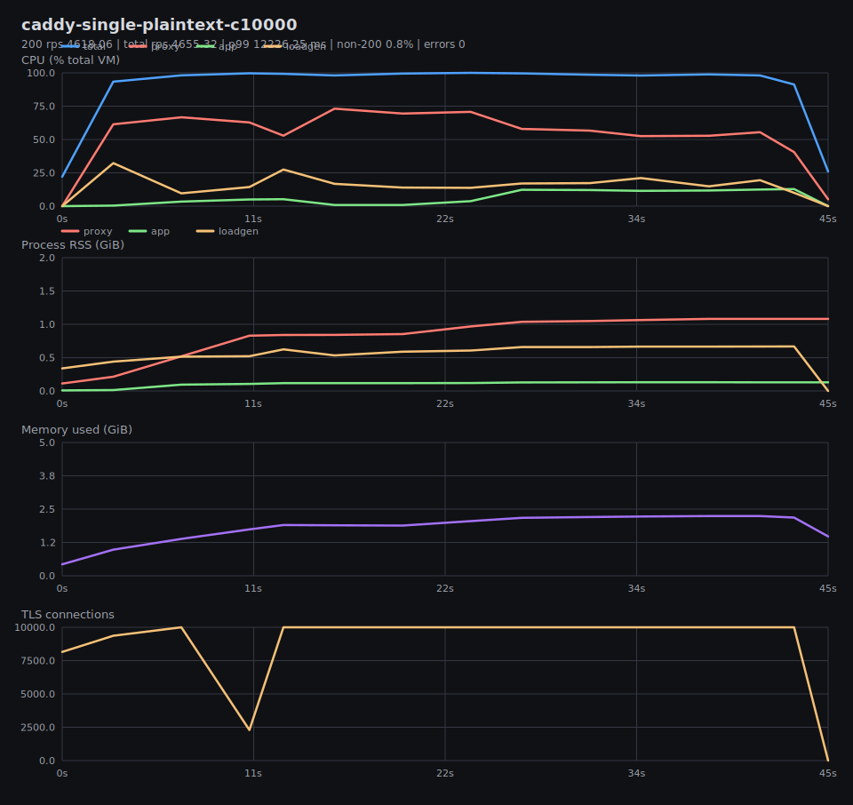

## caddy-single-plaintext-c15000

200 rps 1895.65 | total rps 1900.12 | p99 26018.03 ms | non-200 0.24% | errors 0

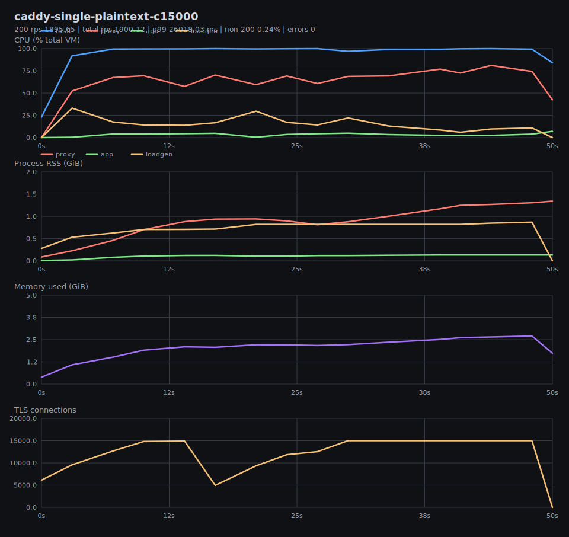

## caddy-single-plaintext-c20000

200 rps 1325.2 | total rps 1527.9 | p99 24318.36 ms | non-200 13.27% | errors 9979

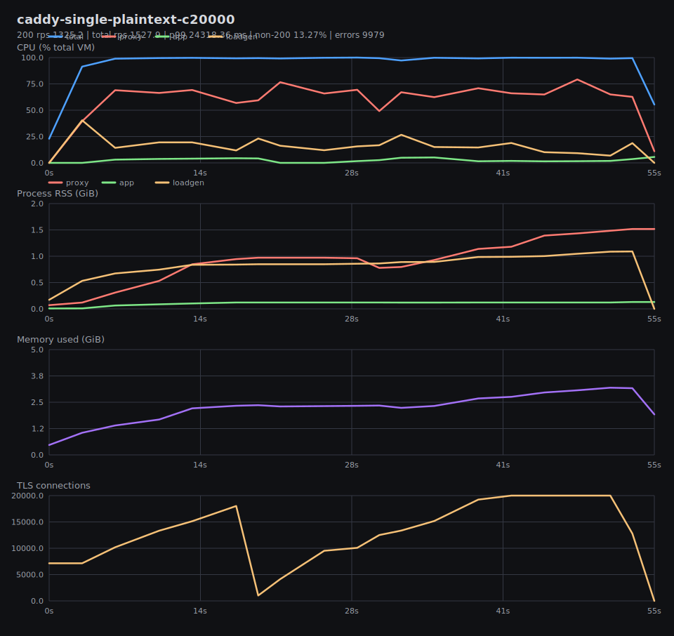

## nginx-single-plaintext-c10000

200 rps 15278.63 | total rps 15278.63 | p99 2603.28 ms | non-200 0% | errors 0

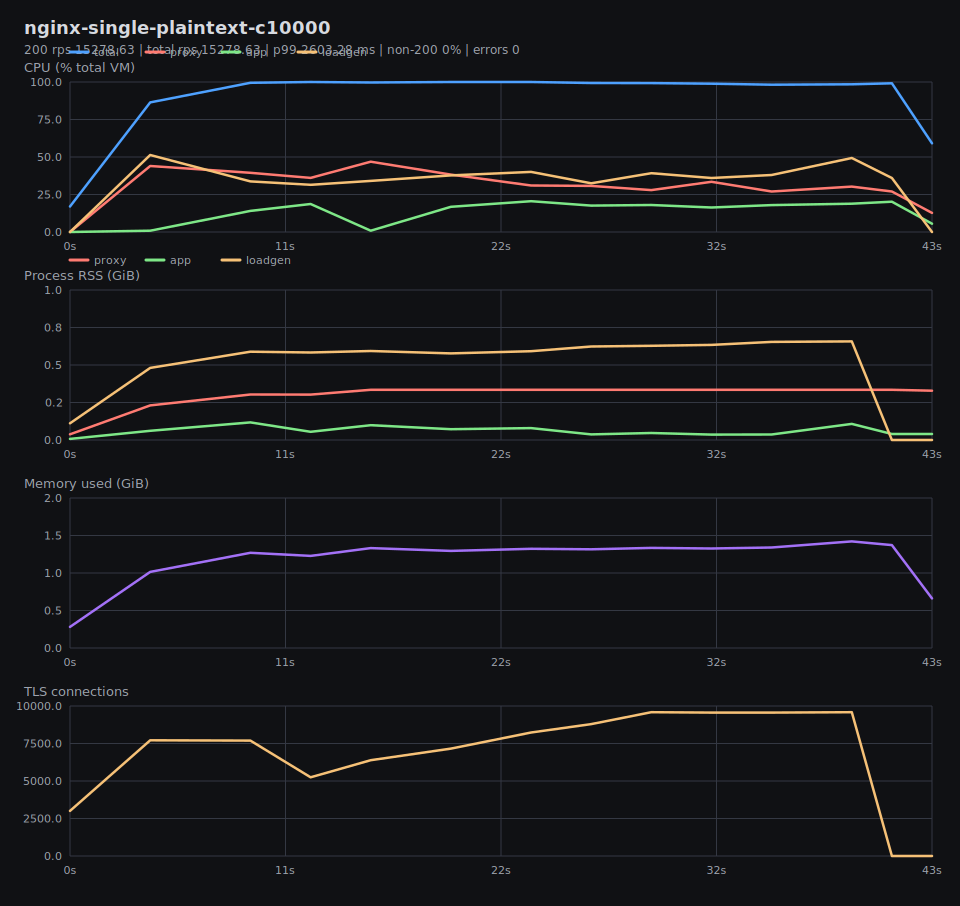

## nginx-single-plaintext-c15000

200 rps 12620.9 | total rps 12620.9 | p99 3143.03 ms | non-200 0% | errors 0

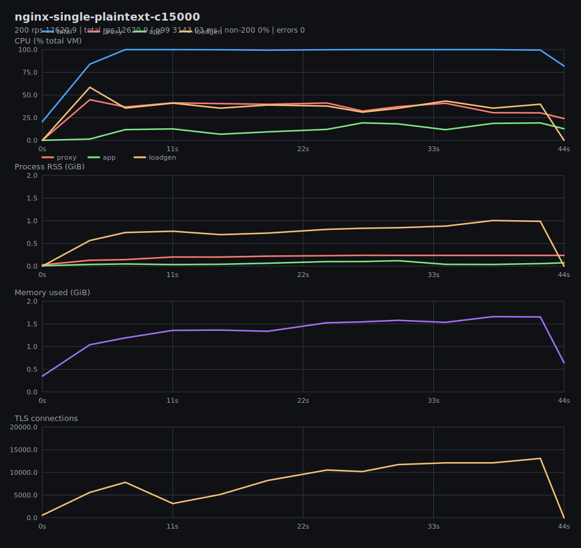

## nginx-single-plaintext-c20000

200 rps 10816.79 | total rps 10897.6 | p99 8680.37 ms | non-200 0.74% | errors 1246

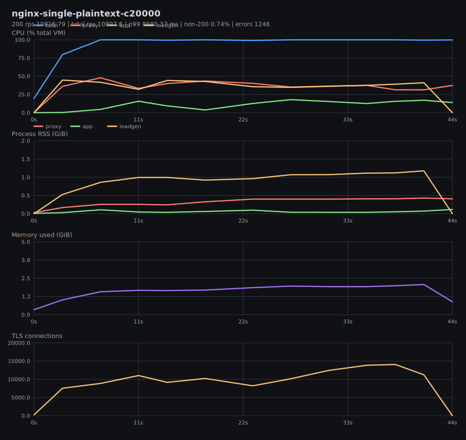

## tako-single-plaintext-c10000

200 rps 10001.03 | total rps 10001.03 | p99 6829.06 ms | non-200 0% | errors 0

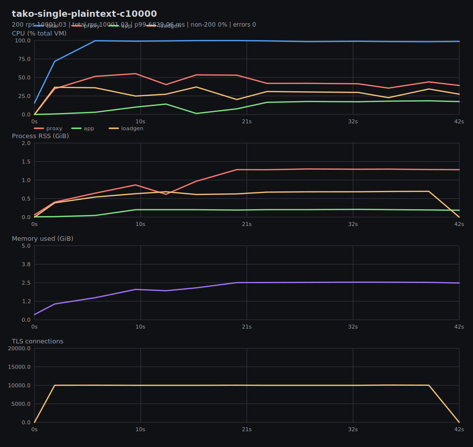

## tako-single-plaintext-c15000

200 rps 8167.02 | total rps 8167.02 | p99 11546.05 ms | non-200 0% | errors 0

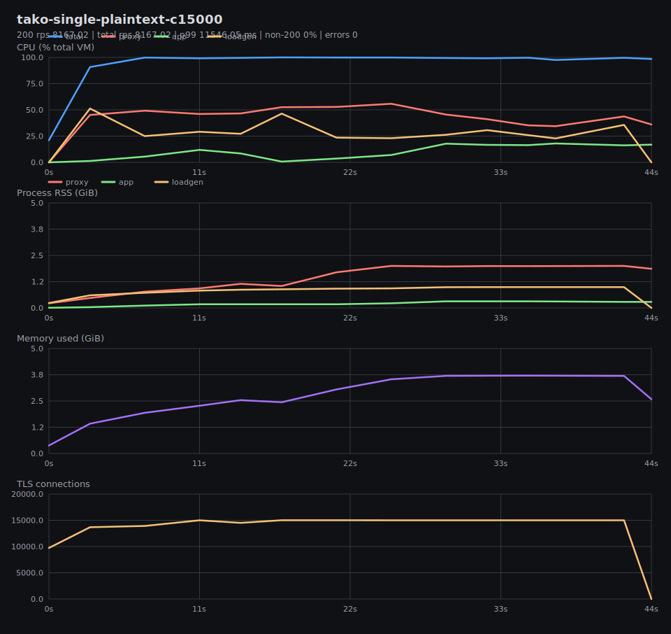

## tako-single-plaintext-c20000

200 rps 6963.78 | total rps 6963.78 | p99 15359.36 ms | non-200 0% | errors 0

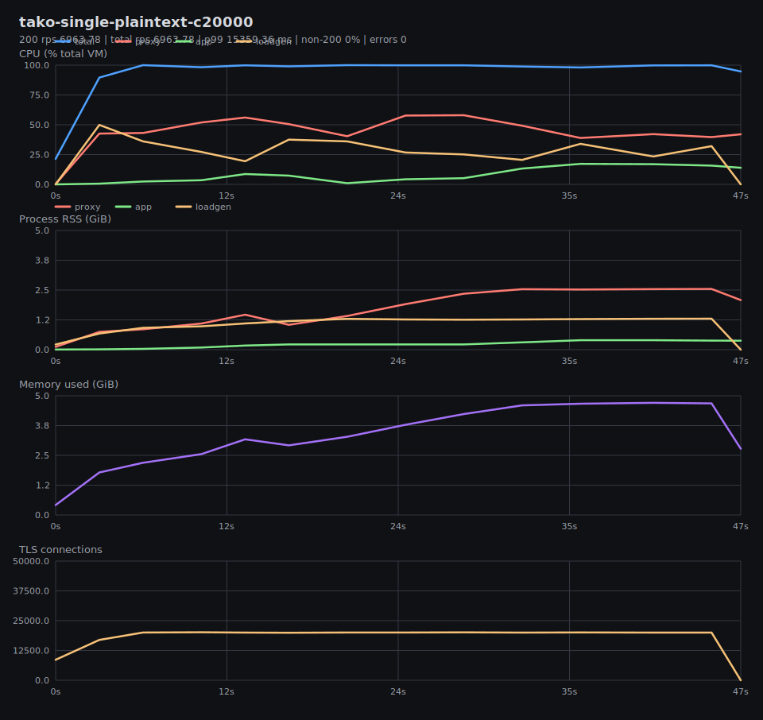

