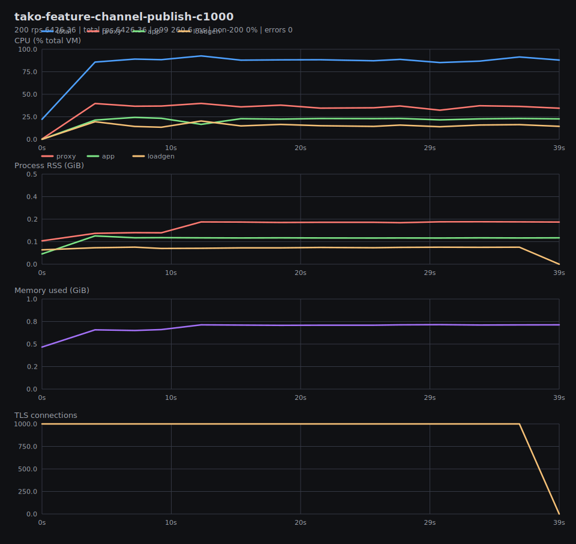
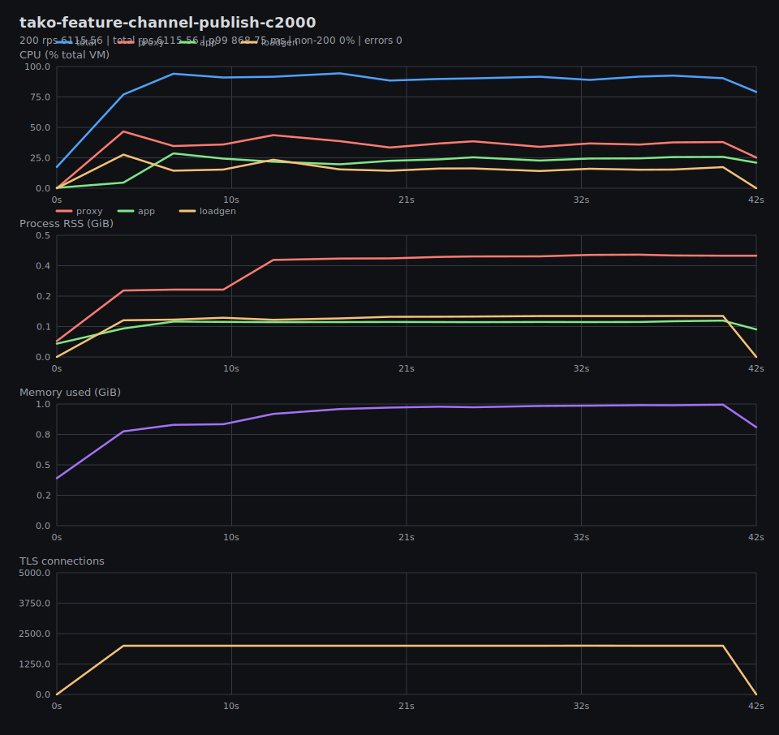
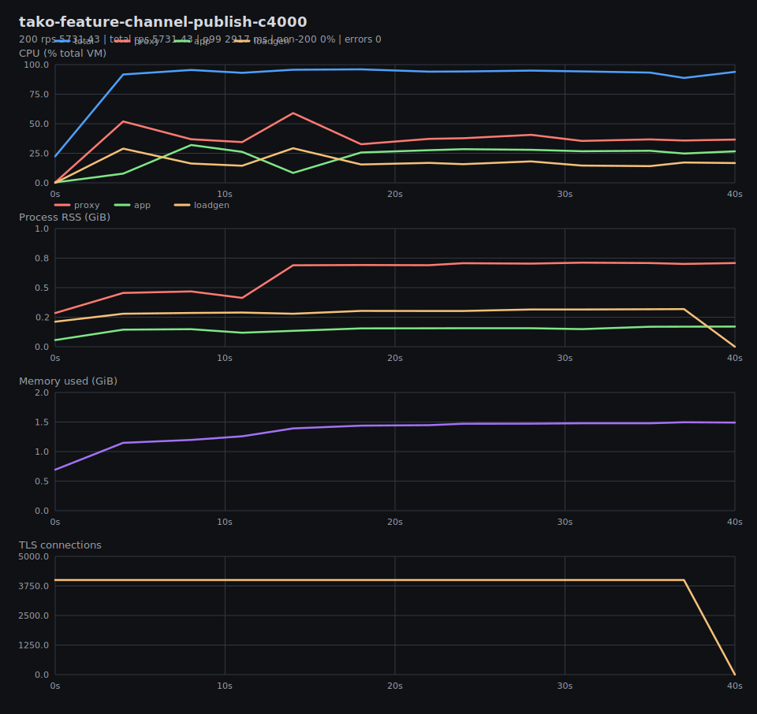
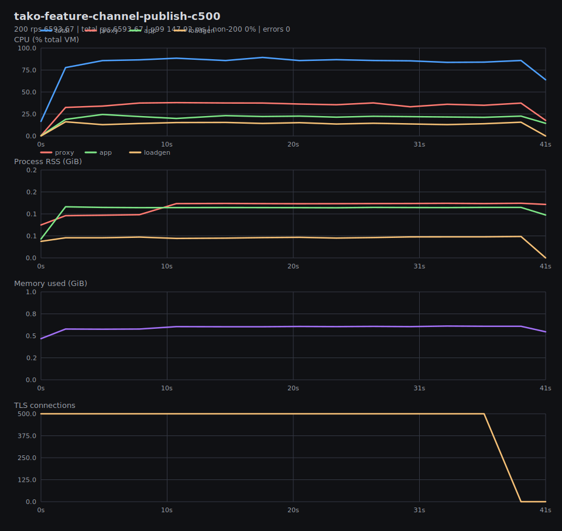
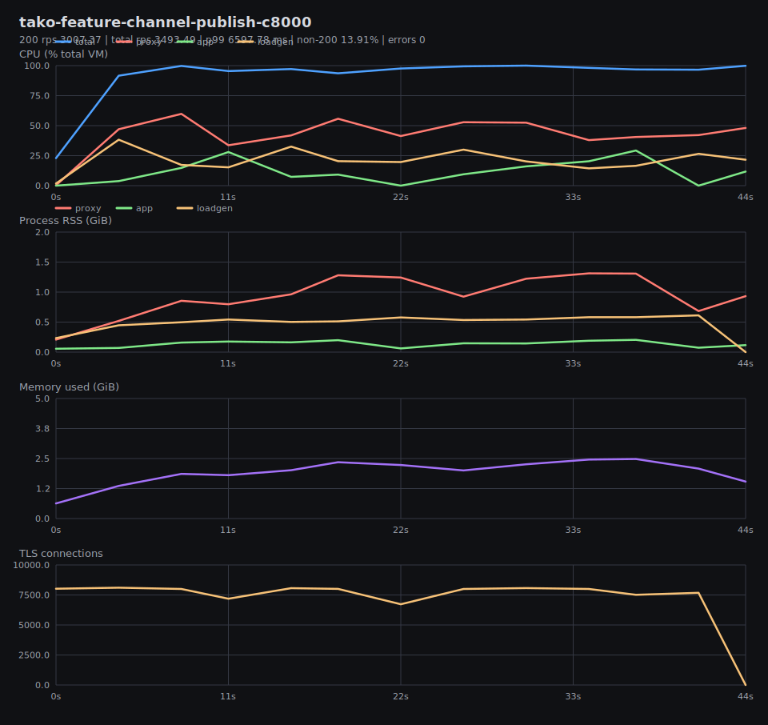
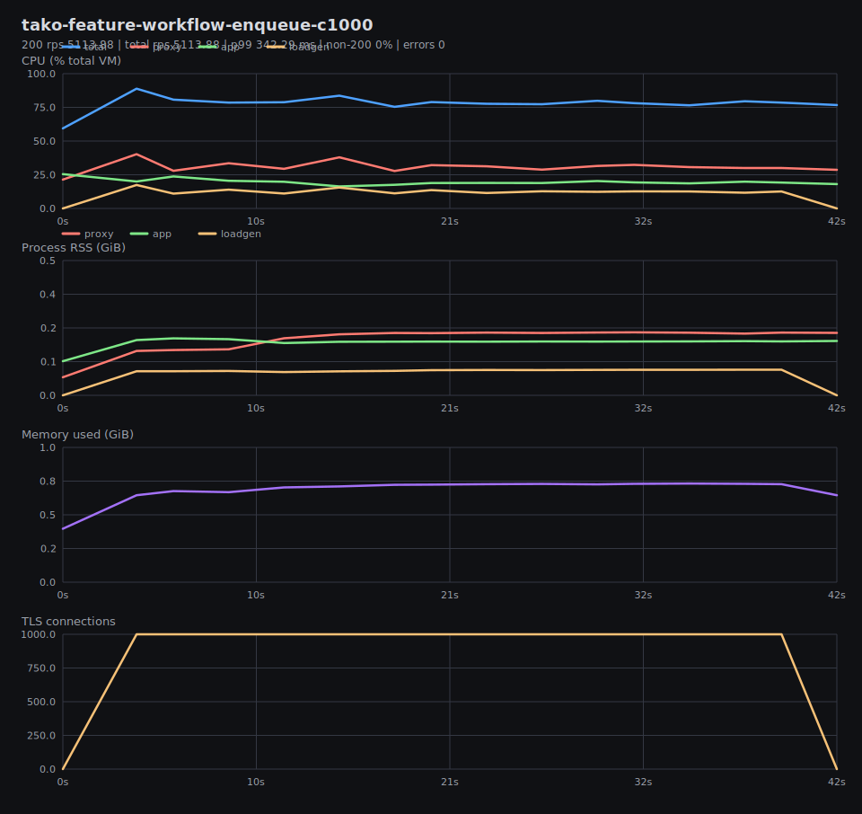
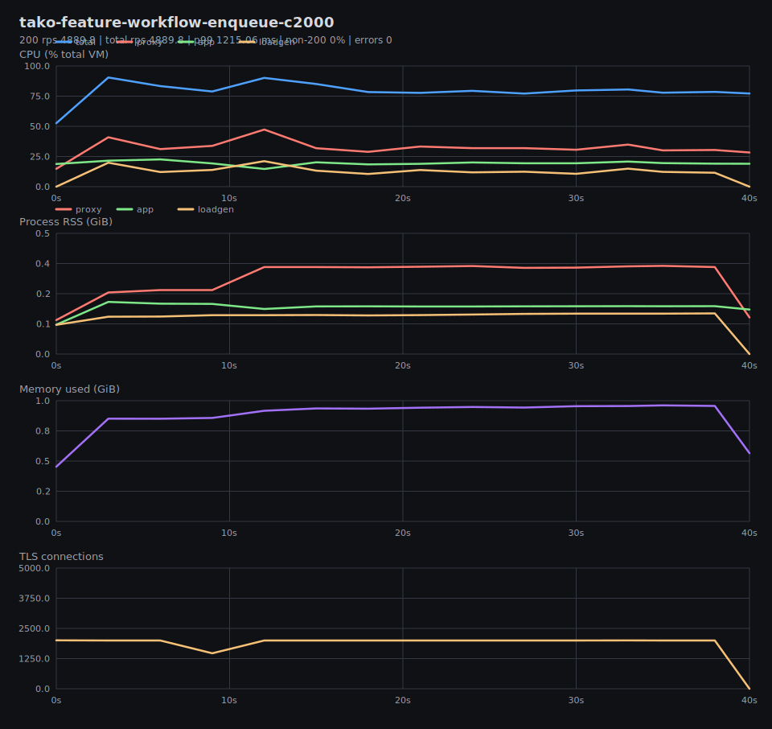
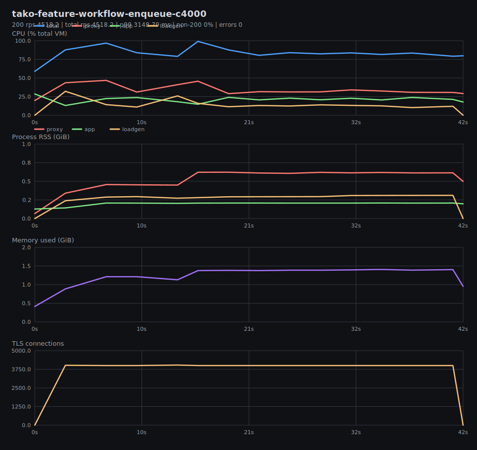
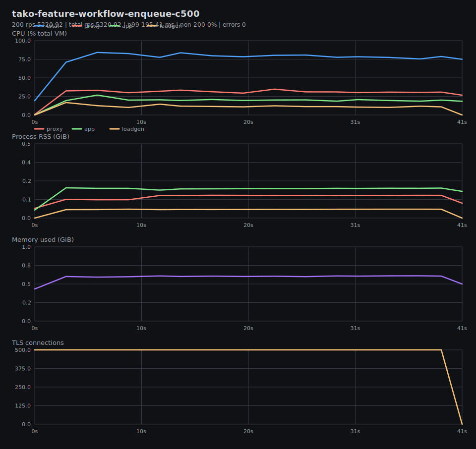
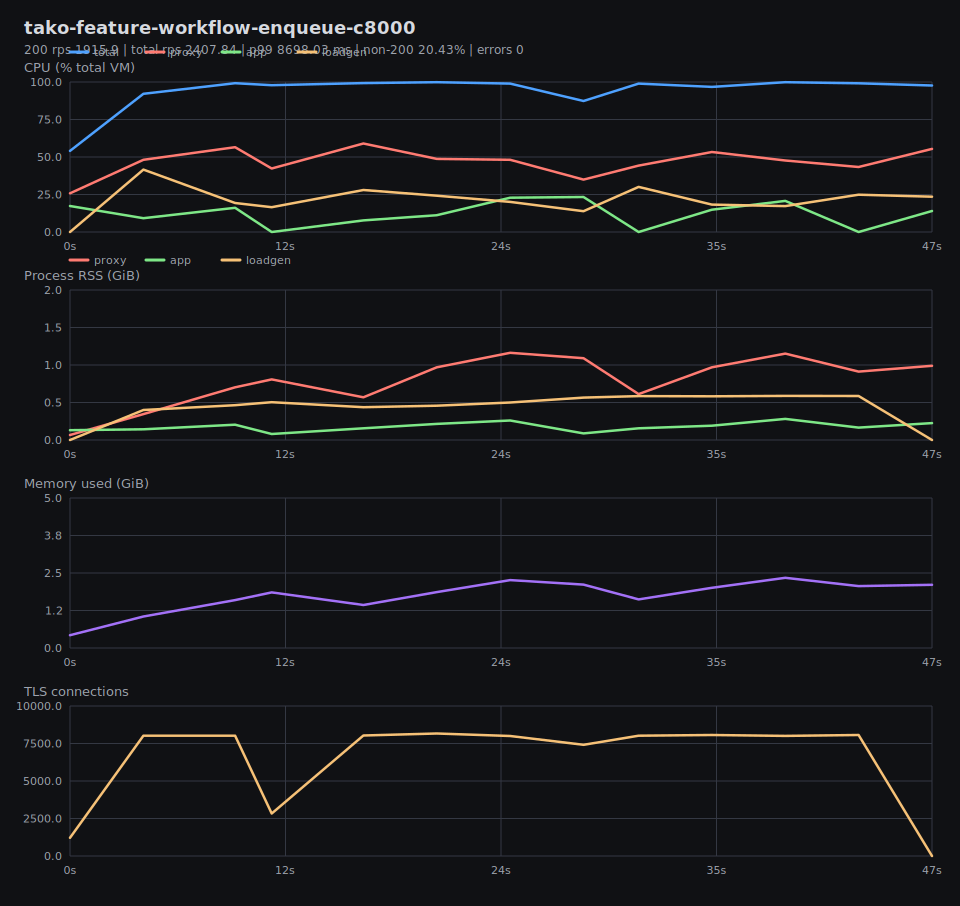

# Benchmark Graphs

Generated from result JSON and per-test metrics CSV files in `tako-features-vm-local`.

## Summary

## tako-feature-channel-publish-c1000

200 rps 6426.36 | total rps 6426.36 | p99 260.6 ms | non-200 0% | errors 0

## tako-feature-channel-publish-c2000

200 rps 6115.56 | total rps 6115.56 | p99 868.75 ms | non-200 0% | errors 0

## tako-feature-channel-publish-c4000

200 rps 5731.43 | total rps 5731.43 | p99 2917 ms | non-200 0% | errors 0

## tako-feature-channel-publish-c500

200 rps 6593.67 | total rps 6593.67 | p99 147.92 ms | non-200 0% | errors 0

## tako-feature-channel-publish-c8000

200 rps 3007.37 | total rps 3493.49 | p99 6597.78 ms | non-200 13.91% | errors 0

## tako-feature-workflow-enqueue-c1000

200 rps 5113.88 | total rps 5113.88 | p99 342.29 ms | non-200 0% | errors 0

## tako-feature-workflow-enqueue-c2000

200 rps 4889.8 | total rps 4889.8 | p99 1215.06 ms | non-200 0% | errors 0

## tako-feature-workflow-enqueue-c4000

200 rps 4518.2 | total rps 4518.2 | p99 3148.79 ms | non-200 0% | errors 0

## tako-feature-workflow-enqueue-c500

200 rps 5320.92 | total rps 5320.92 | p99 195.41 ms | non-200 0% | errors 0

## tako-feature-workflow-enqueue-c8000

200 rps 1915.9 | total rps 2407.84 | p99 8698.03 ms | non-200 20.43% | errors 0

