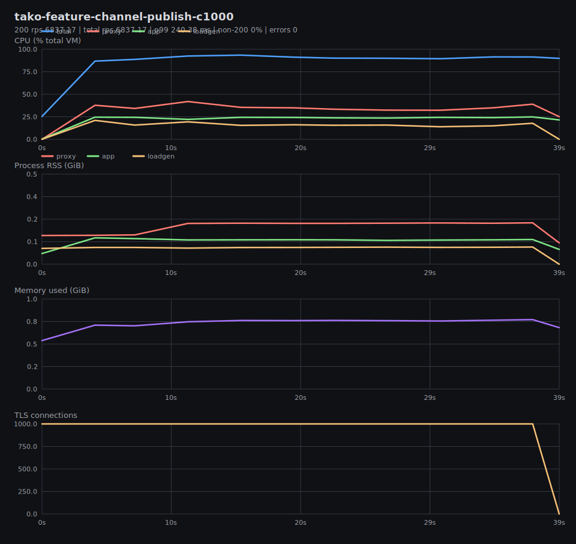
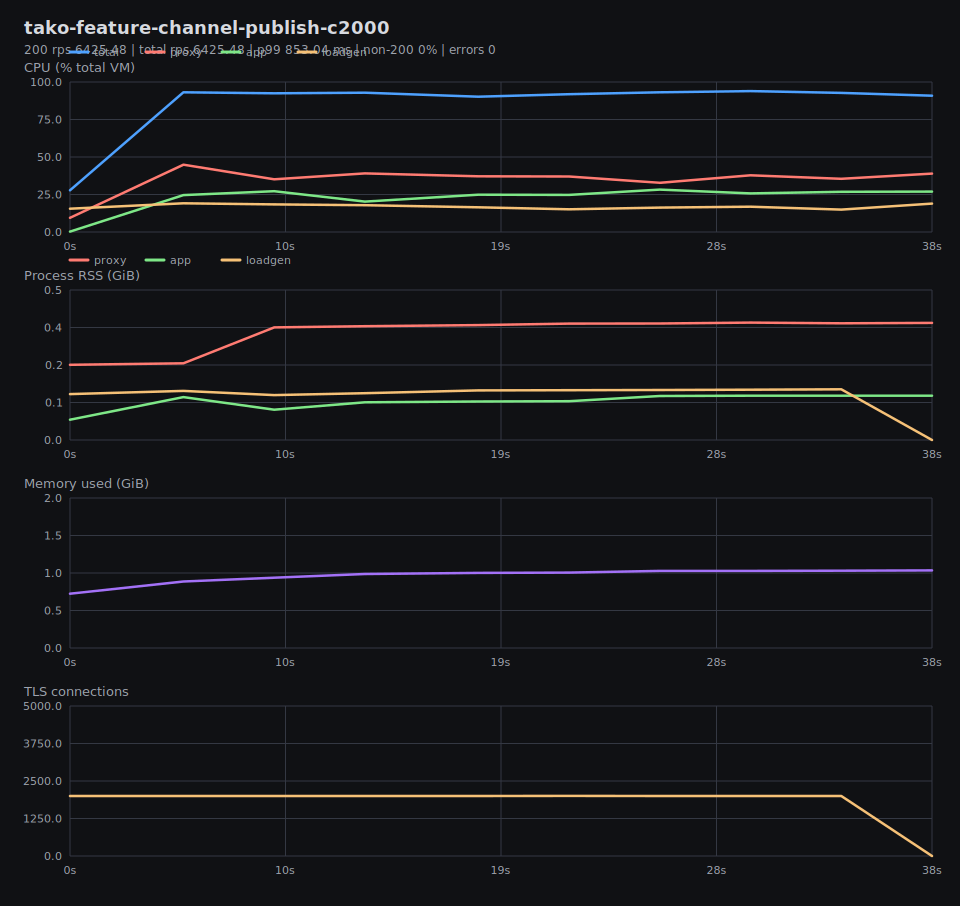
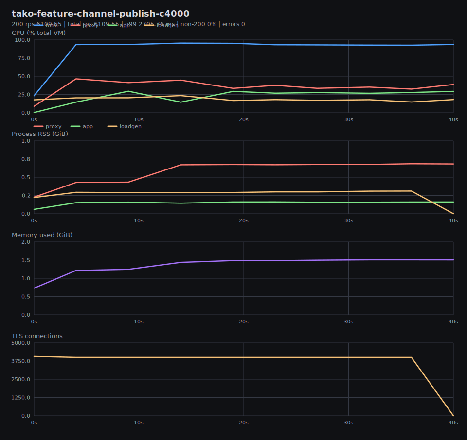
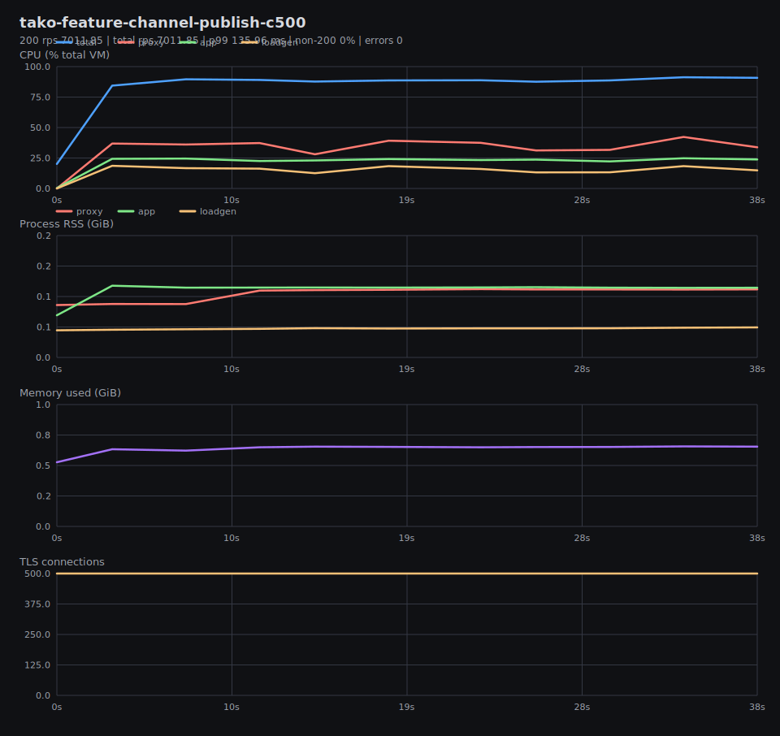
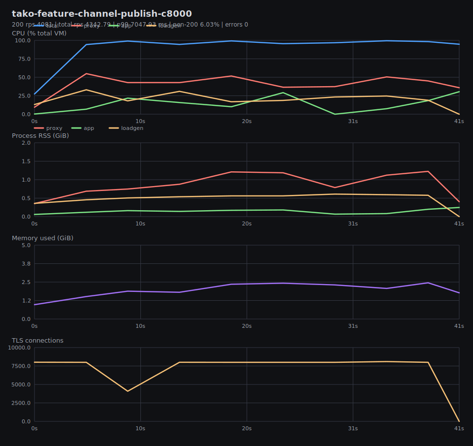
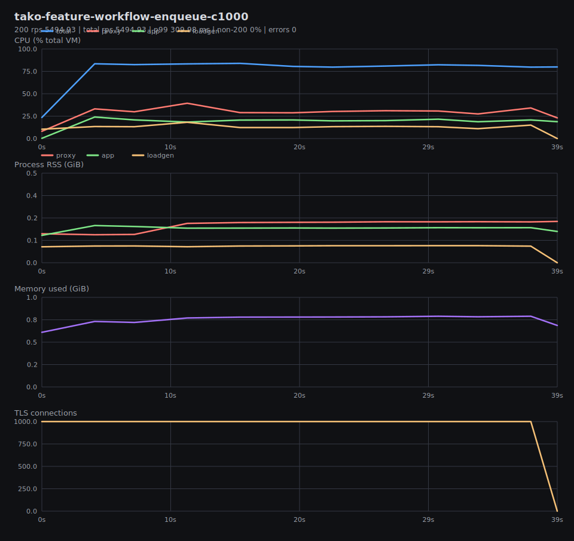
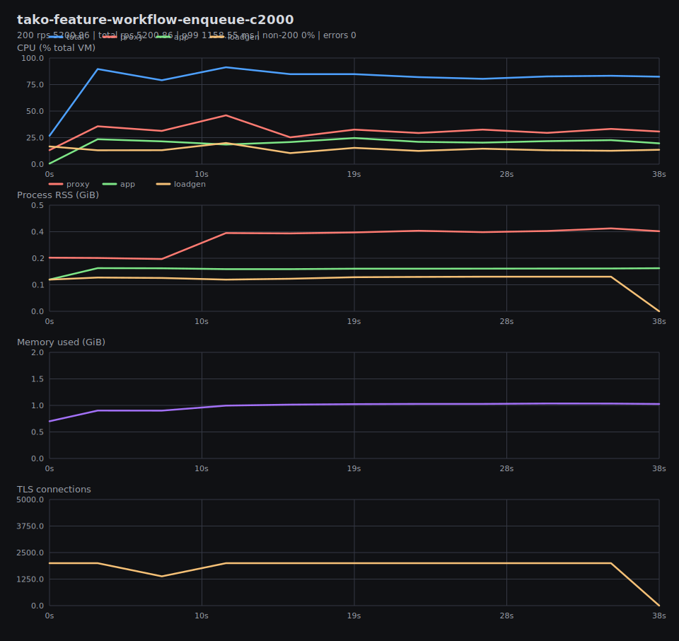
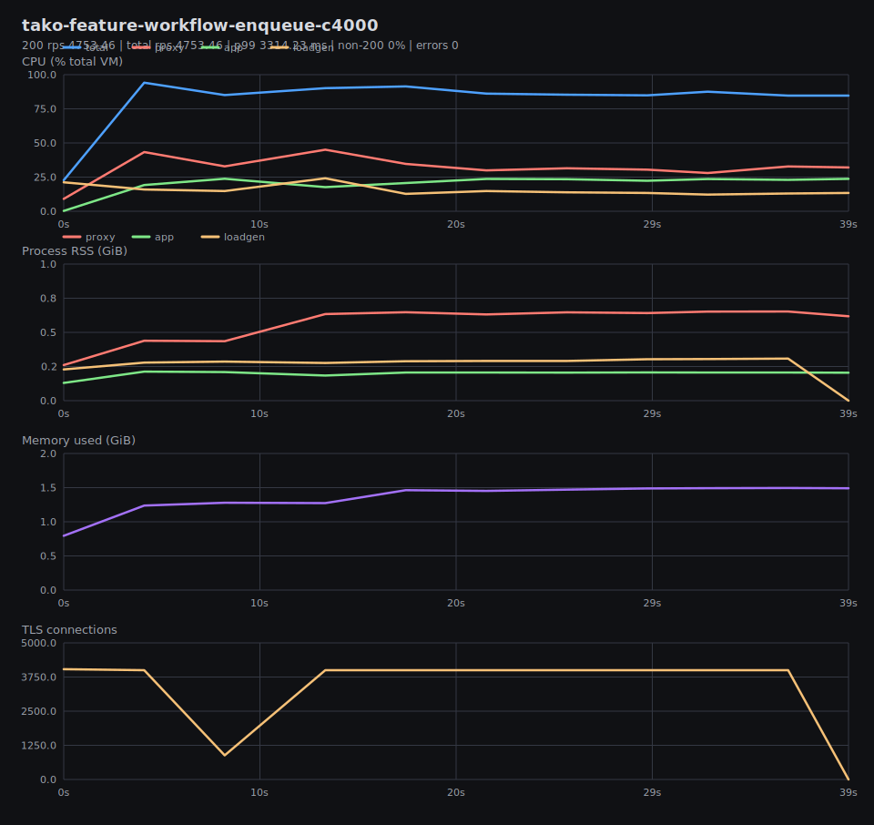
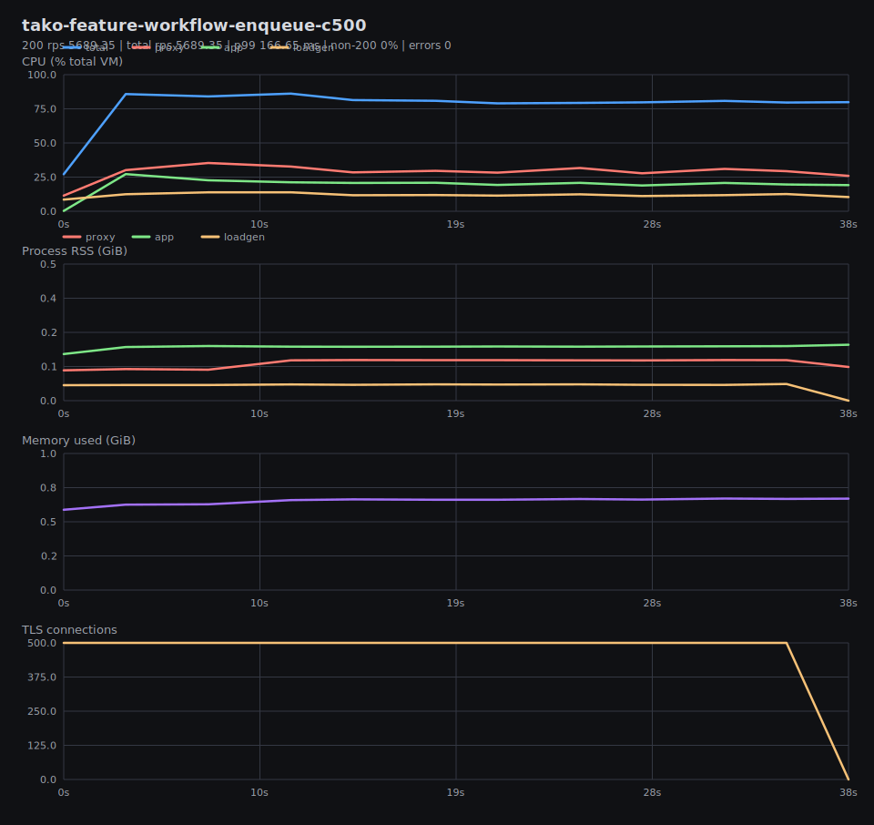
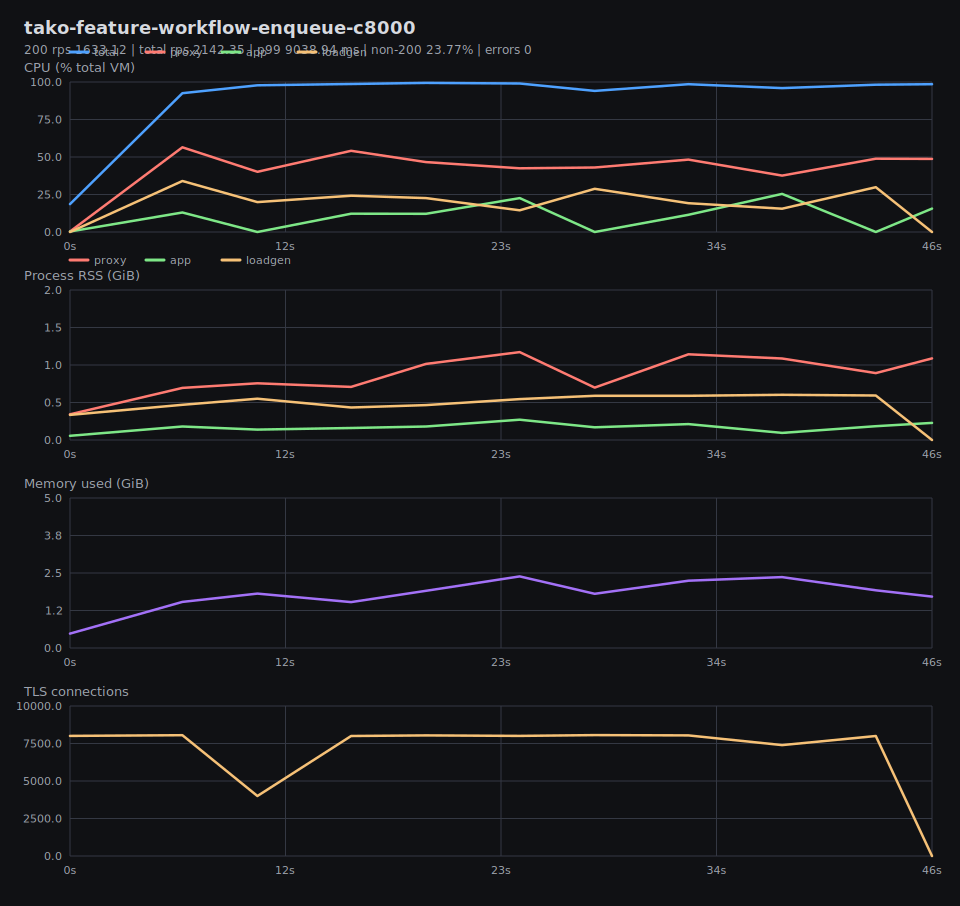

# Benchmark Graphs

Generated from result JSON and per-test metrics CSV files in `tako-features-vm-local`.

## Summary

## tako-feature-channel-publish-c1000

200 rps 6837.17 | total rps 6837.17 | p99 240.38 ms | non-200 0% | errors 0

## tako-feature-channel-publish-c2000

200 rps 6425.48 | total rps 6425.48 | p99 853.04 ms | non-200 0% | errors 0

## tako-feature-channel-publish-c4000

200 rps 6109.55 | total rps 6109.55 | p99 2705.76 ms | non-200 0% | errors 0

## tako-feature-channel-publish-c500

200 rps 7011.85 | total rps 7011.85 | p99 135.96 ms | non-200 0% | errors 0

## tako-feature-channel-publish-c8000

200 rps 4081 | total rps 4342.79 | p99 7047.93 ms | non-200 6.03% | errors 0

## tako-feature-workflow-enqueue-c1000

200 rps 5494.93 | total rps 5494.93 | p99 309.98 ms | non-200 0% | errors 0

## tako-feature-workflow-enqueue-c2000

200 rps 5200.86 | total rps 5200.86 | p99 1158.55 ms | non-200 0% | errors 0

## tako-feature-workflow-enqueue-c4000

200 rps 4753.46 | total rps 4753.46 | p99 3314.23 ms | non-200 0% | errors 0

## tako-feature-workflow-enqueue-c500

200 rps 5689.35 | total rps 5689.35 | p99 166.65 ms | non-200 0% | errors 0

## tako-feature-workflow-enqueue-c8000

200 rps 1633.12 | total rps 2142.35 | p99 9038.94 ms | non-200 23.77% | errors 0

