# Benchmark Graphs

Generated from result JSON and per-test metrics CSV files in `tako-features-vm-local`.

## Summary

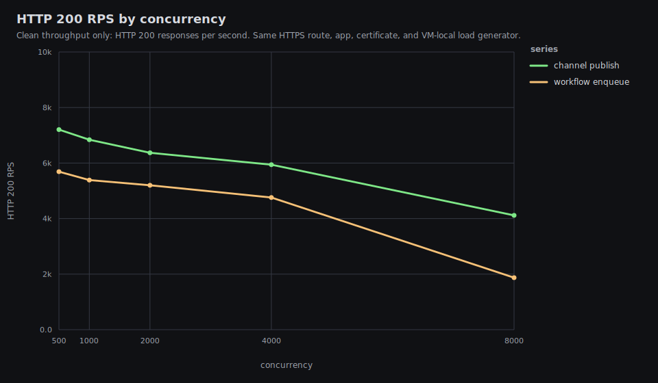

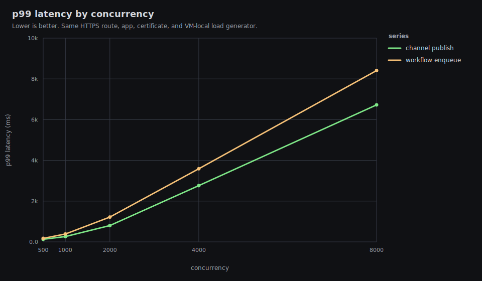

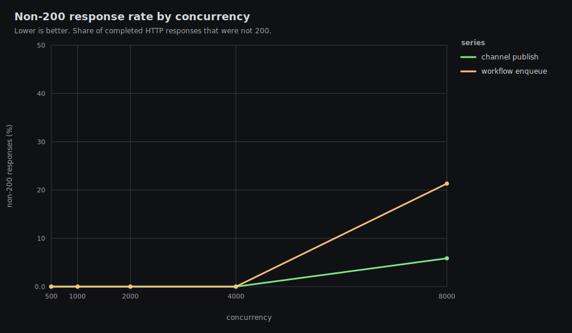

## tako-feature-channel-publish-c1000

200 rps 6838.84 | total rps 6838.84 | p99 260.77 ms | non-200 0% | errors 0

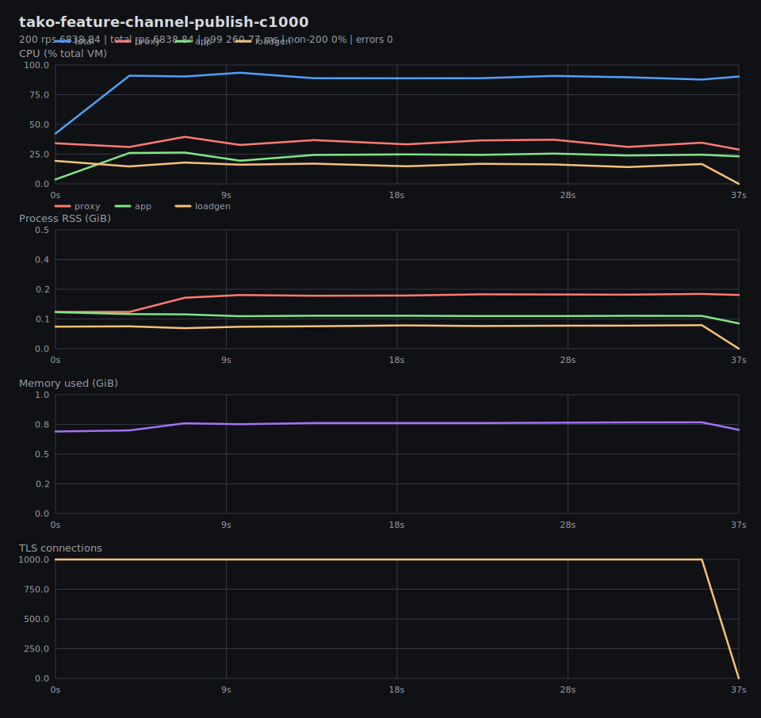

## tako-feature-channel-publish-c2000

200 rps 6369.44 | total rps 6369.44 | p99 800 ms | non-200 0% | errors 0

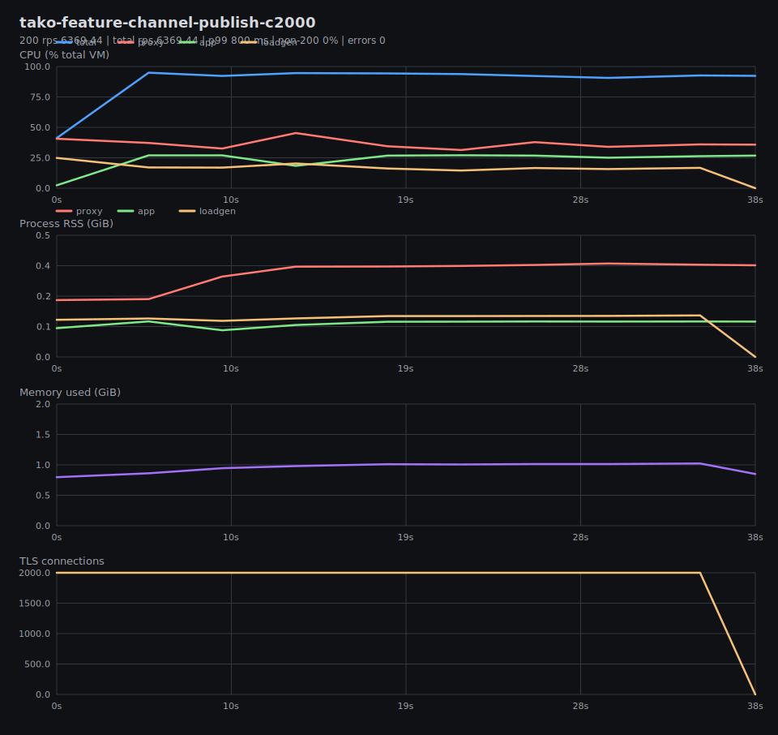

## tako-feature-channel-publish-c4000

200 rps 5941.41 | total rps 5941.41 | p99 2760.91 ms | non-200 0% | errors 0

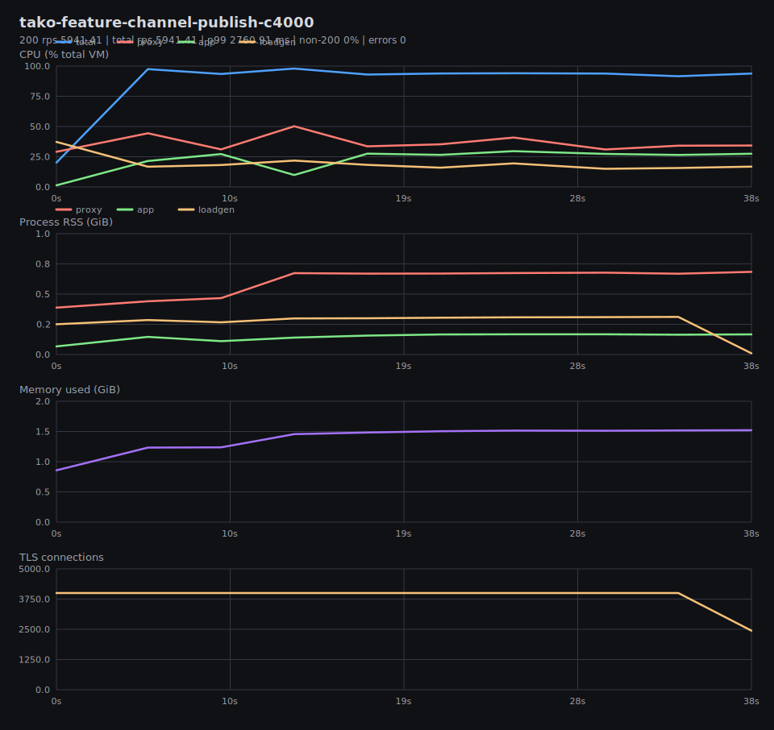

## tako-feature-channel-publish-c500

200 rps 7205.28 | total rps 7205.28 | p99 126.52 ms | non-200 0% | errors 0

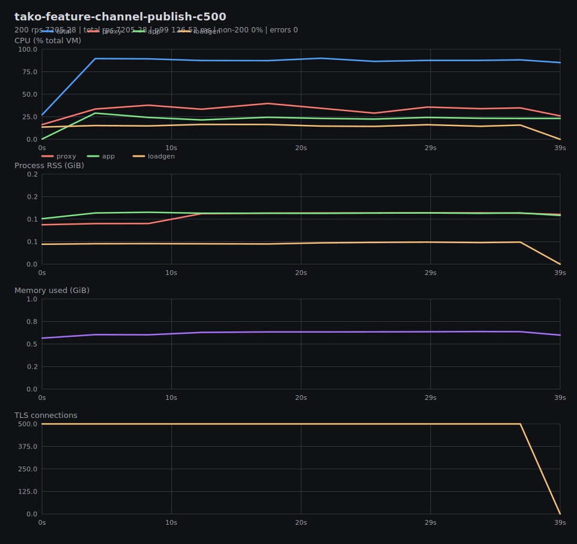

## tako-feature-channel-publish-c8000

200 rps 4116.15 | total rps 4372.25 | p99 6723.34 ms | non-200 5.86% | errors 0

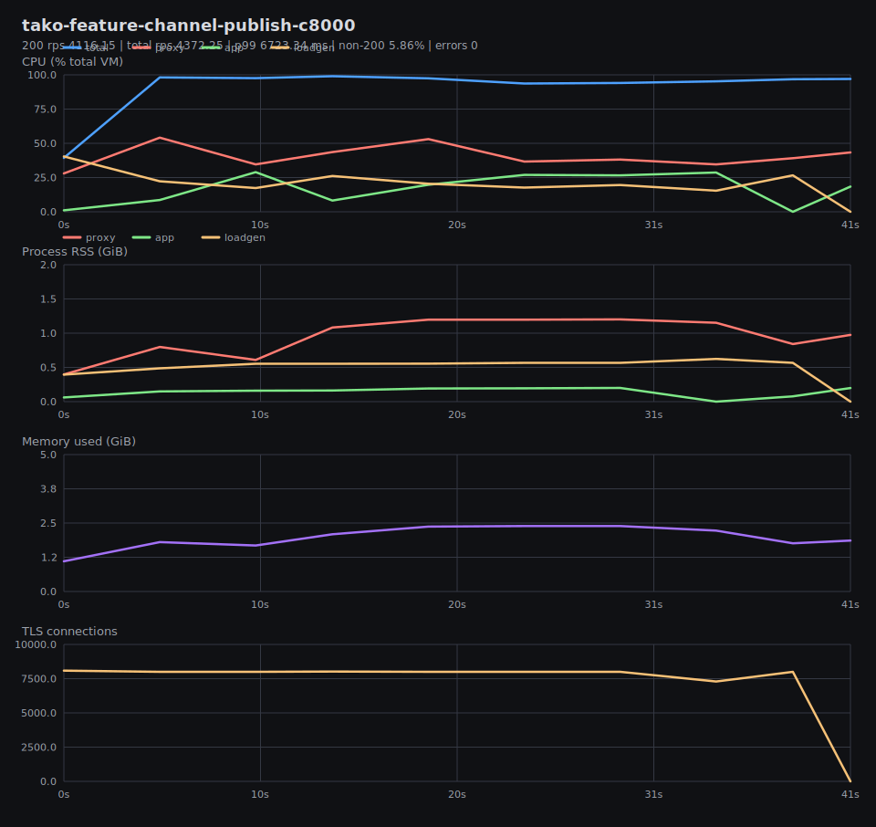

## tako-feature-workflow-enqueue-c1000

200 rps 5387.18 | total rps 5387.18 | p99 387 ms | non-200 0% | errors 0

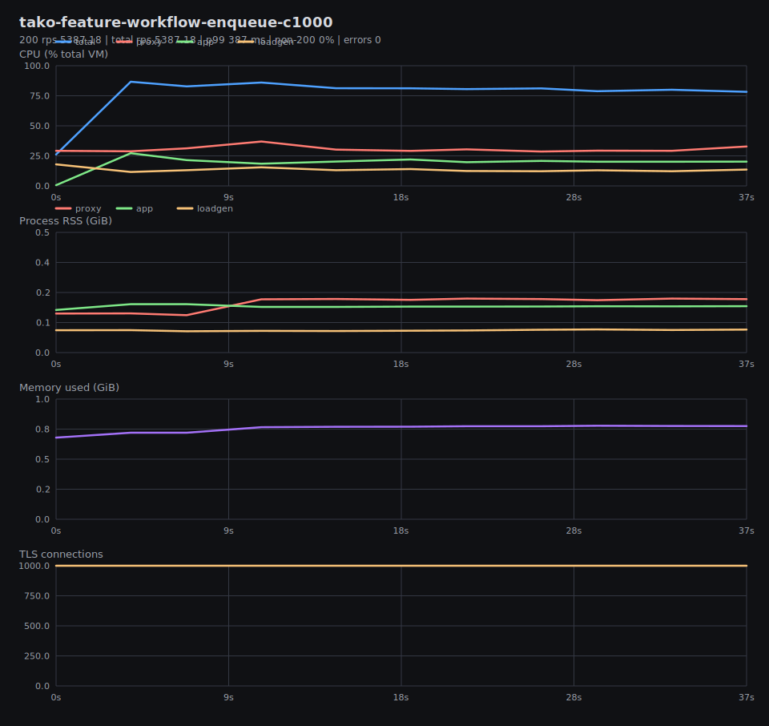

## tako-feature-workflow-enqueue-c2000

200 rps 5200.27 | total rps 5200.27 | p99 1215.53 ms | non-200 0% | errors 0

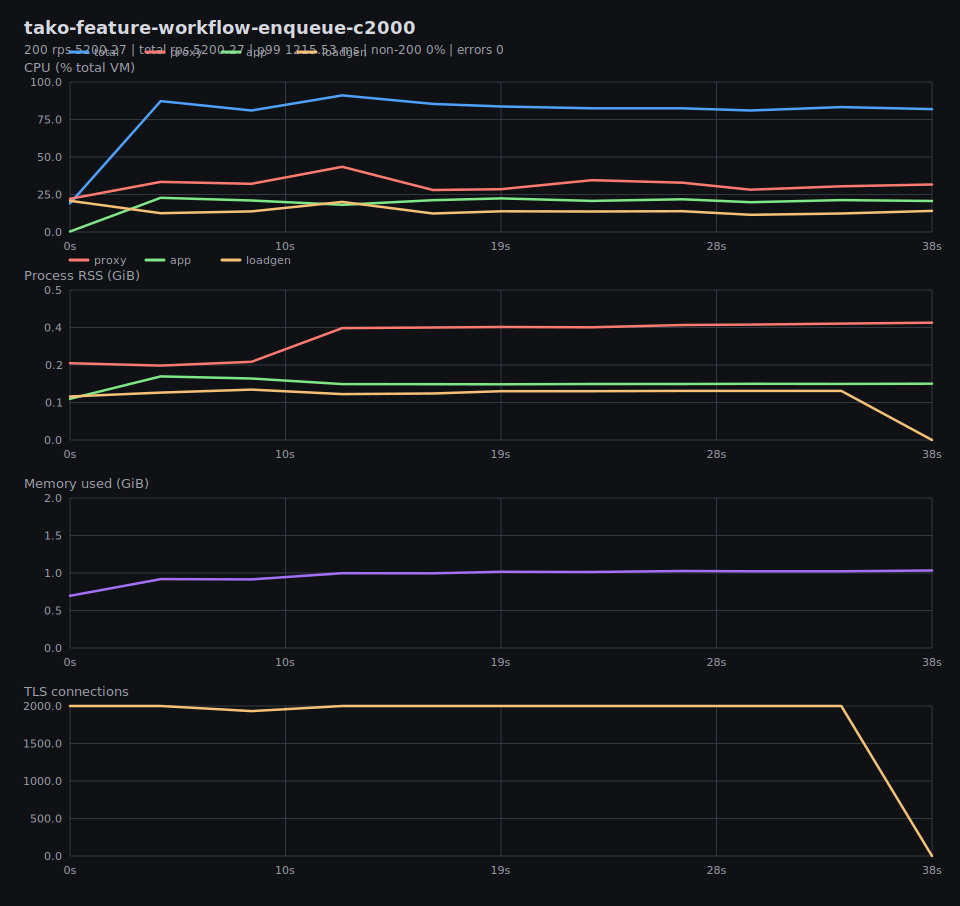

## tako-feature-workflow-enqueue-c4000

200 rps 4757.81 | total rps 4757.81 | p99 3588.6 ms | non-200 0% | errors 0

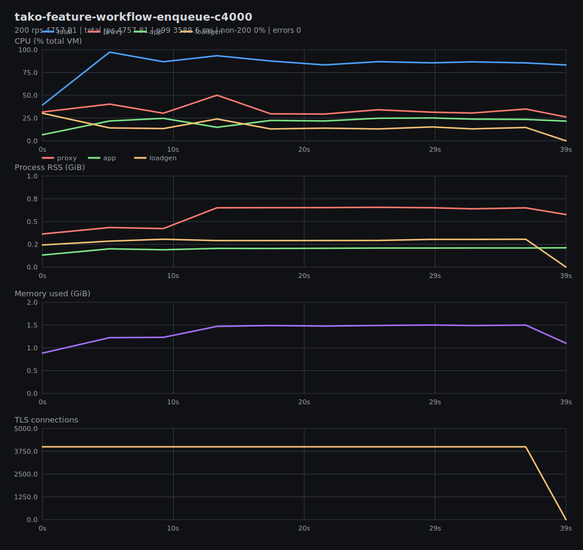

## tako-feature-workflow-enqueue-c500

200 rps 5690.33 | total rps 5690.33 | p99 171.44 ms | non-200 0% | errors 0

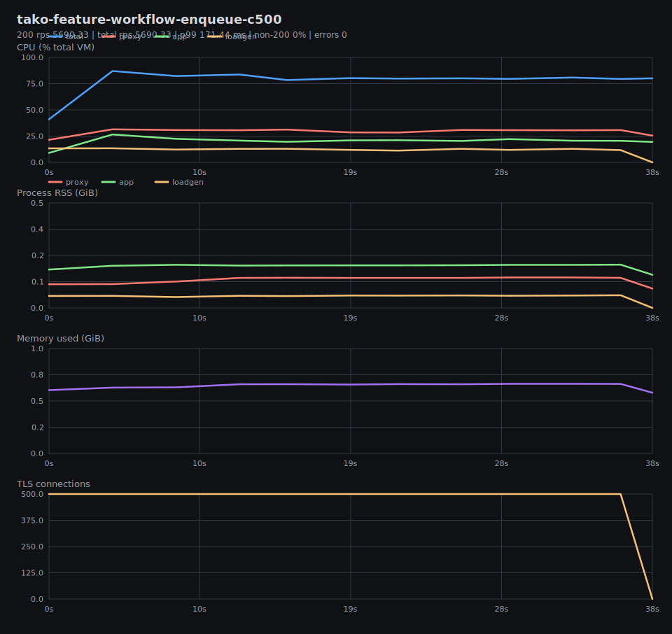

## tako-feature-workflow-enqueue-c8000

200 rps 1872.57 | total rps 2380.67 | p99 8408.91 ms | non-200 21.34% | errors 0

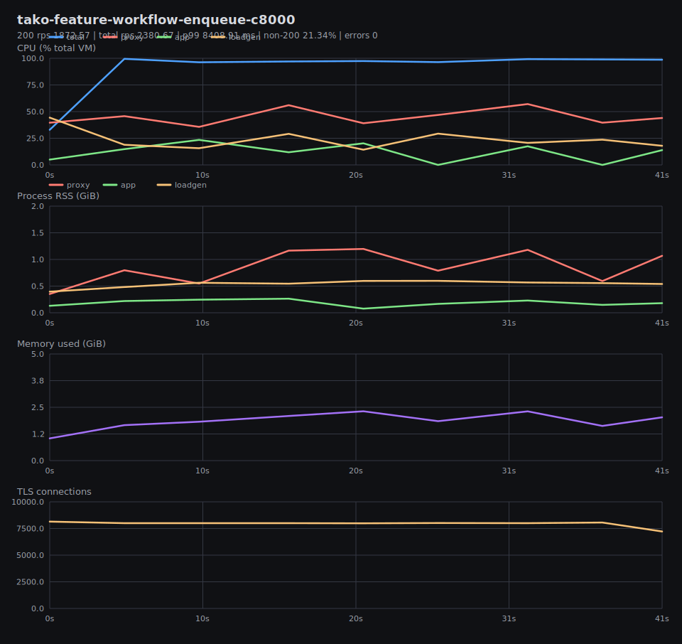
