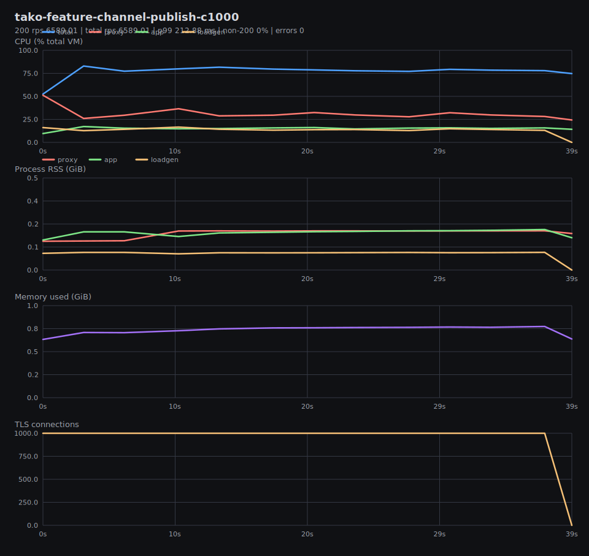
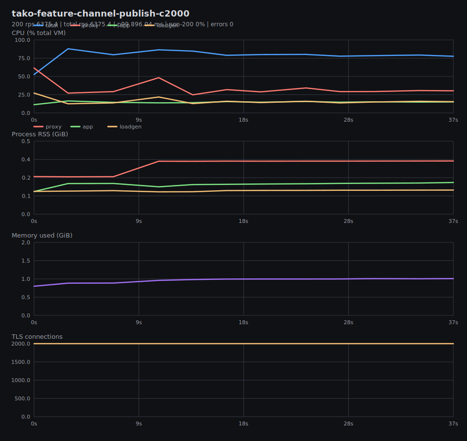
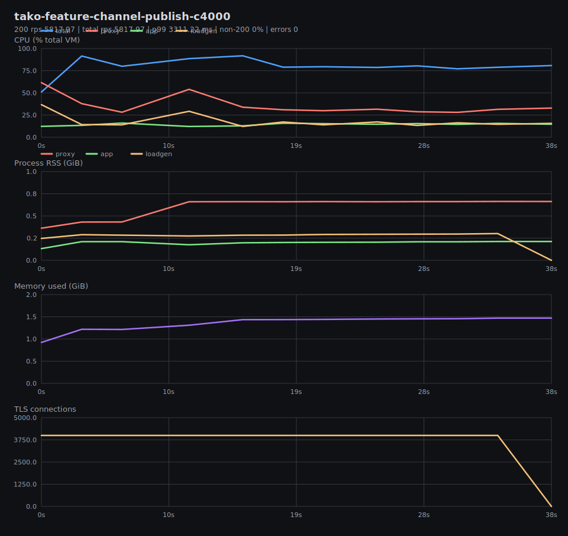
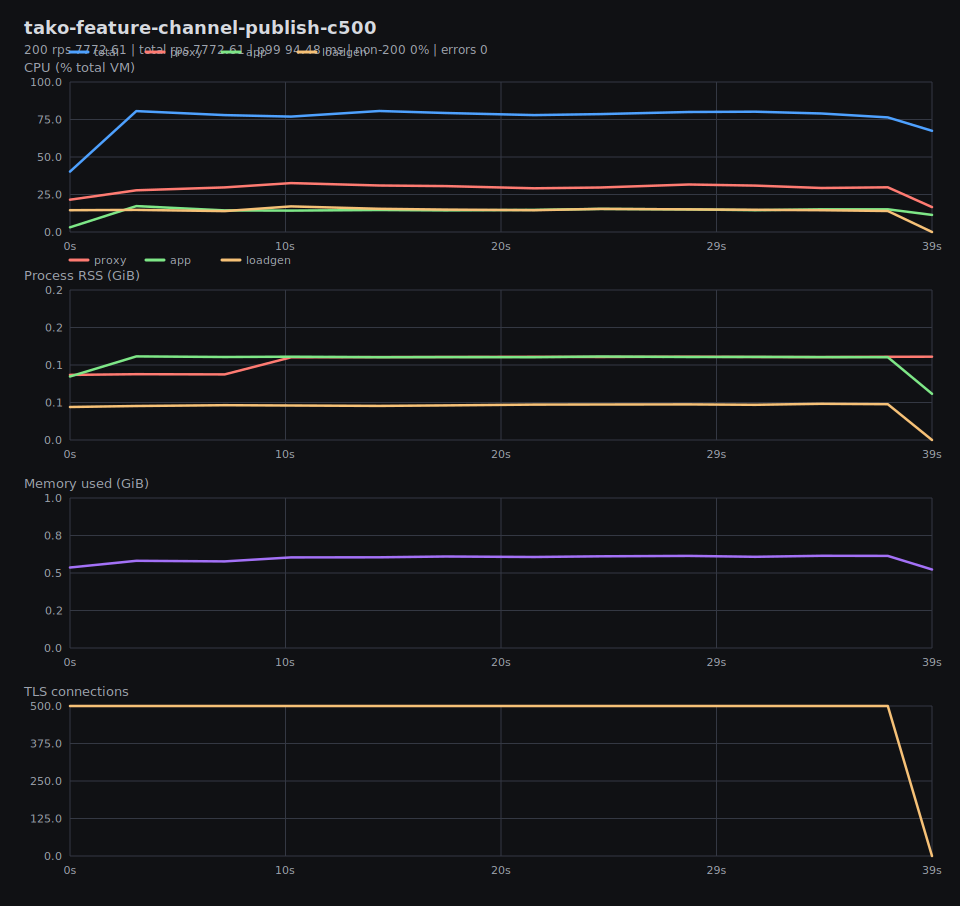
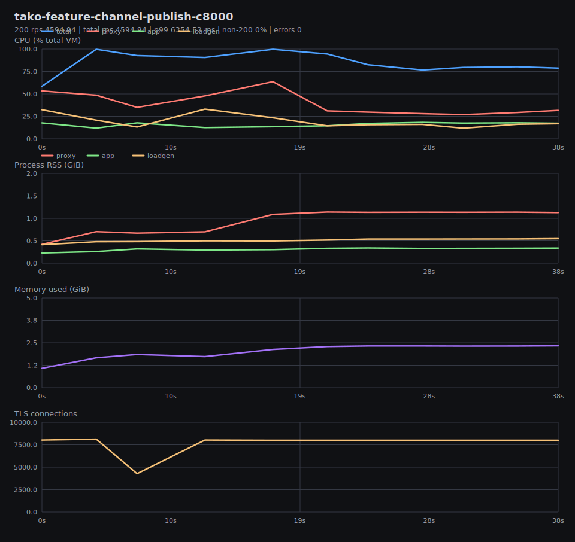
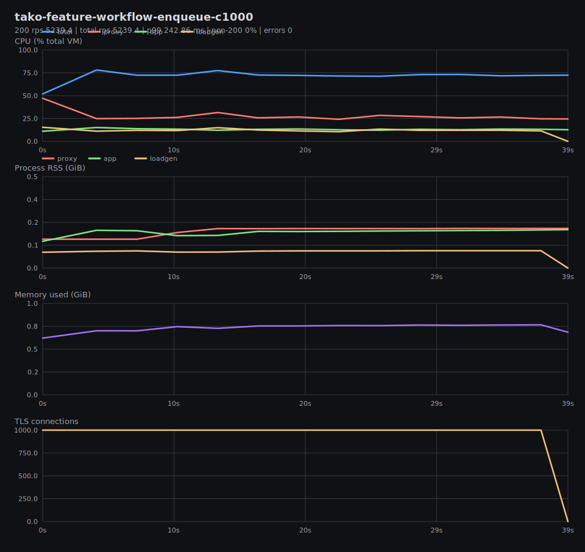
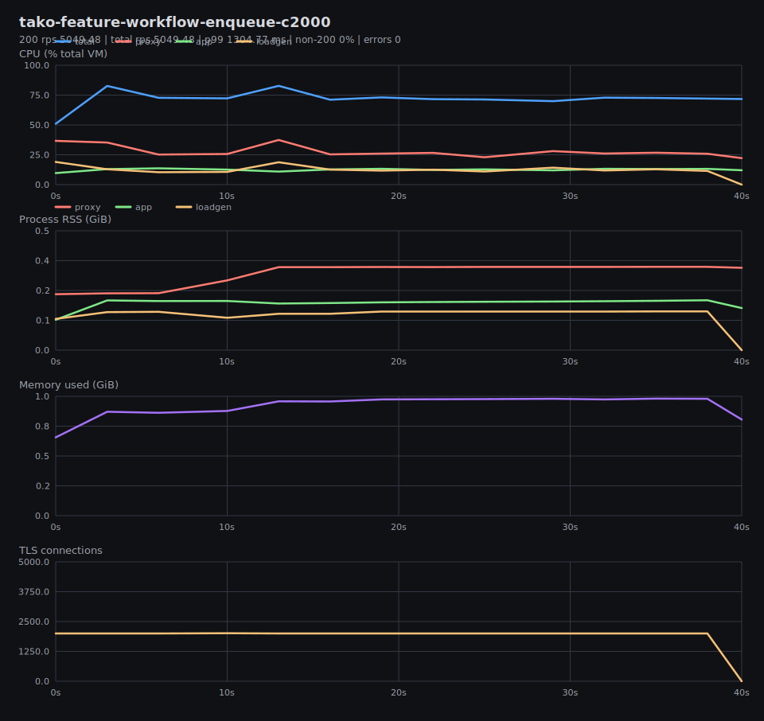
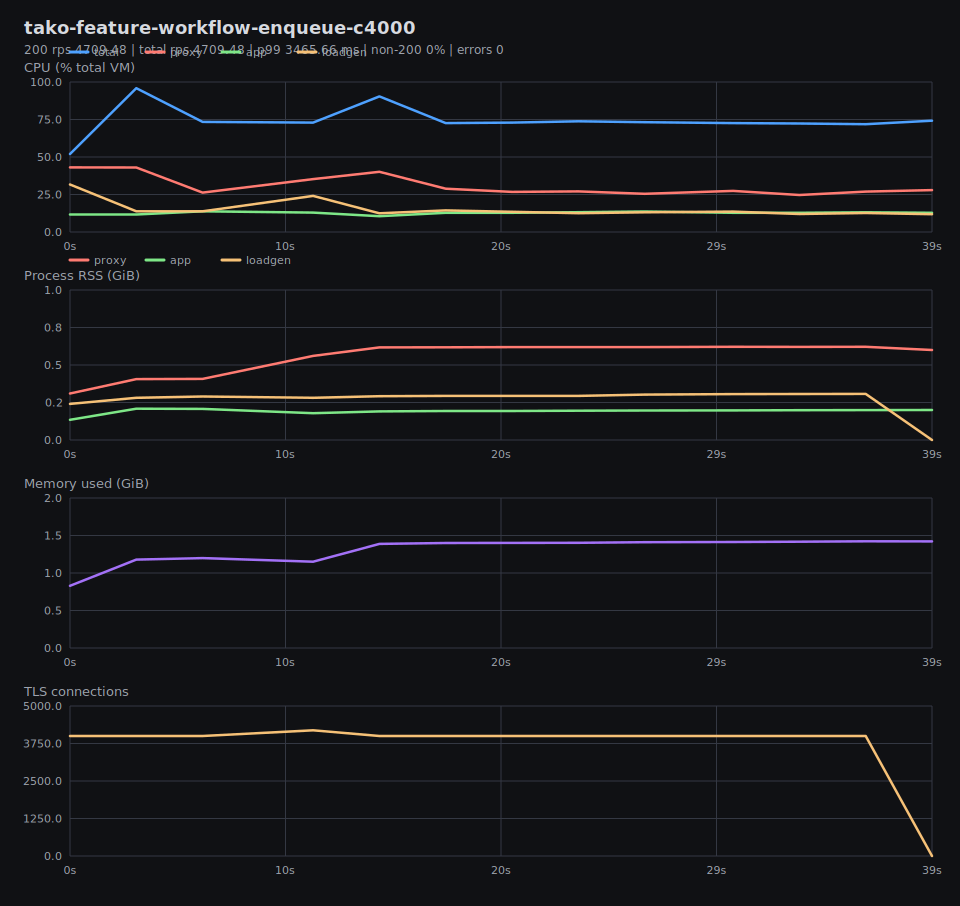
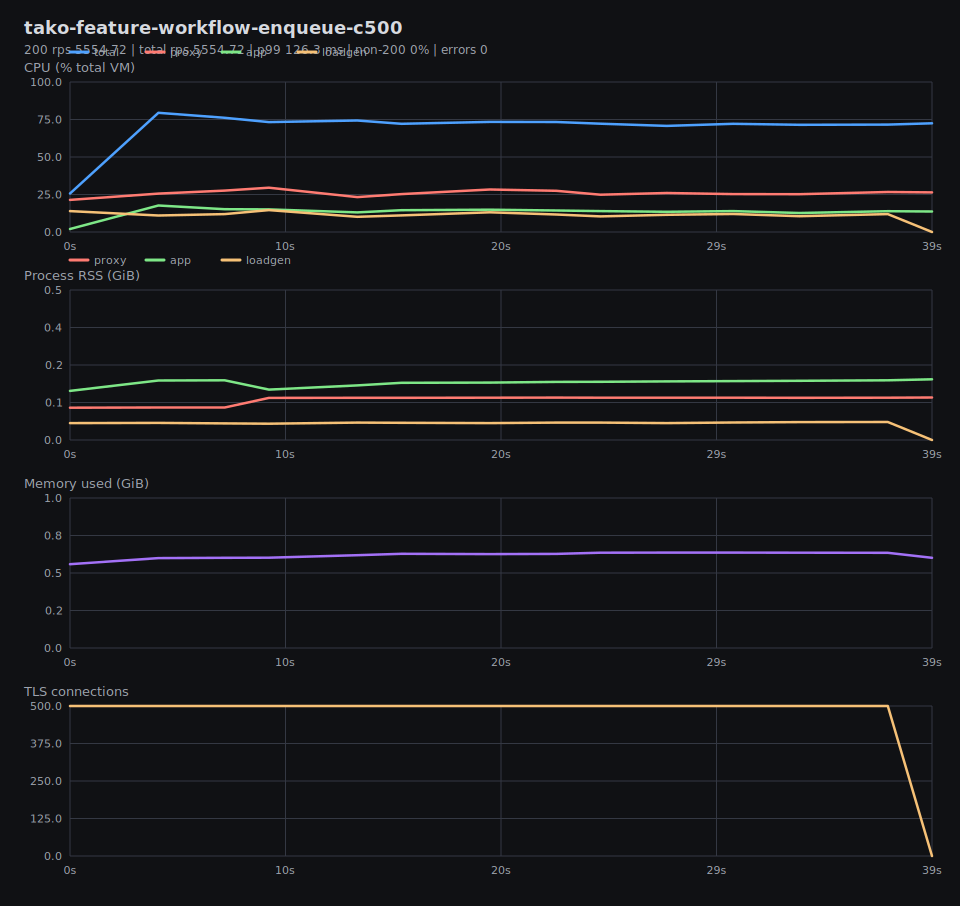
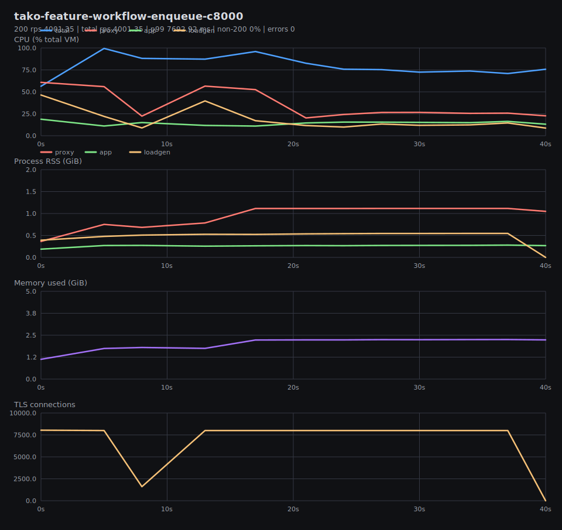

# Benchmark Graphs

Generated from result JSON and per-test metrics CSV files in `tako-features-vm-local`.

## Summary

## tako-feature-channel-publish-c1000

200 rps 6589.01 | total rps 6589.01 | p99 212.88 ms | non-200 0% | errors 0

## tako-feature-channel-publish-c2000

200 rps 6375.4 | total rps 6375.4 | p99 896.04 ms | non-200 0% | errors 0

## tako-feature-channel-publish-c4000

200 rps 5817.97 | total rps 5817.97 | p99 3311.22 ms | non-200 0% | errors 0

## tako-feature-channel-publish-c500

200 rps 7772.61 | total rps 7772.61 | p99 94.48 ms | non-200 0% | errors 0

## tako-feature-channel-publish-c8000

200 rps 4594.94 | total rps 4594.94 | p99 6354.52 ms | non-200 0% | errors 0

## tako-feature-workflow-enqueue-c1000

200 rps 5239.4 | total rps 5239.4 | p99 242.86 ms | non-200 0% | errors 0

## tako-feature-workflow-enqueue-c2000

200 rps 5049.48 | total rps 5049.48 | p99 1304.77 ms | non-200 0% | errors 0

## tako-feature-workflow-enqueue-c4000

200 rps 4709.48 | total rps 4709.48 | p99 3465.66 ms | non-200 0% | errors 0

## tako-feature-workflow-enqueue-c500

200 rps 5554.72 | total rps 5554.72 | p99 126.3 ms | non-200 0% | errors 0

## tako-feature-workflow-enqueue-c8000

200 rps 4001.35 | total rps 4001.35 | p99 7692.92 ms | non-200 0% | errors 0

